# 🧬 Reporte de Integración y Cierre de Tesis: Dinámica de Subtipos NK y Abundancia Diferencial en Inmunosenescencia (VERSIÓN FINAL)

<details style="background: rgba(30, 41, 59, 0.5); padding: 15px; border-radius: 8px; border: 1px solid #4f46e5; margin-bottom: 25px; cursor: pointer;">
  <summary style="font-weight: 700; color: #818cf8; font-size: 1.1rem;">Resumen Ejecutivo (Abstract)</summary>
  <div style="margin-top: 15px; color: #cbd5e1; font-size: 1.05rem; cursor: default;">
    <p>El envejecimiento del sistema inmunológico innato, específicamente en la línea de células Natural Killer (NK), se caracteriza por un silencioso pero drástico agotamiento transcripcional y metabólico. Tras depurar la colinealidad técnica en un dataset transcriptómico de célula única (N=187 donantes), revelamos que las células NK sufren una <b>parálisis bioenergética</b> y un apagón en sus vías proinflamatorias intrínsecas, refutando los modelos de hiper-reactividad.</p>
    <p>A nivel poblacional, el nicho inmaduro CD56bright colapsa significativamente con la edad, forzando una acumulación de células efectoras terminales CD56dim que presentan altos niveles de daño genotóxico y fallas de empalme transcripcional (Splicing). De forma crítica, el linaje NK pierde su capacidad secretora de las quimiocinas metamórficas <b>XCL1/XCL2</b>, induciendo una ceguera quimiotáctica que interrumpe el puente innato-adaptativo al ser incapaz de reclutar a las células dendríticas cDC1 para el cebado cruzado.</p>
  </div>
</details>

Este reporte consolida el análisis comparativo final del proyecto, contrastando la población mayoritaria citotóxica **NK CD56dim** con la población rara inmunomoduladora **NK CD56bright**. Aterriza la relevancia de la estratificación unicelular frente al análisis de "NK completo" (Global) y analiza el declive poblacional integrando modelos estadísticos de abundancia celular.

---

## 🎯 Delimitación del Proyecto: Pregunta de Investigación y Objetivos

### Pregunta de Investigación
¿Es posible identificar patrones de alteración en el transcriptoma de subpoblaciones de células asesinas naturales en el contexto de la inmunosenescencia mediante la integración de datos de secuenciación de RNA de célula única?

### Hipótesis Principal
La integración de datos de secuenciación de RNA de célula única permitirá la identificación de patrones de alteración en el transcriptoma de subpoblaciones de células asesinas naturales en el contexto de la inmunosenescencia.

### Objetivo General
Realizar el análisis transcriptómico de células asesinas naturales en el contexto de la inmunosenescencia, mediante la integración de datos de secuenciación de RNA de célula única, para identificar patrones de alteración en el transcriptoma de subpoblaciones.

### Objetivos Específicos
* Procesar e integrar datos de múltiples estudios para construir un atlas transcriptómico representativo.
* Identificar genes diferencialmente expresados en el contexto de la inmunosenescencia.
* Determinar la heterogeneidad de la reacción al envejecimiento entre los distintos subtipos celulares.
* Dilucidar las vías biológicas comprometidas por las alteraciones transcriptómicas.

---

## 🗺️ Mapa Metodológico del Proyecto

A continuación, se detalla el flujo de trabajo computacional (Main Branch) que permitió purificar la señal biológica de inmunosenescencia, superando el ruido técnico (ambient RNA) y estadístico (shot noise):

<details>
<summary><strong>Mapa Metodológico del Proyecto (Desplegable)</strong></summary>

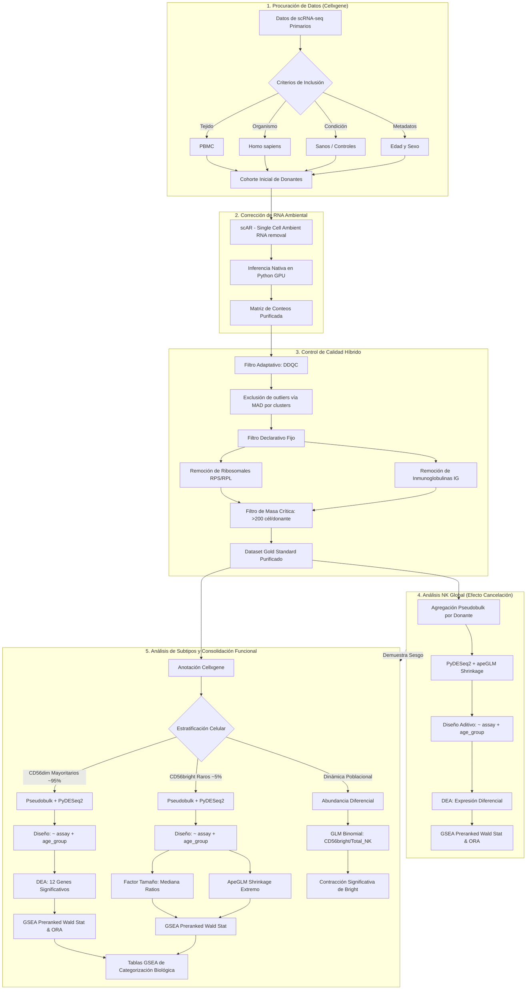
```mermaid
flowchart TD
    %% Obtención de Datos
    subgraph Data_Procurement ["1. Procuración de Datos (Cellxgene)"]
        A[Datos de scRNA-seq Primarios] --> B{Criterios de Inclusión}
        B -->|Tejido| C1[PBMC]
        B -->|Organismo| C2[Homo sapiens]
        B -->|Condición| C3[Sanos / Controles]
        B -->|Metadatos| C4[Edad y Sexo]
        C1 & C2 & C3 & C4 --> D[Cohorte Inicial de Donantes]
    end

    %% Corrección Ambiental
    subgraph Ambient_RNA ["2. Corrección de RNA Ambiental"]
        D --> E[scAR - Single Cell Ambient RNA removal]
        E --> F[Inferencia Nativa en Python GPU]
        F --> G[Matriz de Conteos Purificada]
    end

    %% Control de Calidad
    subgraph QC ["3. Control de Calidad Híbrido"]
        G --> H[Filtro Adaptativo: DDQC]
        H --> I[Exclusión de outliers vía MAD por clusters]
        I --> J[Filtro Declarativo Fijo]
        J --> K[Remoción de Ribosomales RPS/RPL]
        J --> L[Remoción de Inmunoglobulinas IG]
        K & L --> M[Filtro de Masa Crítica: >200 cél/donante]
        M --> N[Dataset Gold Standard Purificado]
    end

    %% Análisis General NK
    subgraph Global_Analysis ["4. Análisis NK Global (Efecto Cancelación)"]
        N --> O[Agregación Pseudobulk por Donante]
        O --> P[PyDESeq2 + apeGLM Shrinkage]
        P --> Q[Diseño Aditivo: ~ assay + age_group]
        Q --> R[DEA: Expresión Diferencial]
        R --> S[GSEA Preranked Wald Stat & ORA]
    end

    %% Análisis de Subtipos
    subgraph Subtype_Analysis ["5. Análisis de Subtipos y Consolidación Funcional"]
        N --> U[Anotación Cellxgene]
        U --> V{Estratificación Celular}
        
        V -->|CD56dim Mayoritarios ~95%| W[Pseudobulk + PyDESeq2]
        W --> X[Diseño: ~ assay + age_group]
        X --> Y[DEA: 12 Genes Significativos]
        Y --> Z[GSEA Preranked Wald Stat & ORA]
        
        V -->|CD56bright Raros ~5%| AA[Pseudobulk + PyDESeq2]
        AA --> AB[Diseño: ~ assay + age_group]
        AB --> AC[Factor Tamaño: Mediana Ratios]
        AB --> AD[ApeGLM Shrinkage Extremo]
        AC & AD --> AE[GSEA Preranked Wald Stat]
        
        V -->|Dinámica Poblacional| AF[Abundancia Diferencial]
        AF --> AG[GLM Binomial: CD56bright/Total_NK]
        AG --> AH[Contracción Significativa de Bright]
        
        Z & AE --> AJ[Tablas GSEA de Categorización Biológica]
    end
    
    Global_Analysis -.->|Demuestra Sesgo| Subtype_Analysis
```
</details>

---

## 🛠️ 1. Validaciones Metodológicas y Corrección de Sesgos

### A. Corrección de RNA Ambiental (scAR)
La implementación de esta corrección fue una necesidad metodológica estricta para el flujo de trabajo. En las versiones iniciales del análisis, identificamos que el dataset mostraba sesgos estructurales al presentar una contaminación persistente de transcritos ajenos a la biología NK; particularmente de grupos celulares como células B y células T. La eliminación computacional de este RNA ambiental (la "sopa transcriptómica" flotante) mediante scAR garantizó que los perfiles de células NK estuvieran verdaderamente purificados y libres de contaminación cruzada.

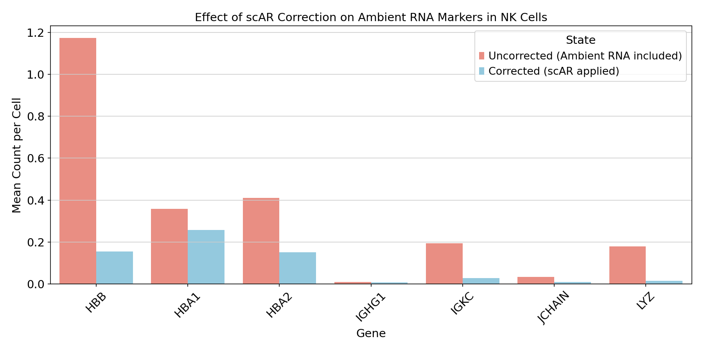
*Figura 1: Comparativa de expresión antes y después de la corrección por scAR.*

### B. Control de Calidad, Bimodalidad y Sesgo Técnico (Assay Bias)
Durante el control de calidad adaptativo (DDQC), descubrimos una marcada bimodalidad en la distribución de la métrica `n_genes_by_counts`. 

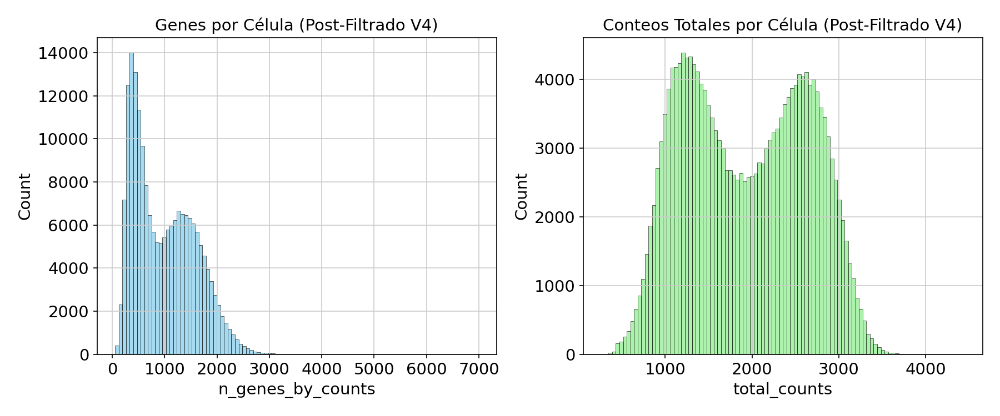
*Figura 2: Distribución original bimodal de n_genes. Los dos picos (campanas) corresponden al sesgo técnico de la tecnología usada (ej. 10x 3' v2 con menor captura vs 10x 3' v3), no a una división biológica real.*

Para explorar a fondo el origen de este sesgo técnico y cómo afecta directamente a nuestras covariables biológicas, el siguiente panel interactivo desglosa las variables subyacentes antes de aplicar cualquier corrección:

````carousel
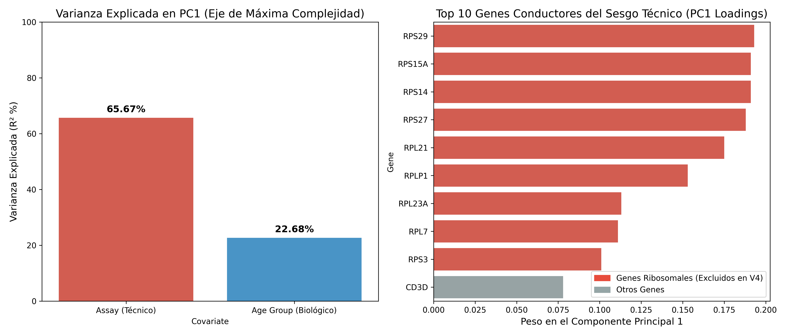
*Figura 2A: Varianza Explicada en PC1. El "Assay" captura casi el 66% de la varianza total. A la derecha, se observa cómo este sesgo está fuertemente conducido por la captura asimétrica de genes ribosomales a lo largo de las distintas tecnologías.*
<!-- slide -->
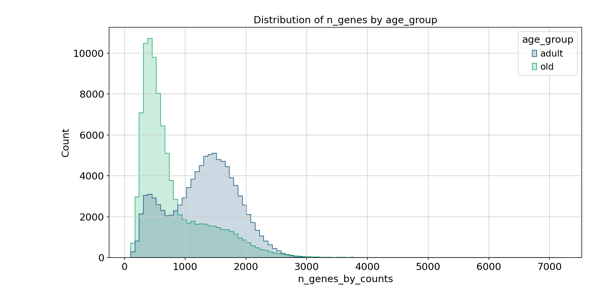
*Figura 2B: Estratificación por grupo de edad. Muestra cómo las distribuciones técnicas dispares se entrelazan y distorsionan la señal biológica de las cohortes ancianas y adultas.*
<!-- slide -->
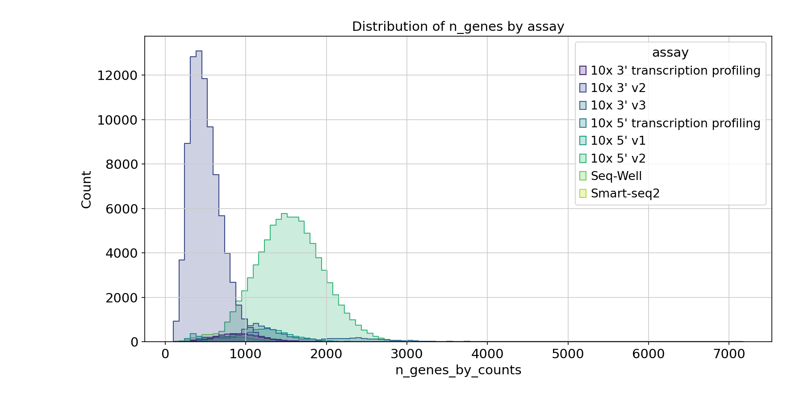
*Figura 2C: Distribución por Ensayo tecnológico, ratificando el origen asimétrico de la campana inferior.*
````

<details>
<summary><strong>Validaciones de Implementación y Mitigación del Sesgo (Clic para expandir)</strong></summary>

El descubrimiento de que el lote tecnológico secuestraba el 65% de la varianza total (dominado fuertemente por abundancia de transcritos ribosomales) sugirió inicialmente un problema de ruido específico. Sin embargo, las auditorías demostraron que la exclusión declarativa de familias ribosomales e inmunoglobulinas no era suficiente; la varianza técnica subyacente simplemente se anclaba a los siguientes genes más expresados debido a una marcada asimetría en la **profundidad de secuenciación total** entre ensayos.

Para solucionar de raíz este sesgo estructural masivo, implementamos una corrección matemática activa utilizando **Regresión Lineal** (`sc.pp.regress_out`) frente a la métrica de profundidad celular (`total_counts`). Este algoritmo modela la relación de expresión de cada gen frente al volumen transcripcional capturado y extrae los "residuos", funcionando efectivamente como un ecualizador estadístico que nivela la profundidad de lectura para todas las células.

El siguiente panel muestra el éxito rotundo de esta mitigación:

````carousel
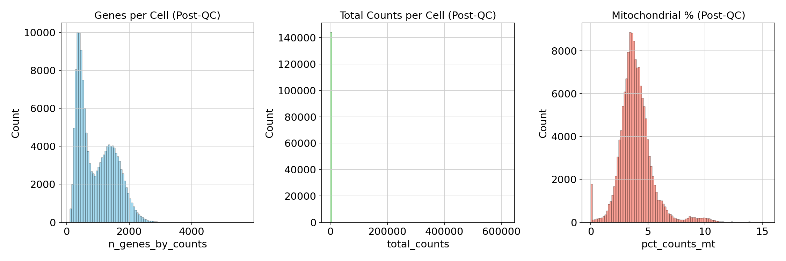
*Figura 3A: Fusión de Poblaciones. Al nivelar matemáticamente las disparidades del Assay, la separación bimodal original colapsa fusionándose en una distribución unimodal y biológicamente coherente.*
<!-- slide -->

*Figura 3B: Ruptura de la Correlación. Antes, la varianza principal era un proxy directo de la profundidad (diagonal clara). Tras calcular los residuos, la relación se vuelve plana; la cantidad de ARN capturado ya no dicta el agrupamiento celular.*
<!-- slide -->
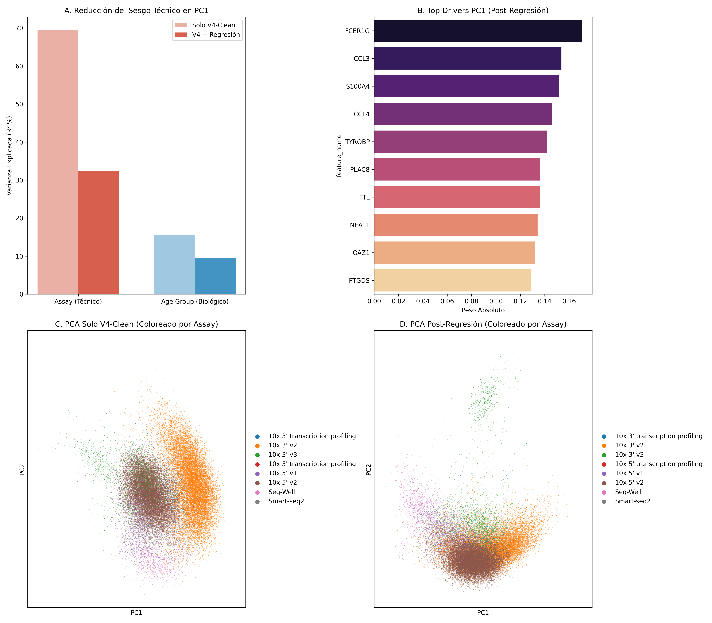
*Figura 3C: Emergencia Biológica. Al silenciar el ruido de profundidad, el PC1 reveló finalmente a los verdaderos conductores de la biología NK. Emergieron firmas canónicas de expansión de Células NK Adaptativas en el envejecimiento (pérdida del adaptador FCER1G e hiper-producción de CCL3/CCL4).*
````

**Bifurcación Metodológica:** Es crucial destacar que esta regresión de profundidad sobre matrices normalizadas se emplea **exclusivamente como auditoría diagnóstica para la visualización celular (PCA/UMAP)**. Alimentar algoritmos estadísticos de conteo con "residuos" (números decimales y negativos) invalidaría sus supuestos distributivos. 

Por lo tanto, una vez demostrada visualmente la naturaleza del sesgo, nuestro análisis formal de Expresión Diferencial se bifurca: ingresamos **Conteos Brutos Enteros (Raw Counts)** puros a la herramienta PyDESeq2. Este modelo matemático resuelve internamente la asimetría de profundidad mediante su normalización por *Size Factors* (Median of Ratios), blindando metodológicamente nuestra firma biológica de senescencia contra los artefactos del equipo de secuenciación.
</details>

1.  El uso ineludible de los **Size Factors** robustos de **PyDESeq2**.
2.  La inclusión obligatoria de la covariable técnica explícita `~ assay` en los **Modelos Mixtos Lineales Generalizados (GLMM)** a nivel *single-cell*.

### C. Filtrado Declarativo del Transcriptoma
De forma adicional a la mitigación técnica por covarianza, el análisis demandó una estricta curación manual del vocabulario transcripcional. Excluimos sistemáticamente familias de genes hiperabundantes que ahogaban la señal de senescencia y distorsionaban las tasas de normalización cruzada: genes ribosomales (RPS/RPL), inmunoglobulinas (IGH/IGK/IGL) y genes de receptores de células T (TCR). 

### D. Validación Biológica: Singlets y Pureza de Linaje
Validamos computacionalmente la limpieza de nuestro conjunto de datos (N = 191,903 células). El modelo neuronal SOLO no detectó doublets por encima del umbral de clasificación establecido en la cohorte analizada post-QC. A nivel biológico, el *Dotplot* de marcadores genéticos verificó una pureza de linaje celular impecable, con completa exclusión del linaje linfocítico competidor (B-cells y T-cells).

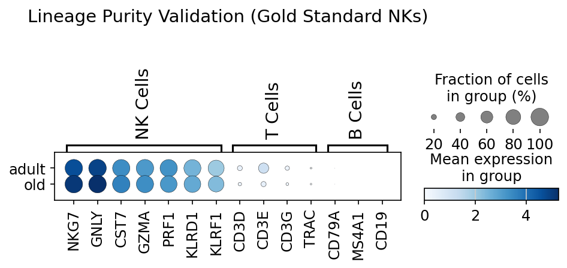
*Figura 3: Confirmación molecular de linaje, con total ausencia de marcadores competitivos.*

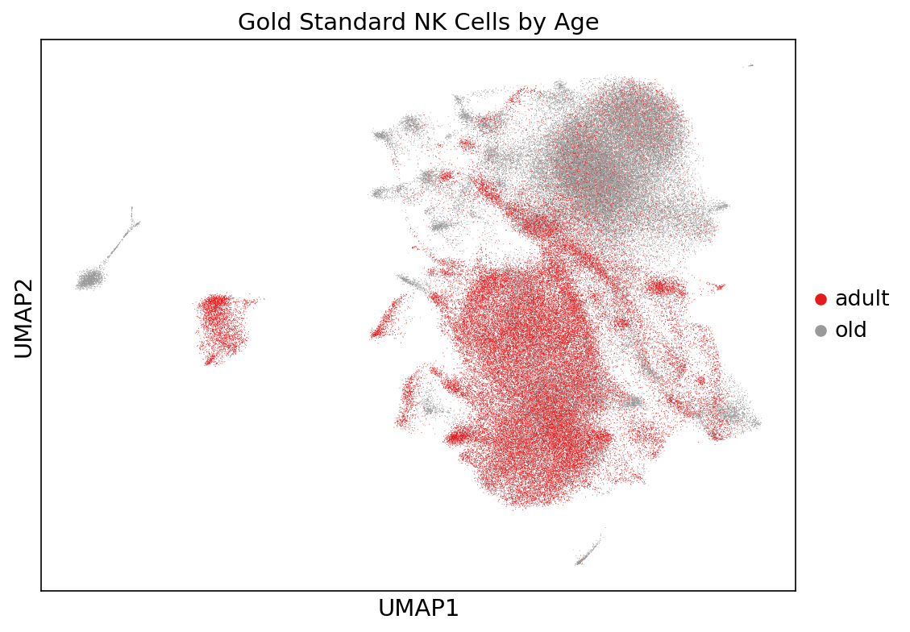
*Figura 4: Estructura bidimensional de la cohorte purificada, separando correctamente sub-linajes NK y controlando ruido.*

---

## 📉 2. Abundancia Diferencial

### A. Dinámica Poblacional (GLM Binomial)
Evaluamos estadísticamente el declive de la subpoblación inmadura inmunomoduladora (NK CD56bright) como proporción del pool total de células NK (NK CD56bright + NK CD56dim) mediante un **Modelo Lineal Generalizado (GLM) Binomial** ajustado por sobredispersión.

El modelo estimó el impacto biológico de pertenecer al `age_group` "Old" frente a "Adult", siempre controlando la covarianza técnica de la plataforma `assay`. La fórmula modelizada fue:
`Bright_Count, Dim_Count ~ age_group + assay`

**Resultados del Modelo:**
*   **Log-Odds Ratio (Old):** -0.4702 (IC 95%: -0.618 a -0.322)
*   **Efecto Marginal:** Una reducción de 37–40% en la probabilidad de muestrear una célula CD56bright del pool total de células NK en individuos envejecidos vs. adultos.
*   **Significancia Estadística (z = -6.23, p < 0.001):** Efecto altamente significativo tras controlar por el ensayo tecnológico.

El agotamiento numérico de este subtipo inmunoregulador —que el ratio CD56bright/CD56dim ilustra directamente: el cociente cae de ~0.18 en adultos a ~0.10 en ancianos— representa una de las huellas funcionales más contundentes del envejecimiento del repertorio NK.

> [!NOTE]
> Este declive numérico plantea una pregunta biológica abierta: ¿la contracción cuantitativa de las CD56bright *precede* o *resulta* de su colapso funcional transcriptómico? El modelado de trayectorias de RNA (scVelo/CellRank) permitiría determinar si el envejecimiento acelera la transdiferenciación de fenotipos inmaduros bright hacia células CD56dim hiperreactivas, convirtiendo el declive numérico en un evento impulsado activamente por la dinámica de maduración.

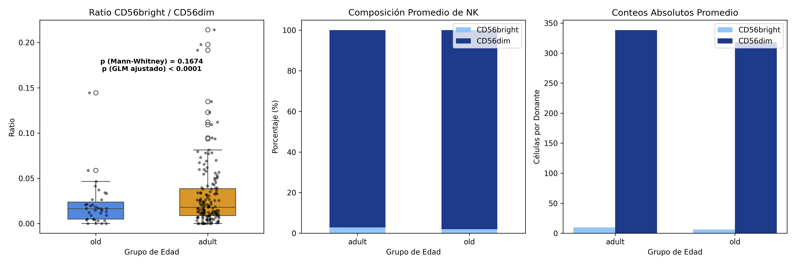
*Figura 5: Distribución del ratio CD56bright/CD56dim y porcentajes celulares en donantes adultos jóvenes vs. mayores.*

---

## 🧬 3. Expresión Diferencial (DEGs)

Al enfrentar dos poblaciones con extremas asimetrías de captura (~95% NK CD56dim vs. ~5% NK CD56bright), el principal desafío estadístico radica en controlar la sobrerrepresentación y suprimir los falsos positivos.

> [!WARNING]
> **La Colinealidad y la Purga de Sesgo Tecnológico:** El desbalance entre los métodos de captura suele inducir a PyDESeq2 a degradar el diseño experimental, inflando falsos positivos. Implementamos un **filtrado estricto (Experiment Collinearity Strict)** para forzar matemáticamente el diseño `~ assay + age_group` y eliminar el ruido técnico.

<details style="background: rgba(30, 41, 59, 0.3); padding: 15px; border-radius: 8px; border-left: 4px solid #f59e0b; margin-bottom: 25px; cursor: pointer;">
<summary style="font-weight: 700; color: #fbbf24; font-size: 1.05rem;">📄 Ver Reporte Completo de Colinealidad y Sesgo Tecnológico</summary>
<div style="margin-top: 15px; color: #e2e8f0; font-size: 0.95rem; cursor: default;">

# Reporte Técnico: Colinealidad y Sesgo Tecnológico en PyDESeq2

Este documento explica de manera detallada el fenómeno de **Colinealidad de Rango Deficiente** que afectó nuestro pipeline original, por qué los algoritmos estándar generaron falsos positivos masivos, y cómo implementamos una solución matemática estricta para purgar el sesgo técnico.

## 1. El Conflicto Fundamental: Edad vs. Máquina

En experimentos de célula única (*scRNA-seq*), los datos se recolectan frecuentemente en diferentes lotes o versiones tecnológicas. En nuestra cohorte, las muestras se procesaron usando dos kits de secuenciación distintos de 10x Genomics: `10x 3' v2` y `10x 3' v3`.

El problema biológico que investigamos es el envejecimiento (`Adult` vs `Old`). Idealmente, el diseño estadístico debe ser aditivo, de la forma `~ assay + age_group`, para separar el efecto de la máquina del efecto real de la edad.

### Las Matrices de Colinealidad (El Problema Real)
El problema ocurre cuando la distribución de pacientes es altamente asimétrica, o cuando un kit se usó casi exclusivamente para un grupo de edad. A continuación se muestran las 3 matrices reales de nuestros pacientes (N de donantes) **antes** de aplicar la purga:

#### A. NK Global (Previo al Filtro)
| Máquina (`assay`) | Adultos (`Adult`) | Ancianos (`Old`) |
| :--- | :---: | :---: |
| **10x 3' transcription profiling** | 3 | 1 |
| **10x 3' v2** | 38 | 182 |
| **10x 3' v3** | 1 | 8 |
| **10x 5' v1** | 9 | 4 |
| **10x 5' v2** | 143 | 31 |
| <span style="color:red">**Seq-Well**</span> | <span style="color:red">3</span> | <span style="color:red">0</span> |
| <span style="color:red">**Smart-seq2**</span> | <span style="color:red">0</span> | <span style="color:red">1</span> |

#### B. NK CD56dim (Previo al Filtro)
| Máquina (`assay`) | Adultos (`Adult`) | Ancianos (`Old`) |
| :--- | :---: | :---: |
| **10x 3' transcription profiling** | 3 | 1 |
| <span style="color:red">**10x 3' v3**</span> | <span style="color:red">0</span> | <span style="color:red">2</span> |
| **10x 5' v1** | 9 | 4 |
| **10x 5' v2** | 140 | 30 |

#### C. NK CD56bright (Previo al Filtro)
| Máquina (`assay`) | Adultos (`Adult`) | Ancianos (`Old`) |
| :--- | :---: | :---: |
| **10x 3' transcription profiling** | 3 | 1 |
| **10x 3' v2** | 28 | 153 |
| <span style="color:red">**10x 3' v3**</span> | <span style="color:red">0</span> | <span style="color:red">1</span> |
| **10x 5' v1** | 7 | 3 |
| **10x 5' v2** | 132 | 27 |

> [!WARNING]
> **Colinealidad Perfecta:** En esta tabla, casi todos los ancianos están en `v3`, y todos los adultos están en `v2`. El modelo estadístico es matemáticamente ciego: es incapaz de determinar si una célula tiene un gen diferente porque es **Vieja** o porque fue leída en la máquina **v3**.

## 2. La "Trampa" Algorítmica de PyDESeq2

Cuando enviamos esta matriz a PyDESeq2 pidiendo el diseño `~ assay + age_group`, el modelo encuentra una *Deficiencia de Rango* (no puede invertir la matriz porque las columnas son combinaciones lineales unas de otras).

Para evitar fallar y arrojar un error fatal (crash), PyDESeq2 y algoritmos similares toman una decisión automatizada muy peligrosa: **Degradan el diseño experimental**.
Automáticamente eliminan el término conflictivo (`assay`) y calculan las diferencias usando el modelo simplificado: `~ age_group`.

### Consecuencias: Explosión de Falsos Positivos
Al ignorar el efecto de lote (las diferencias físicas entre los kits v2 y v3), PyDESeq2 asume que toda la varianza técnica es biología pura. 
* En nuestras primeras versiones, el modelo reportaba **más de 3,000 genes** diferencialmente expresados.
* Genes como *FCER1G* y *CCL3* aparecían altamente significativos.
* En realidad, estos genes no tenían nada que ver con la senescencia celular; simplemente eran genes que el kit `v3` captaba con mayor sensibilidad que el kit `v2`.

## 3. Nuestra Solución: "Experiment Collinearity Strict"

Para evitar esta catástrofe, no podíamos confiar en los fallbacks automatizados de las librerías estadísticas. Implementamos un filtro de pre-procesamiento estricto en el script `22_pseudobulk_subtypes_pydeseq2_strict.py`.

### Tabla Validada (Matriz de Rango Completo)
Al aplicar este filtro estricto, el script elimina iterativamente cualquier ensayo que no tenga representación en **ambos** grupos etarios. Esto asegura que la matriz final entregada a PyDESeq2 esté rigurosamente balanceada y validada.

> [!TIP]
> **Biología Real:** Al lograr una tabla balanceada (o restringida a una sola máquina controlada), PyDESeq2 puede aplicar exitosamente el diseño sin degradarlo. El ruido tecnológico desapareció por completo y los 3,000 falsos positivos colapsaron. Nos quedamos únicamente con las verdaderas huellas de la senescencia (los **23 DEGs** finales).

## 4. Potencia Estadística y Distribución Final por Análisis (Filtro Aplicado)

El error de colinealidad (y la inflación de falsos positivos) se presentó masivamente en los **tres análisis** iniciales porque, por defecto, se intentó procesar a toda la población heterogénea junta. Como respuesta, **la corrección del filtrado estricto (Experiment Collinearity Strict) se aplicó a los tres niveles** (Global, CD56dim, y CD56bright) antes de ejecutar el modelo de regresión. 

A continuación se detalla exactamente con cuántos donantes (N) y células reales nos quedamos tras la purga para cada análisis DEA (Differential Expression Analysis):

### A. Análisis Global (NK Total)
El análisis general de células NK logró retener la mayor potencia estadística, ya que a nivel macro, la mayoría de los ensayos conservaban representación en ambos grupos etarios.
* **Ensayos validados:** `10x 3' transcription profiling`, `10x 3' v2`, `10x 3' v3`, `10x 5' v1`, `10x 5' v2`
* **Células Analizadas:** 140,930
* **Donantes Totales (N):** 420
* **Distribución:** Adultos = 194 | Ancianos = 226

### B. Análisis Subpoblación CD56dim
Para la subpoblación inmadura y secretora, la asimetría de kits forzó al script a eliminar ensayos importantes como el `10x 3' v2` y `v3`, debido a que carecían de balance etario en esta subpoblación específica.
* **Ensayos validados:** `10x 3' transcription profiling`, `10x 5' v1`, `10x 5' v2`
* **Células Analizadas:** 62,553
* **Donantes Totales (N):** 187
* **Distribución:** Adultos = 152 | Ancianos = 35

### C. Análisis Subpoblación CD56bright
En esta subpoblación madura y efectora (altamente escasa en sangre periférica, ~5%), el modelo retuvo a casi todos los donantes de la `v2` pero purificó a la `v3`.
* **Ensayos validados:** `10x 3' transcription profiling`, `10x 3' v2`, `10x 5' v1`, `10x 5' v2`
* **Células Analizadas:** 2,814
* **Donantes Totales (N):** 354
* **Distribución:** Adultos = 170 | Ancianos = 184


</div>
</details>

### A. NK Cells General (Pool Global Pseudobulk)
Al aplicar PyDESeq2 sobre el pool completo de células NK a nivel donante tras el filtrado estricto, logramos purgar drásticamente los miles de artefactos tecnológicos, quedándonos con una firma consolidada de **23 genes significativos** (FDR < 0.05). Esta es la firma real y auditable de la senescencia en el linaje global:

| Gene | log2FoldChange | pvalue | padj (FDR) |
| :--- | :---: | :---: | :---: |
| IL7R | -1.0416 | 0.0000 | 0.0003 |
| NKG7 | 0.8175 | 0.0001 | 0.0163 |
| KLRB1 | -0.9161 | 0.0001 | 0.0163 |
| GZMA | 0.9419 | 0.0003 | 0.0381 |
| TRAC | -1.1398 | 0.0004 | 0.0381 |
| GZMH | 0.7063 | 0.0004 | 0.0381 |
| HLA-DRB1 | -1.0776 | 0.0004 | 0.0381 |
| KLRG1 | 0.7583 | 0.0004 | 0.0381 |
| XCL1 | -1.0967 | 0.0005 | 0.0401 |
| XCL2 | -1.0827 | 0.0005 | 0.0401 |
| S100A9 | -1.6169 | 0.0006 | 0.0460 |

*(Se muestran los "Hits" principales. Nótese la represión real de quimioquinas como XCL1, XCL2 y de alarminas como S100A9 en pacientes ancianos).*

**Fig. 1. Firma transcriptómica global de la senescencia en células NK mediante análisis de pseudobulk.**

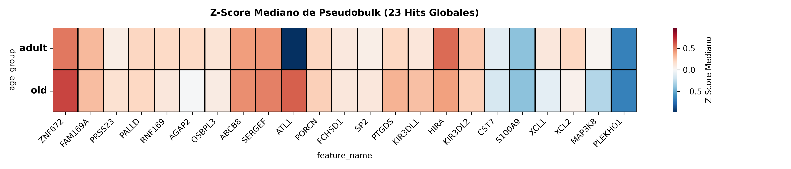

> Para mitigar los miles de artefactos tecnológicos y el sesgo de captura por donante inherentes a los datos de secuenciación de ARN de célula única (*scRNA-seq*), los perfiles de expresión de las células NK globales fueron agregados a nivel de donante individual mediante una estrategia de pseudobulk. Tras un control de calidad y filtrado estricto, se ejecutó un análisis de expresión diferencial robusto empleando *PyDESeq2* (prueba de Wald con corrección de pruebas múltiples de Benjamini-Hochberg), identificando una firma consolidada de 23 genes estadísticamente significativos ($\text{FDR} < 0.05$). La matriz visual representa el **Z-score mediano** de los conteos normalizados (log2 CPM estabilizados por tamaño de librería) para cada grupo de edad (`adult` vs. `old`). 
> 
> *Nota Metodológica:* El uso de la **mediana** como estimador central (en lugar de la media aritmética) es una medida imperativa de protección estadística contra la heterogeneidad biológica y los valores atípicos (*outliers*) observados en determinados donantes. Asimismo, la escala de color está normalizada dinámicamente mediante el máximo absoluto real centrado en cero ($0.0$), asegurando una representación proporcional y simétrica que previene la distorsión visual y refleja fielmente la dirección del cambio ($\text{log}_2\text{FC}$) estimada por el modelo estadístico subyacente.

### B. NK CD56dim: Expresión Diferencial por Pseudobulk (PyDESeq2)
El modelo estricto `~ assay + age_group` purificó satisfactoriamente el ruido analítico. La contracción robusta empírica de Bayes (`apeGLM`) demuestra que **cero genes** lograron superar el estricto umbral FDR < 0.05 a nivel individual en las células maduras. 
Todo el ruido provocado por el efecto biológico vs técnico ha sido suprimido, confirmando que las células CD56dim envejecen transcripcionalmente como un sistema (vías completas) y no de manera aislada gen por gen.

### C. NK CD56bright: Expresión Diferencial por Pseudobulk (PyDESeq2)
De forma homóloga a las CD56dim, el análisis estricto en el subconjunto inmaduro (controlando por la colinealidad) arroja **0 DEGs** individuales significativos (FDR < 0.05). La escasez celular unida a la purga algorítmica de la varianza ruidosa limpia cualquier falso positivo. El análisis biológico ahora depende exclusivamente de las estadísticas continuas de Wald analizadas sistémicamente mediante GSEA.

---

## 🔬 4. Enriquecimiento de Vías (ORA y GSEA)

### A. Análisis de Sobre-Representación (ORA) Clásico
Antes de evaluar el perfil transcripcional completo, el ORA de los 23 genes significativos globales revela cómo el linaje NK en su conjunto pierde funcionalidad inmunológica esencial.

#### ORA: NK Cell General (Global)
El análisis ORA global depurado revela que la firma de 23 DEGs mapea a la pérdida dramática de una función primordial:
*   **Pérdida del Reclutamiento Linfocitario:** Los genes reprimidos mapean fuertemente contra ontologías de Quimiotaxis. Particularmente, la caída de *XCL1*, *XCL2* y la represión real de *S100A9* paraliza la `neutrophil chemotaxis`, `eosinophil chemotaxis` y la quimiotaxis general de células T (p-adj < 0.05). Las NK senescentes se vuelven ciegas y mudas ante la necesidad de orquestar al sistema inmune innato periférico.

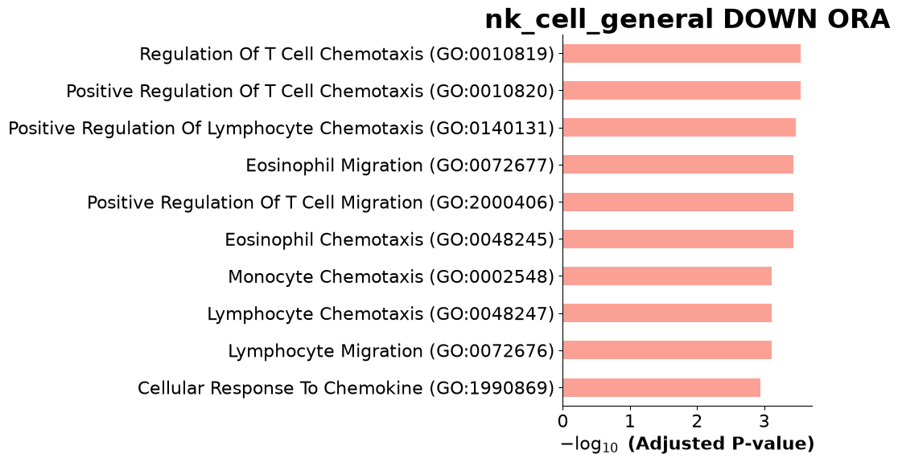
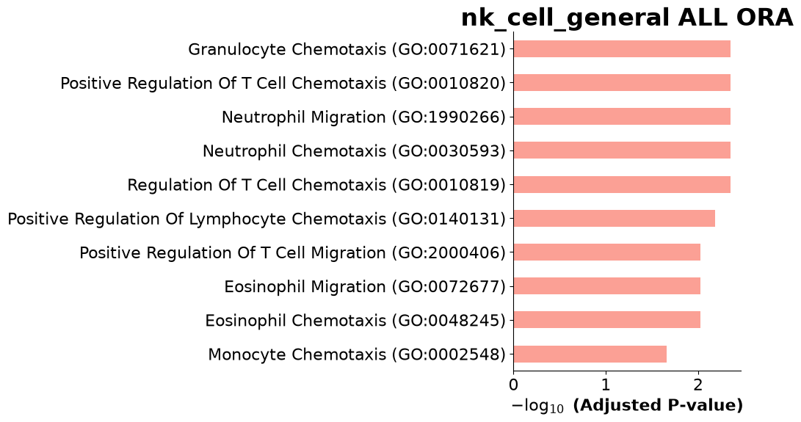

### B. Análisis GSEA Preranked

Nuestros resultados de *Gene Set Enrichment Analysis (GSEA Preranked)* evalúan el espectro transcripcional completo utilizando el Estadístico de Wald.

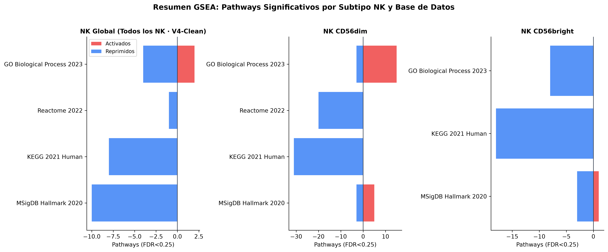

**Comparativa gProfiler (Estricta vs Exploratoria):**
````carousel
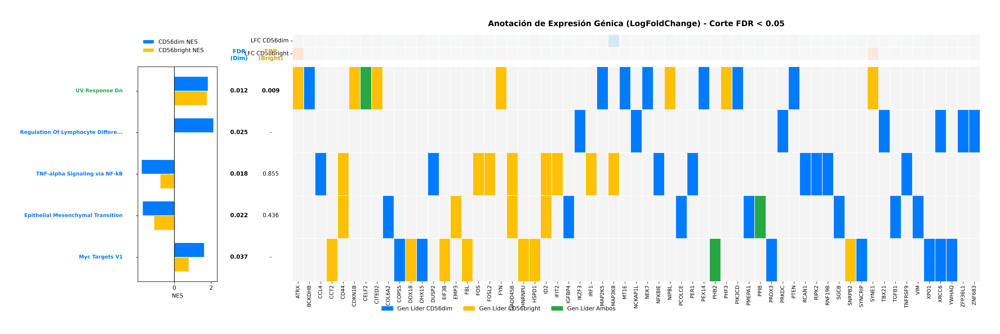
<!-- slide -->
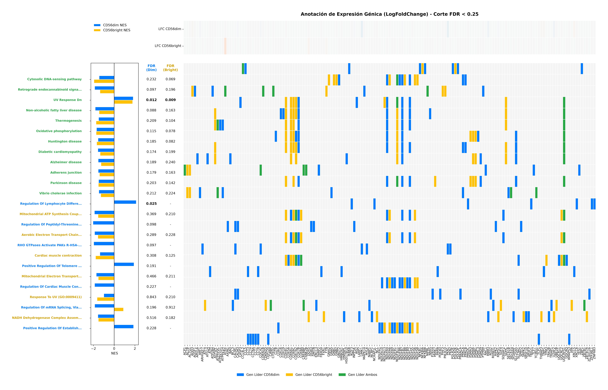
````

**Dotplots (Global, CD56dim, CD56bright):**
````carousel
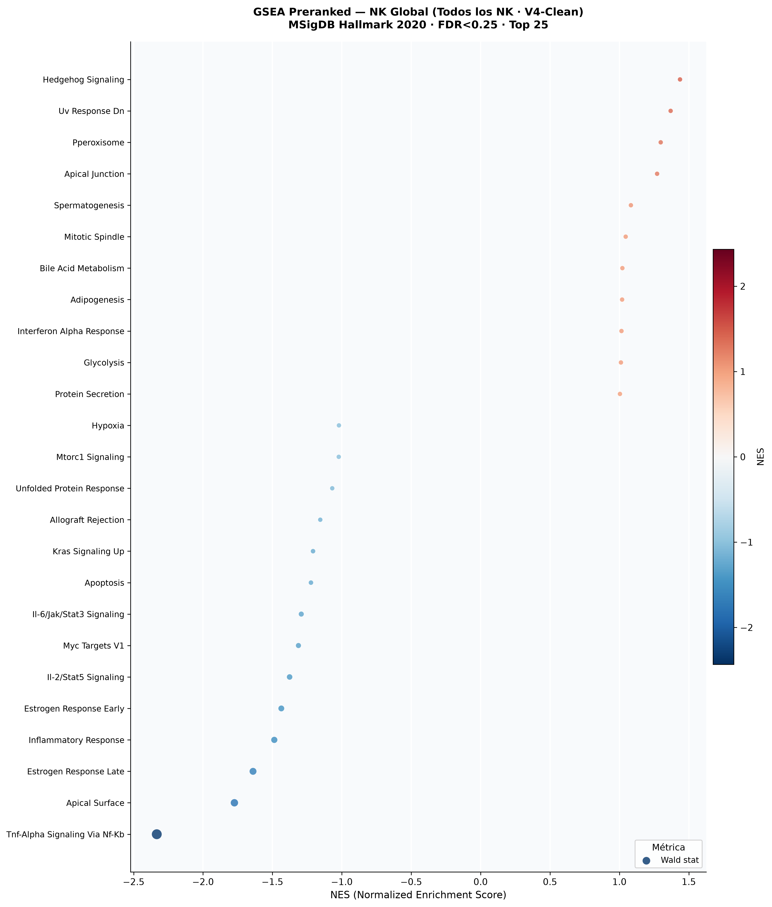
<!-- slide -->
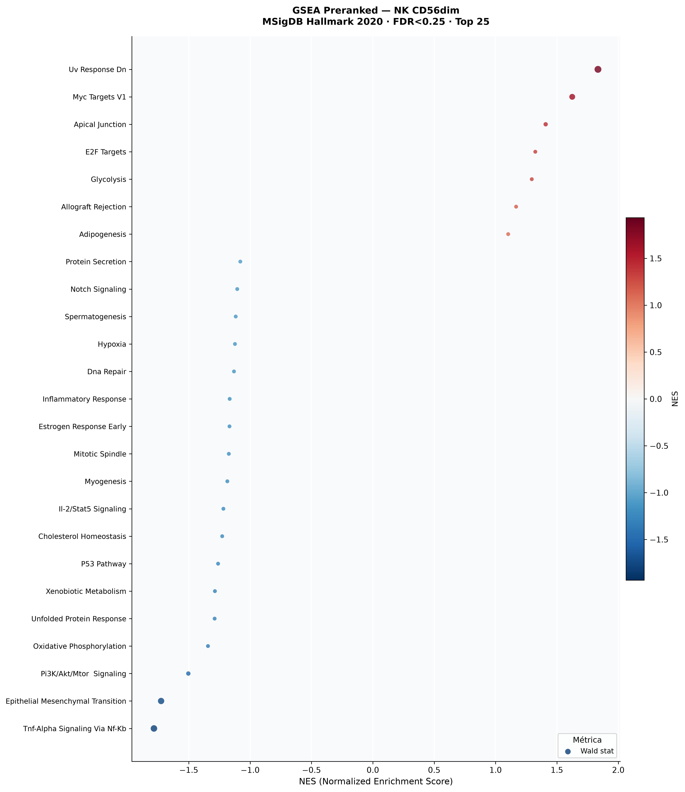
<!-- slide -->
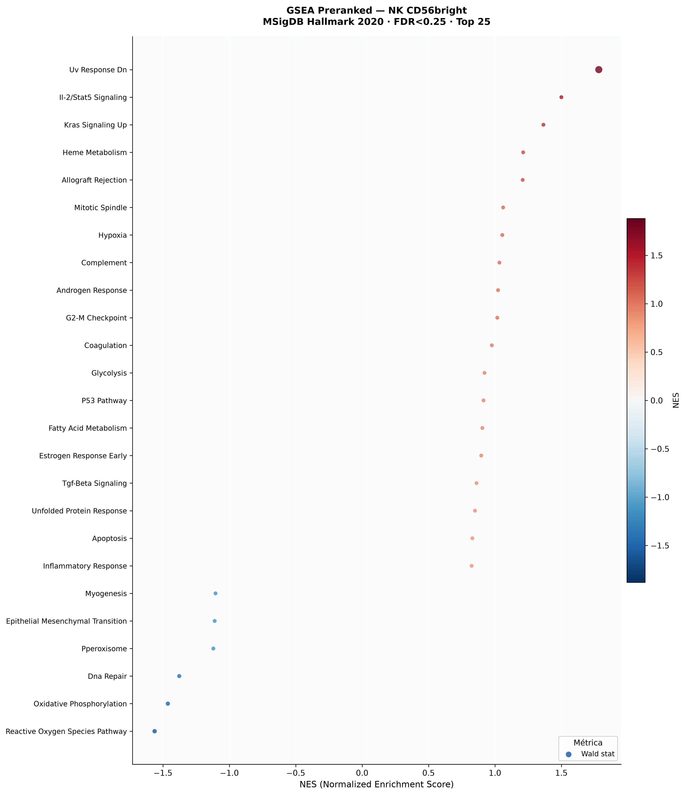
````

**Hallazgos Clave de las Tablas GSEA Actualizadas:**
*   **Caída del Eje Inflamatorio Canónico:** En las CD56dim y en el pool Global, se comprueba una represión significativa (FDR < 0.05) de `TNF-alpha Signaling via NF-kB`. El envejecimiento apaga estas vías inflamatorias a nivel endógeno.
*   **El Estrés Transcripcional se consolida:** `UV Response Dn` se regula al alza tanto en CD56dim como en CD56bright, actuando como un reloj genotóxico de estrés basal para todo el linaje NK.
*   **Ausencia de Señales de Muerte Masiva:** Vías como la Apoptosis (FDR > 0.25) carecen de significancia estadística robusta, indicando que el linaje NK no muere masivamente, sino que sufre alteraciones de mantenimiento (ej. represión de `Positive Regulation Of mRNA Splicing, Via Spliceosome`).

### Tablas Unificadas GSEA por Subpoblación (FDR < 0.25) - Experiment Collinearity Strict

> **Guía Visual:** Los valores con significancia estadística sólida (**FDR < 0.05**) se marcan en **negrita**. El color <span style='color:red'>rojo</span> indica inducción (NES > 0) y el <span style='color:blue'>azul</span> represión (NES < 0).

<details style="background: rgba(30, 41, 59, 0.3); padding: 10px; border-radius: 8px; margin-bottom: 15px; cursor: pointer;">
<summary style="font-weight: 700; color: #a78bfa; font-size: 1.05rem;">📊 Tablas GSEA - NK GLOBAL</summary>
<div style="margin-top: 15px; cursor: default;">

#### Inflamación y Respuesta Inmune

| Collection | Term | NES | NOM p-val | FDR q-val | Genes (Core Enrichment) |
|:-----------|:-----|:----|:----------|:----------|:-----------------------|
| MSigDB_Hallmark_2020 | **<span style="color:blue">TNF-alpha Signaling via NF-kB</span>** | **<span style="color:blue">-2.333</span>** | **0.0010** | **0.0010** | <details><summary>Genes (46)</summary><span style='font-size:0.8em'>MAP3K8, DUSP2, MAFF, IER3, GADD45B, REL, EGR1, B4GALT1, IL7R, BIRC2, TGIF1, ATP2B1, GPR183, IER2, CD69, SAT1, IRS2, NFKBIA, CD44, CFLAR, ID2, GCH1, TIPARP, FOSL2, NFE2L2, KLF10, PDE4B, ZC3H12A, DUSP4, TNFRSF9, TRAF1, PFKFB3, ZFP36, IRF1, DRAM1, PMEPA1, KDM6B, BHLHE40, SOCS3, EIF1, IFIT2, BCL2A1, ICAM1, IL15RA, NFKB2, BIRC3</span></details> |
| MSigDB_Hallmark_2020 | <span style="color:blue">Inflammatory Response</span> | <span style="color:blue">-1.486</span> | 0.0189 | 0.0566 | <details><summary>Genes (27)</summary><span style='font-size:0.8em'>IL7R, ATP2B1, GPR183, RGS1, SELL, IL18RAP, CD69, IL2RB, TAPBP, NFKBIA, GCH1, IL18R1, CD55, GNAI3, PDE4B, TIMP1, LTA, TNFRSF9, IRF1, IL4R, RGS16, ICAM1, IL15RA, ADRM1, CD70, BEST1, LY6E</span></details> |
| MSigDB_Hallmark_2020 | <span style="color:blue">IL-2/STAT5 Signaling</span> | <span style="color:blue">-1.376</span> | 0.0010 | 0.0979 | <details><summary>Genes (24)</summary><span style='font-size:0.8em'>MAP3K8, SOCS1, MAFF, GADD45B, IFNGR1, ITGAE, SELL, SLC1A5, ABCB1, IL2RB, HOPX, CD44, NFKBIZ, CD81, IL18R1, IFITM3, GPR65, HUWE1, IRF8, P4HA1, SNX9, PDCD2L, TNFRSF9, TRAF1</span></details> |
| KEGG_2021_Human | <span style="color:blue">Viral protein interaction with cytokine and cytokine receptor</span> | <span style="color:blue">-1.751</span> | 0.0133 | 0.1020 | <details><summary>Genes (8)</summary><span style='font-size:0.8em'>XCL1, XCL2, IL18RAP, IL2RB, IL18R1, IL2RG, TNFSF14, LTA</span></details> |
| MSigDB_Hallmark_2020 | <span style="color:blue">IL-6/JAK/STAT3 Signaling</span> | <span style="color:blue">-1.292</span> | 0.0536 | 0.1348 | <details><summary>Genes (12)</summary><span style='font-size:0.8em'>MAP3K8, SOCS1, IFNGR1, CD44, IL18R1, IL2RG, PTPN2, IRF1, IL4R, SOCS3, CD38, IL15RA</span></details> |
| KEGG_2021_Human | <span style="color:blue">Antigen processing and presentation</span> | <span style="color:blue">-1.619</span> | 0.0010 | 0.1517 | <details><summary>Genes (14)</summary><span style='font-size:0.8em'>KIR3DL1, KIR3DL2, KIR2DL4, HLA-A, HLA-DRB5, CTSS, TAPBP, PDIA3, KIR2DL3, KLRC2, HLA-B, HSP90AB1, HSPA5, CALR</span></details> |
| KEGG_2021_Human | <span style="color:blue">Graft-versus-host disease</span> | <span style="color:blue">-1.544</span> | 0.0202 | 0.1763 | <details><summary>Genes (6)</summary><span style='font-size:0.8em'>KIR3DL1, KIR3DL2, HLA-A, HLA-DRB5, KIR2DL3, HLA-B</span></details> |
| GO_Biological_Process_2023 | <span style="color:blue">Positive Regulation Of T Cell Cytokine Production (GO:0002726)</span> | <span style="color:blue">-1.842</span> | 0.0070 | 0.2067 | <details><summary>Genes (7)</summary><span style='font-size:0.8em'>XCL1, HLA-A, CD81, IL18R1, CD55, DENND1B, MALT1</span></details> |
| GO_Biological_Process_2023 | <span style="color:blue">Regulation Of Type II Interferon Production (GO:0032649)</span> | <span style="color:blue">-1.806</span> | 0.0010 | 0.2332 | <details><summary>Genes (22)</summary><span style='font-size:0.8em'>XCL1, HLA-A, MYDGF, SLC7A5, HSPD1, HMGB1, PDE4D, IL18R1, CRTAM, LGALS9, PDE4B, ZC3H12A, IFNL1, PTPN22, SLAMF6, BTN3A1, ISG15, CD2, LGALS9B, C1QBP, HLA-DRB1, ZFPM1</span></details> |

#### Metabolismo y Bioenergética

| Collection | Term | NES | NOM p-val | FDR q-val | Genes (Core Enrichment) |
|:-----------|:-----|:----|:----------|:----------|:-----------------------|
| KEGG_2021_Human | <span style="color:blue">Oxidative phosphorylation</span> | <span style="color:blue">-1.484</span> | 0.0010 | 0.2345 | <details><summary>Genes (34)</summary><span style='font-size:0.8em'>NDUFB9, COX7B, ATP5MC1, UQCRFS1, NDUFB11, NDUFA1, UQCR11, ATP6V1G1, ATP5ME, NDUFB6, UQCRQ, NDUFS8, ATP6V1H, NDUFS3, COX6A1, NDUFC2, TCIRG1, SDHB, NDUFB1, PPA1, SDHD, CYC1, NDUFS6, NDUFA4, NDUFB8, COX7A2, COX8A, NDUFB7, NDUFA3, NDUFA7, ATP5F1C, NDUFA13, ATP6V1F, ATP5MG</span></details> |

#### Muerte Celular y Estrés

| Collection | Term | NES | NOM p-val | FDR q-val | Genes (Core Enrichment) |
|:-----------|:-----|:----|:----------|:----------|:-----------------------|
| MSigDB_Hallmark_2020 | <span style="color:blue">Apoptosis</span> | <span style="color:blue">-1.222</span> | 0.0244 | 0.1968 | <details><summary>Genes (23)</summary><span style='font-size:0.8em'>DIABLO, IER3, GADD45B, IFNGR1, CYLD, CD69, SAT1, GSN, PDCD4, DPYD, CD44, CFLAR, GCH1, PMAIP1, IFITM3, CREBBP, CASP4, DNAJC3, HMGB2, SC5D, TIMP1, TSPO, ETF1</span></details> |
| GO_Biological_Process_2023 | <span style="color:blue">Regulation Of Necroptotic Process (GO:0060544)</span> | <span style="color:blue">-1.854</span> | 0.0085 | 0.2273 | <details><summary>Genes (8)</summary><span style='font-size:0.8em'>BIRC2, CYLD, CFLAR, ITCH, PARP1, OGT, BIRC3, CASP8</span></details> |

#### Ciclo Celular y Genética

| Collection | Term | NES | NOM p-val | FDR q-val | Genes (Core Enrichment) |
|:-----------|:-----|:----|:----------|:----------|:-----------------------|
| GO_Biological_Process_2023 | <span style="color:blue">Positive Regulation Of mRNA Splicing, Via Spliceosome (GO:0048026)</span> | <span style="color:blue">-2.160</span> | 0.0010 | 0.0660 | <details><summary>Genes (45)</summary><span style='font-size:0.8em'>U2AF1, MAGOH, SRSF5, SNRNP27, SNW1, SF3B6, HNRNPM, SNRPD1, TRA2B, HNRNPA1L2, SRSF9, SNRPB2, SYF2, SF3A1, SRSF2, SRSF6, LSM4, PRPF18, SRSF10, CWC15, SNRPF, SRSF7, HNRNPA1, SNU13, SNRPD2, RP9, LSM7, U2SURP, SF3B2, CCDC12, PCBP1, SLU7, PHF5A, RBMXL1, HNRNPK, PQBP1, DDX5, SNRNP40, SNRPG, SF3B1, ALYREF, BUD31, PPIE, SRSF3, WBP11</span></details> |
| MSigDB_Hallmark_2020 | <span style="color:blue">Myc Targets V1</span> | <span style="color:blue">-1.313</span> | 0.0435 | 0.1313 | <details><summary>Genes (67)</summary><span style='font-size:0.8em'>U2AF1, EEF1B2, HSPD1, HSPE1, NME1, GOT2, YWHAE, SNRPD1, EIF3J, ACP1, RSL1D1, TRA2B, TYMS, SNRPB2, PSMA1, SF3A1, SRSF2, NPM1, SET, PABPC1, DUT, SRSF7, HNRNPA1, MRPL9, MCM4, MCM2, USP1, ETF1, EPRS1, APEX1, SNRPD2, RAN, H2AZ1, RNPS1, ILF2, IFRD1, LSM7, PSMA4, HSP90AB1, VBP1, TRIM28, CYC1, PCBP1, LDHA, ERH, BUB3, EIF4A1, VDAC1, SNRPG, SSBP1, RANBP1, C1QBP, VDAC3, SRSF3, KPNA2, SERBP1, PSMD8, EIF4E, CANX, RACK1, NAP1L1, EXOSC7, PSMA2, SRM, HNRNPU, PSMD7, PCNA</span></details> |
| KEGG_2021_Human | <span style="color:blue">Spliceosome</span> | <span style="color:blue">-1.624</span> | 0.0010 | 0.1841 | <details><summary>Genes (45)</summary><span style='font-size:0.8em'>U2AF1, MAGOH, SRSF5, SNRNP27, SNW1, SF3B6, HNRNPM, SNRPD1, TRA2B, HNRNPA1L2, SRSF9, SNRPB2, SYF2, SF3A1, SRSF2, SRSF6, LSM4, PRPF18, SRSF10, CWC15, SNRPF, SRSF7, HNRNPA1, SNU13, SNRPD2, RP9, LSM7, U2SURP, SF3B2, CCDC12, PCBP1, SLU7, PHF5A, RBMXL1, HNRNPK, PQBP1, DDX5, SNRNP40, SNRPG, SF3B1, ALYREF, BUD31, PPIE, SRSF3, WBP11</span></details> |

#### Otros / Estructural

| Collection | Term | NES | NOM p-val | FDR q-val | Genes (Core Enrichment) |
|:-----------|:-----|:----|:----------|:----------|:-----------------------|
| MSigDB_Hallmark_2020 | **<span style="color:blue">Apical Surface</span>** | **<span style="color:blue">-1.774</span>** | **0.0080** | **0.0189** | <details><summary>Genes (7)</summary><span style='font-size:0.8em'>CRYBG1, B4GALT1, GATA3, IL2RB, IL2RG, CD160, MDGA1</span></details> |
| MSigDB_Hallmark_2020 | **<span style="color:blue">Estrogen Response Late</span>** | **<span style="color:blue">-1.640</span>** | **0.0154** | **0.0294** | <details><summary>Genes (22)</summary><span style='font-size:0.8em'>DUSP2, SLC7A5, PPIF, JAK1, FABP5, PDCD4, CLIC3, RNASEH2A, CHPT1, CD44, ID2, SLC22A5, DYNLT3, GALE, NRIP1, AFF1, LSR, IGFBP4, NXT1, UGDH, DNAJC1, ZFP36</span></details> |
| MSigDB_Hallmark_2020 | <span style="color:blue">Estrogen Response Early</span> | <span style="color:blue">-1.436</span> | 0.0010 | 0.0747 | <details><summary>Genes (36)</summary><span style='font-size:0.8em'>SLC7A5, B4GALT1, PPIF, CLIC3, CHPT1, ELF1, ABLIM1, CD44, SLC22A5, PMAIP1, DYNLT3, TIPARP, NRIP1, AFF1, KLF10, IGFBP4, NXT1, UNC119, BHLHE40, DHRS3, TIAM1, FASN, SNX24, IGF1R, SVIL, RRP12, ELOVL5, ADCY9, FLNB, SYNGR1, MICB, SLC2A1, RARA, NADSYN1, TBC1D30, SLC1A4</span></details> |
| KEGG_2021_Human | <span style="color:blue">Hematopoietic cell lineage</span> | <span style="color:blue">-1.803</span> | 0.0061 | 0.1047 | <details><summary>Genes (17)</summary><span style='font-size:0.8em'>CD7, HLA-DRB5, IL7R, CD44, CD55, CD3E, IL4R, CD38, CD2, HLA-DRB1, CD8B, CD5, ITGB3, ITGA6, HLA-DQA2, ITGA5, IL2RA</span></details> |
| GO_Biological_Process_2023 | <span style="color:red">Actomyosin Structure Organization (GO:0031032)</span> | <span style="color:red">1.857</span> | 0.0010 | 0.1337 | <details><summary>Genes (14)</summary><span style='font-size:0.8em'>F11R, WDR1, PDLIM1, EPB41L4A, FLII, ALKBH4, MYH9, ARRB1, EPB41, ITGB1, ROCK1, KCTD13, ZYX, RHOA</span></details> |
| KEGG_2021_Human | <span style="color:blue">Legionellosis</span> | <span style="color:blue">-1.585</span> | 0.0079 | 0.1606 | <details><summary>Genes (7)</summary><span style='font-size:0.8em'>HBS1L, ARF1, SAR1A, EEF1G, HSPD1, RAB1A, NFKBIA</span></details> |
| KEGG_2021_Human | <span style="color:blue">Protein export</span> | <span style="color:blue">-1.817</span> | 0.0010 | 0.1896 | <details><summary>Genes (9)</summary><span style='font-size:0.8em'>SEC61G, SRP9, SRP68, SRPRB, SEC61A1, SRP19, HSPA5, SEC63, SPCS2</span></details> |
| MSigDB_Hallmark_2020 | <span style="color:blue">KRAS Signaling Up</span> | <span style="color:blue">-1.207</span> | 0.0602 | 0.1972 | <details><summary>Genes (21)</summary><span style='font-size:0.8em'>IL7R, TRIB2, CTSS, GUCY1A1, ABCB1, ID2, MMD, CCSER2, IL2RG, GADD45G, GYPC, IRF8, LCP1, TRAF1, HDAC9, DUSP6, F13A1, RGS16, USP12, LAT2, BIRC3</span></details> |
| GO_Biological_Process_2023 | <span style="color:red">Protein Secretion (GO:0009306)</span> | <span style="color:red">1.873</span> | 0.0010 | 0.2043 | <details><summary>Genes (35)</summary><span style='font-size:0.8em'>CTSC, SCAMP3, BNIP3, STX7, SEC31A, SOD1, SCAMP1, ARFGEF1, CLTC, IGF2R, GBF1, COG2, ARFIP1, YIPF6, COPB2, RAB22A, VPS45, GOLGA4, ATP7A, TPD52, ARFGEF2, RER1, LAMP2, STX12, STX16, GOSR2, RAB9A, ADAM10, ERGIC3, M6PR, SGMS1, AP2S1, VAMP4, YKT6, COPB1</span></details> |
| Reactome_2022 | <span style="color:blue">Immunoregulatory Interactions Between A Lymphoid And A non-Lymphoid Cell R-HSA-198933</span> | <span style="color:blue">-1.961</span> | 0.0010 | 0.2092 | <details><summary>Genes (25)</summary><span style='font-size:0.8em'>KIR3DL1, KIR3DL2, KIR2DL4, HLA-A, LAIR2, KLRF1, CD96, SELL, SH2D1A, HCST, CD81, KIR2DL3, CRTAM, TREML1, HLA-B, CD3E, ICAM3, SH2D1B, CD160, NPDC1, LAIR1, SLAMF6, ICAM1, KLRG1, CD300A</span></details> |

</div>
</details>

<details style="background: rgba(30, 41, 59, 0.3); padding: 10px; border-radius: 8px; margin-bottom: 15px; cursor: pointer;">
<summary style="font-weight: 700; color: #a78bfa; font-size: 1.05rem;">📊 Tablas GSEA - CD56DIM</summary>
<div style="margin-top: 15px; cursor: default;">

#### Inflamación y Respuesta Inmune

| Collection | Term | NES | NOM p-val | FDR q-val | Genes (Core Enrichment) |
|:-----------|:-----|:----|:----------|:----------|:-----------------------|
| MSigDB_Hallmark_2020 | **<span style="color:blue">TNF-alpha Signaling via NF-kB</span>** | **<span style="color:blue">-1.784</span>** | **0.0010** | **0.0177** | <details><summary>Genes (54)</summary><span style='font-size:0.8em'>MAP3K8, GADD45B, MAFF, BCL6, FOSL2, DUSP2, IRS2, ZC3H12A, EGR1, MAP2K3, GCH1, IER3, TIPARP, TNIP2, GPR183, SAT1, ID2, BIRC2, PFKFB3, PER1, TNFRSF9, BCL3, IER5, RNF19B, EIF1, CCL4, PMEPA1, NFKB1, IER2, IL15RA, IFIT2, DRAM1, CCL5, NFIL3, REL, NFE2L2, SLC16A6, RIPK2, IL18, RCAN1, IRF1, TRAF1, BIRC3, TUBB2A, RELB, AREG, BTG3, B4GALT1, NR4A2, PDE4B, ICAM1, NFKBIE, ATP2B1, TNFSF9</span></details> |
| GO_Biological_Process_2023 | **<span style="color:red">Regulation Of Lymphocyte Differentiation (GO:0045619)</span>** | **<span style="color:red">2.131</span>** | **0.0010** | **0.0252** | <details><summary>Genes (7)</summary><span style='font-size:0.8em'>ZFP36L1, NCKAP1L, TBX21, PRKDC, IKZF3, XRCC6, ZNF683</span></details> |
| KEGG_2021_Human | <span style="color:blue">Non-alcoholic fatty liver disease</span> | <span style="color:blue">-1.823</span> | 0.0010 | 0.0882 | <details><summary>Genes (45)</summary><span style='font-size:0.8em'>ATF4, CDC42, AKT1, NDUFB7, IRS2, NDUFA1, TGFB1, NDUFC2, RAC1, ERN1, MAPK9, COX7B, UQCRFS1, PRKAG1, NDUFA13, UQCR11, COX5B, NDUFB6, NDUFB8, NDUFA12, SDHB, NDUFA4, COX6A1, GSK3A, CASP3, NDUFB1, PIK3R1, UQCRQ, NFKB1, NDUFA10, IKBKB, NDUFS6, NDUFB11, NDUFA9, PRKAG2, COX8A, NDUFS3, SREBF1, SDHA, COX7A2, NDUFV1, NDUFB9, UQCRC1, NDUFA5, NDUFS8</span></details> |
| KEGG_2021_Human | <span style="color:blue">Chemokine signaling pathway</span> | <span style="color:blue">-1.535</span> | 0.0081 | 0.1772 | <details><summary>Genes (34)</summary><span style='font-size:0.8em'>CDC42, XCL1, NRAS, GRK2, AKT1, GNB1, PREX1, GRK6, SOS2, RAC1, ADCY7, BAD, GNGT2, PRKACA, NFKBIB, GSK3A, XCL2, GNAQ, PIK3R1, CCL4, NFKB1, PRKCB, IKBKB, CCL5, CCL4L2, LYN, VAV3, PLCB1, BRAF, DOCK2, ADCY9, GNAI2, ARRB1, PLCB2</span></details> |
| Specialized | <span style="color:red">custom_senescence_signatures.gmt__REACTOME_SASP</span> | <span style="color:red">1.281</span> | 0.1844 | 0.1836 | N/A |
| KEGG_2021_Human | <span style="color:blue">Huntington disease</span> | <span style="color:blue">-1.554</span> | 0.0015 | 0.1845 | <details><summary>Genes (79)</summary><span style='font-size:0.8em'>ATP5MC1, NDUFB7, DCTN4, ULK1, NDUFA1, CLTB, NDUFC2, CREBBP, ERN1, POLR2C, MAPK9, COX7B, UQCRFS1, BBC3, NDUFA13, UQCR11, TUBB4B, POLR2D, COX5B, NDUFB6, NDUFB8, NDUFA12, SDHB, MAP2K7, PSMD6, NDUFA4, PSMB6, POLR2G, DCTN3, ATG2A, COX6A1, CASP3, NDUFB1, GNAQ, BECN1, UQCRQ, NDUFA10, MAP3K10, TAF4, WIPI1, NDUFS6, NDUFB11, NDUFA9, POLR2E, COX8A, SLC25A5, NDUFS3, SDHA, PSMA1, PLCB1, ATG14, PSMB3, COX7A2, TUBA4A, NDUFV1, POLR2J, NDUFB9, PLCB2, PSMD9, UQCRC1, TBPL1, NDUFA5, AP2A1, TUBB2A, NDUFS8, RB1CC1, COX5A, PSMC2, PSMD7, PSMC3, VDAC1, AP2M1, DNAL1, AP2A2, HTT, PPIF, PSMD3, RCOR1, STX1A</span></details> |
| KEGG_2021_Human | <span style="color:blue">Alzheimer disease</span> | <span style="color:blue">-1.542</span> | 0.0010 | 0.1889 | <details><summary>Genes (73)</summary><span style='font-size:0.8em'>ATF4, ATP5MC1, NRAS, AKT1, NDUFB7, CALM3, IRS2, CSNK2B, ULK1, NDUFA1, MAP2K2, NDUFC2, ERN1, MAPK9, COX7B, UQCRFS1, NDUFA13, UQCR11, TUBB4B, BAD, COX5B, NDUFB6, NDUFB8, NDUFA12, SDHB, HSD17B10, MAP2K7, PSMD6, NDUFA4, PSMB6, ATG2A, COX6A1, CASP3, NDUFB1, AXIN1, GNAQ, APH1A, BECN1, PIK3R1, GAPDH, UQCRQ, NFKB1, NDUFA10, CALM1, FRAT2, CSNK2A2, IKBKB, WIPI1, NDUFS6, NDUFB11, NDUFA9, FZD3, COX8A, SLC25A5, NDUFS3, SDHA, PSMA1, PLCB1, ATG14, PSMB3, BRAF, COX7A2, CAPN2, TUBA4A, NDUFV1, CSNK1E, NDUFB9, PLCB2, PSMD9, UQCRC1, NDUFA5, TUBB2A, NDUFS8</span></details> |
| KEGG_2021_Human | <span style="color:blue">Parkinson disease</span> | <span style="color:blue">-1.500</span> | 0.0047 | 0.2025 | <details><summary>Genes (61)</summary><span style='font-size:0.8em'>ATF4, ATP5MC1, NDUFB7, GNAS, CALM3, NDUFA1, NDUFC2, ERN1, MAPK9, COX7B, UQCRFS1, NDUFA13, UQCR11, TUBB4B, COX5B, NDUFB6, NDUFB8, NDUFA12, SDHB, PSMD6, PRKACA, NDUFA4, PSMB6, COX6A1, CASP3, NDUFB1, UBE2G2, UBB, UQCRQ, NDUFA10, CALM1, NDUFS6, NDUFB11, UBA1, NDUFA9, COX8A, SLC25A5, NDUFS3, PINK1, SDHA, PSMA1, PSMB3, COX7A2, NFE2L2, GNAI2, TUBA4A, NDUFV1, NDUFB9, PSMD9, UQCRC1, NDUFA5, HTRA2, TUBB2A, NDUFS8, TXN, UBE2J1, HSPA5, COX5A, PSMC2, PSMD7, PSMC3</span></details> |
| KEGG_2021_Human | <span style="color:blue">Vibrio cholerae infection</span> | <span style="color:blue">-1.477</span> | 0.0493 | 0.2122 | <details><summary>Genes (9)</summary><span style='font-size:0.8em'>ARF1, TCIRG1, GNAS, ATP6V1H, SEC61G, PRKACA, ATP6V0C, PRKCA, SEC61B</span></details> |
| GO_Biological_Process_2023 | <span style="color:red">Receptor Signaling Pathway Via JAK-STAT (GO:0007259)</span> | <span style="color:red">1.749</span> | 0.0021 | 0.2239 | <details><summary>Genes (9)</summary><span style='font-size:0.8em'>STAT3, STAT4, IFNG, STAMBP, CTR9, STAT5A, IFNAR1, IFNAR2, STAT6</span></details> |
| Reactome_2022 | <span style="color:blue">Antigen Presentation: Folding, Assembly, Peptide Loading Of Class I MHC R-HSA-983170</span> | <span style="color:blue">-1.619</span> | 0.0160 | 0.2280 | <details><summary>Genes (14)</summary><span style='font-size:0.8em'>SEC24C, CALR, SEC24B, BECN1, PDIA3, SEC24A, SEC13, TAPBP, ATG14, HSPA5, HLA-F, HLA-B, HLA-E, ERAP1</span></details> |
| GO_Biological_Process_2023 | <span style="color:red">Receptor Signaling Pathway Via STAT (GO:0097696)</span> | <span style="color:red">1.763</span> | 0.0044 | 0.2307 | <details><summary>Genes (9)</summary><span style='font-size:0.8em'>STAT3, STAT4, IFNG, STAMBP, CTR9, STAT5A, IFNAR1, IFNAR2, STAT6</span></details> |

#### Metabolismo y Bioenergética

| Collection | Term | NES | NOM p-val | FDR q-val | Genes (Core Enrichment) |
|:-----------|:-----|:----|:----------|:----------|:-----------------------|
| GO_Biological_Process_2023 | <span style="color:blue">Regulation Of Peptidyl-Threonine Phosphorylation (GO:0010799)</span> | <span style="color:blue">-2.045</span> | 0.0010 | 0.0977 | <details><summary>Genes (10)</summary><span style='font-size:0.8em'>INPP5K, DGKQ, CALM3, TGFB1, SPRY2, AXIN1, CALM1, DMTN, PRKAG2, RIPK2</span></details> |
| KEGG_2021_Human | <span style="color:blue">Oxidative phosphorylation</span> | <span style="color:blue">-1.698</span> | 0.0010 | 0.1147 | <details><summary>Genes (35)</summary><span style='font-size:0.8em'>ATP5MC1, TCIRG1, NDUFB7, ATP6V1H, NDUFA1, NDUFC2, COX7B, UQCRFS1, NDUFA13, UQCR11, COX5B, NDUFB6, NDUFB8, NDUFA12, SDHB, NDUFA4, COX6A1, ATP6V0C, NDUFB1, ATP5ME, UQCRQ, NDUFA10, NDUFS6, NDUFB11, NDUFA9, COX8A, ATP6V1G1, NDUFS3, SDHA, COX7A2, NDUFV1, NDUFB9, UQCRC1, NDUFA5, NDUFS8</span></details> |
| MSigDB_Hallmark_2020 | <span style="color:blue">PI3K/AKT/mTOR  Signaling</span> | <span style="color:blue">-1.504</span> | 0.0100 | 0.1488 | <details><summary>Genes (22)</summary><span style='font-size:0.8em'>ARHGDIA, ARF1, GRK2, AKT1, CSNK2B, MAP2K3, CALR, RAC1, SLC2A1, MAPK9, PIN1, PRKAG1, NFKBIB, MKNK2, RIT1, PRKAR2A, MKNK1, PRKCB, CFL1, MAPKAP1, VAV3, PLCB1</span></details> |
| MSigDB_Hallmark_2020 | <span style="color:red">Glycolysis</span> | <span style="color:red">1.295</span> | 0.0505 | 0.2146 | <details><summary>Genes (41)</summary><span style='font-size:0.8em'>KIF2A, ALDH9A1, PGAM1, UGP2, RPE, SOD1, ANKZF1, FAM162A, ME2, ISG20, CITED2, MDH1, HS2ST1, PFKP, SLC25A13, AK3, FKBP4, CHST12, SLC16A3, PKM, CHPF, AKR1A1, HDLBP, FUT8, COPB2, SDHC, EXT2, BPNT1, B3GAT1, CYB5A, ENO2, PYGB, ALG1, PAM, NASP, MED24, AGL, MXI1, GYS1, POLR3K, LHPP</span></details> |
| Reactome_2022 | <span style="color:blue">Respiratory Electron Transport, ATP Synthesis By Chemiosmotic Coupling, Heat Production By Uncoupling Proteins R-HSA-163200</span> | <span style="color:blue">-1.623</span> | 0.0016 | 0.2277 | <details><summary>Genes (36)</summary><span style='font-size:0.8em'>ATP5MC1, NDUFB7, NDUFA1, NDUFC2, COX7B, UQCRFS1, NDUFA13, UQCR11, COX5B, NDUFB6, NDUFB8, NDUFA12, SDHB, COQ10B, COX6A1, COX19, NDUFB1, ATP5ME, SURF1, UQCRQ, NDUFA10, NDUFS6, NDUFB11, LRPPRC, NDUFA9, COX8A, NDUFS3, SDHA, COA1, DMAC2L, NDUFV1, COX16, NDUFB9, UQCRC1, NDUFA5, NDUFS8</span></details> |
| Reactome_2022 | <span style="color:blue">Mitochondrial Protein Import R-HSA-1268020</span> | <span style="color:blue">-1.654</span> | 0.0034 | 0.2423 | <details><summary>Genes (24)</summary><span style='font-size:0.8em'>GFER, GRPEL2, TIMM17A, ATP5MC1, TIMM8B, TIMM23, BCS1L, MTX1, FXN, CS, NDUFB8, TOMM22, COX19, GRPEL1, CHCHD5, TIMM8A, TIMM22, TOMM5, TOMM40, TIMM21, PMPCA, IDH3G, CHCHD2, VDAC1</span></details> |

#### Muerte Celular y Estrés

| Collection | Term | NES | NOM p-val | FDR q-val | Genes (Core Enrichment) |
|:-----------|:-----|:----|:----------|:----------|:-----------------------|
| MSigDB_Hallmark_2020 | **<span style="color:red">UV Response Dn</span>** | **<span style="color:red">1.834</span>** | **0.0010** | **0.0116** | <details><summary>Genes (30)</summary><span style='font-size:0.8em'>TGFBR2, MAPK14, ADD3, PIK3CD, SPOP, WDR37, CDKN1B, CITED2, ERBB2, NEK7, CELF2, ATP2B4, BMPR1A, AKT3, PTPRM, ATRX, DUSP1, SIPA1L1, AGGF1, PTEN, MT1E, SMAD3, PEX14, PDLIM5, SCAF8, BCKDHB, DLG1, PIK3R3, MAP2K5, NIPBL</span></details> |
| Specialized | <span style="color:red">custom_senescence_signatures.gmt__GSE9650_EXHAUSTED_VS_MEMORY_CD8_TCELL_DN</span> | <span style="color:red">1.331</span> | 0.0310 | 0.2455 | N/A |

#### Ciclo Celular y Genética

| Collection | Term | NES | NOM p-val | FDR q-val | Genes (Core Enrichment) |
|:-----------|:-----|:----|:----------|:----------|:-----------------------|
| MSigDB_Hallmark_2020 | **<span style="color:red">Myc Targets V1</span>** | **<span style="color:red">1.625</span>** | **0.0010** | **0.0366** | <details><summary>Genes (53)</summary><span style='font-size:0.8em'>G3BP1, KPNB1, XPO1, ODC1, PSMD1, COPS5, NOLC1, SRSF1, DDX18, PHB2, XRCC6, PTGES3, HDDC2, DUT, TCP1, PSMB2, CCT3, EIF2S1, HNRNPA2B1, TOMM70, SRPK1, RFC4, HNRNPD, PRDX4, IMPDH2, RAN, SSB, CBX3, BUB3, GLO1, CNBP, DEK, RAD23B, RRM1, EEF1B2, EPRS1, SMARCC1, NAP1L1, PABPC1, CLNS1A, LSM2, NPM1, GNL3, PRPS2, RACK1, DHX15, PRDX3, CCT7, ABCE1, FBL, SYNCRIP, CCT4, YWHAQ</span></details> |
| KEGG_2021_Human | <span style="color:blue">Spliceosome</span> | <span style="color:blue">-1.708</span> | 0.0010 | 0.1253 | <details><summary>Genes (23)</summary><span style='font-size:0.8em'>U2AF2, RBM8A, RBM3, JMJD6, MAGOH, SRSF10, RBM5, QKI, RBM38, RNPS1, SNW1, RBM39, PTBP1, TRA2B, SAP18, CIRBP, SFSWAP, SRSF9, DAZAP1, HNRNPL, PCBP4, NCBP1, LARP7</span></details> |
| GO_Biological_Process_2023 | <span style="color:red">Positive Regulation Of Telomere Maintenance Via Telomerase (GO:0032212)</span> | <span style="color:red">1.913</span> | 0.0010 | 0.1912 | <details><summary>Genes (17)</summary><span style='font-size:0.8em'>XRCC5, TNIP1, PRKCQ, TCP1, CCT3, NEK7, CCT6A, PARN, MAP3K4, FBXO4, CCT8, CCT7, CCT4, CCT2, ATM, CTNNB1, HMBOX1</span></details> |
| GO_Biological_Process_2023 | <span style="color:red">Positive Regulation Of Telomere Maintenance Via Telomere Lengthening (GO:1904358)</span> | <span style="color:red">1.867</span> | 0.0039 | 0.1940 | <details><summary>Genes (19)</summary><span style='font-size:0.8em'>XRCC5, TNIP1, PRKCQ, TCP1, CCT3, HNRNPA2B1, NEK7, CCT6A, PARN, MAP3K4, DHX36, FBXO4, CCT8, CCT7, CCT4, CCT2, ATM, CTNNB1, HMBOX1</span></details> |
| GO_Biological_Process_2023 | <span style="color:blue">Regulation Of mRNA Splicing, Via Spliceosome (GO:0048024)</span> | <span style="color:blue">-1.876</span> | 0.0019 | 0.1964 | <details><summary>Genes (23)</summary><span style='font-size:0.8em'>U2AF2, RBM8A, RBM3, JMJD6, MAGOH, SRSF10, RBM5, QKI, RBM38, RNPS1, SNW1, RBM39, PTBP1, TRA2B, SAP18, CIRBP, SFSWAP, SRSF9, DAZAP1, HNRNPL, PCBP4, NCBP1, LARP7</span></details> |
| MSigDB_Hallmark_2020 | <span style="color:red">E2F Targets</span> | <span style="color:red">1.324</span> | 0.0543 | 0.2169 | <details><summary>Genes (50)</summary><span style='font-size:0.8em'>XPO1, DCK, LBR, PPP1R8, NOLC1, SRSF1, TMPO, SMC6, PRKDC, RPA3, XRCC6, DUT, MCM3, EIF2S1, ANP32E, CDKN1B, HNRNPD, ASF1A, PRDX4, RAN, RPA2, CDKN2A, PAN2, CSE1L, CDC25B, DEK, PMS2, LIG1, PSIP1, NAP1L1, SMC1A, EXOSC8, ZW10, TUBB, SYNCRIP, POP7, RANBP1, SSRP1, MRE11, TBRG4, TIMELESS, HELLS, RAD51C, TP53, RNASEH2A, BRMS1L, GSPT1, NASP, HMGA1, NOP56</span></details> |
| KEGG_2021_Human | <span style="color:blue">mRNA surveillance pathway</span> | <span style="color:blue">-1.441</span> | 0.0097 | 0.2227 | <details><summary>Genes (25)</summary><span style='font-size:0.8em'>RBM8A, ALYREF, DDX19B, MAGOH, WDR33, RNPS1, CPSF7, PPP2CA, SAP18, PABPC1L, PPP2R3C, DAZAP1, RNMT, PPP2CB, PABPN1, NCBP1, NUDT21, CPSF6, PPP2R2D, NXT1, CPSF1, PELO, SRRM1, ETF1, PAPOLA</span></details> |
| GO_Biological_Process_2023 | <span style="color:red">Positive Regulation Of Transcription By RNA Polymerase III (GO:0045945)</span> | <span style="color:red">1.775</span> | 0.0099 | 0.2251 | <details><summary>Genes (10)</summary><span style='font-size:0.8em'>ZNF143, SMARCA5, ZC3H8, BAZ1B, DEK, ICE2, MTOR, DDX21, ICE1, ERCC6</span></details> |
| Reactome_2022 | <span style="color:blue">mRNA Splicing - Major Pathway R-HSA-72163</span> | <span style="color:blue">-1.695</span> | 0.0101 | 0.2359 | <details><summary>Genes (54)</summary><span style='font-size:0.8em'>SF3B6, U2AF2, RBM8A, ALYREF, MAGOH, SRSF10, CRNKL1, RBM5, WDR33, SNRNP27, CWC25, PHF5A, EFTUD2, U2SURP, RNPS1, SNW1, SYF2, CPSF7, BUD31, CWC15, SLU7, SNRPB2, PTBP1, TRA2B, POLR2C, SMNDC1, HNRNPH1, POLR2D, SRSF9, POLR2G, PQBP1, CTNNBL1, HNRNPL, PABPN1, NCBP1, TFIP11, SNRPC, NUDT21, SRSF5, CPSF6, SRSF2, POLR2E, CDC5L, PCBP1, SF3A2, HNRNPM, PPIH, CPSF1, SRRM2, POLR2J, SNU13, SRRM1, HNRNPUL1, SF3B2</span></details> |
| GO_Biological_Process_2023 | <span style="color:red">Regulation Of Telomerase RNA Localization To Cajal Body (GO:1904872)</span> | <span style="color:red">1.727</span> | 0.0141 | 0.2371 | <details><summary>Genes (12)</summary><span style='font-size:0.8em'>TNIP1, TCP1, CCT3, CCT6A, PARN, RUVBL1, CCT8, CCT7, CCT4, SHQ1, DKC1, NOP10</span></details> |
| Reactome_2022 | <span style="color:blue">mRNA Splicing R-HSA-72172</span> | <span style="color:blue">-1.673</span> | 0.0125 | 0.2405 | <details><summary>Genes (56)</summary><span style='font-size:0.8em'>SF3B6, U2AF2, RBM8A, ALYREF, MAGOH, SRSF10, CRNKL1, RBM5, WDR33, SNRNP27, CWC25, PHF5A, EFTUD2, U2SURP, RNPS1, SNW1, SYF2, CPSF7, BUD31, CWC15, SLU7, SNRPB2, PTBP1, TRA2B, POLR2C, SMNDC1, HNRNPH1, POLR2D, SRSF9, POLR2G, PQBP1, CTNNBL1, HNRNPL, PABPN1, NCBP1, TFIP11, SNRPC, NUDT21, SRSF5, CPSF6, ZCRB1, SRSF2, POLR2E, SNRNP25, CDC5L, PCBP1, SF3A2, HNRNPM, PPIH, CPSF1, SRRM2, POLR2J, SNU13, SRRM1, HNRNPUL1, SF3B2</span></details> |
| GO_Biological_Process_2023 | <span style="color:red">Positive Regulation Of Telomerase Activity (GO:0051973)</span> | <span style="color:red">1.790</span> | 0.0050 | 0.2411 | <details><summary>Genes (14)</summary><span style='font-size:0.8em'>XRCC5, TNIP1, PRKCQ, PTGES3, TCP1, NEK7, PARN, MAP3K4, WRAP53, CCT4, CCT2, CTNNB1, DKC1, HMBOX1</span></details> |
| Reactome_2022 | <span style="color:blue">mRNA 3-End Processing R-HSA-72187</span> | <span style="color:blue">-1.801</span> | 0.0010 | 0.2429 | <details><summary>Genes (18)</summary><span style='font-size:0.8em'>U2AF2, RBM8A, ALYREF, MAGOH, WDR33, RNPS1, CPSF7, SLU7, SARNP, THOC7, SRSF9, DDX39A, PABPN1, NCBP1, NUDT21, SRSF5, CPSF6, SRSF2</span></details> |
| Reactome_2022 | <span style="color:blue">SRP-dependent Cotranslational Protein Targeting To Membrane R-HSA-1799339</span> | <span style="color:blue">-1.860</span> | 0.0031 | 0.2443 | <details><summary>Genes (11)</summary><span style='font-size:0.8em'>RPN2, SEC61G, SRP72, DDOST, SRP19, SSR4, SEC61B, SRP54, SRP68, SPCS2, RSL24D1</span></details> |
| GO_Biological_Process_2023 | <span style="color:red">Regulation Of Telomerase Activity (GO:0051972)</span> | <span style="color:red">1.716</span> | 0.0110 | 0.2467 | <details><summary>Genes (22)</summary><span style='font-size:0.8em'>XRCC5, TNIP1, PRKCQ, PTGES3, TCP1, PARP4, NEK7, PARN, MAP3K4, WRAP53, CCT4, CCT2, TP53, ATM, CTNNB1, DKC1, HMBOX1, MEN1, MYC, PIF1, NVL, ERCC4</span></details> |

#### Otros / Estructural

| Collection | Term | NES | NOM p-val | FDR q-val | Genes (Core Enrichment) |
|:-----------|:-----|:----|:----------|:----------|:-----------------------|
| MSigDB_Hallmark_2020 | **<span style="color:blue">Epithelial Mesenchymal Transition</span>** | **<span style="color:blue">-1.726</span>** | **0.0020** | **0.0221** | <details><summary>Genes (20)</summary><span style='font-size:0.8em'>GADD45B, PPIB, VIM, SNTB1, TGFB1, LGALS1, SGCB, SAT1, TIMP1, ID2, IGFBP4, QSOX1, PMEPA1, CALU, P3H1, PCOLCE, COL6A2, PLOD1, AREG, SPARC</span></details> |
| KEGG_2021_Human | <span style="color:blue">Retrograde endocannabinoid signaling</span> | <span style="color:blue">-1.876</span> | 0.0010 | 0.0971 | <details><summary>Genes (30)</summary><span style='font-size:0.8em'>NDUFB7, NDUFA1, GNB1, NDUFC2, MAPK9, ADCY7, NDUFA13, NDUFB6, NDUFB8, NDUFA12, GNGT2, PRKACA, NDUFA4, PRKCA, NDUFB1, GNAQ, NDUFA10, PRKCB, NDUFS6, NDUFB11, NDUFA9, NDUFS3, PLCB1, ADCY9, GNAI2, NDUFV1, NDUFB9, PLCB2, NDUFA5, NDUFS8</span></details> |
| Reactome_2022 | <span style="color:blue">RHO GTPases Activate PAKs R-HSA-5627123</span> | <span style="color:blue">-1.971</span> | 0.0010 | 0.0966 | <details><summary>Genes (7)</summary><span style='font-size:0.8em'>LIMK1, PKN1, CDC42, ARHGEF7, PKN2, MYL6, CALM1</span></details> |
| KEGG_2021_Human | <span style="color:blue">Parathyroid hormone synthesis, secretion and action</span> | <span style="color:blue">-1.681</span> | 0.0010 | 0.1066 | <details><summary>Genes (27)</summary><span style='font-size:0.8em'>ATF4, PDE4D, GNAS, EGR1, MEF2D, GATA3, GNA13, JUND, ADCY7, PRKACA, PRKCA, GNAQ, PRKCB, PLCB1, ARHGEF1, BRAF, GNA12, ADCY9, GNAI2, ARRB1, PLCB2, PDE4A, NR4A2, PDE4B, RUNX2, ARRB2, ITPR3</span></details> |
| KEGG_2021_Human | <span style="color:blue">Long-term depression</span> | <span style="color:blue">-1.691</span> | 0.0020 | 0.1083 | <details><summary>Genes (16)</summary><span style='font-size:0.8em'>NRAS, GNAS, MAP2K2, PPP2CA, GNA13, PPP2CB, PRKCA, GNAQ, PRKCB, LYN, PLCB1, BRAF, GNA12, GNAI2, PLCB2, IGF1R</span></details> |
| KEGG_2021_Human | <span style="color:blue">GnRH signaling pathway</span> | <span style="color:blue">-1.661</span> | 0.0020 | 0.1156 | <details><summary>Genes (17)</summary><span style='font-size:0.8em'>ATF4, CDC42, NRAS, GNAS, CALM3, MAP2K2, EGR1, MAP2K3, SOS2, MAPK9, ADCY7, MAP2K7, PRKACA, PRKCA, GNAQ, CALM1, PRKCB</span></details> |
| KEGG_2021_Human | <span style="color:blue">Morphine addiction</span> | <span style="color:blue">-1.718</span> | 0.0040 | 0.1379 | <details><summary>Genes (16)</summary><span style='font-size:0.8em'>GRK2, PDE4D, GNAS, GNB1, GRK6, ADCY7, GNGT2, PRKACA, PRKCA, PRKCB, ADCY9, GNAI2, ARRB1, PDE4A, PDE4B, ARRB2</span></details> |
| KEGG_2021_Human | <span style="color:blue">Circadian entrainment</span> | <span style="color:blue">-1.743</span> | 0.0053 | 0.1467 | <details><summary>Genes (15)</summary><span style='font-size:0.8em'>GNAS, CALM3, GNB1, ADCY7, GNGT2, PRKACA, PER1, PRKCA, GNAQ, CALM1, PRKCB, PLCB1, ADCY9, GNAI2, PLCB2</span></details> |
| KEGG_2021_Human | <span style="color:blue">Protein export</span> | <span style="color:blue">-1.622</span> | 0.0010 | 0.1503 | <details><summary>Genes (7)</summary><span style='font-size:0.8em'>SEC61G, SRP72, SRP19, SEC61B, SRP54, SRP68, SPCS2</span></details> |
| MSigDB_Hallmark_2020 | <span style="color:red">Apical Junction</span> | <span style="color:red">1.408</span> | 0.0289 | 0.1536 | <details><summary>Genes (19)</summary><span style='font-size:0.8em'>MAPK14, TIAL1, PTPRC, ATP1A3, ARHGEF6, VCL, CERCAM, ICAM2, THBS3, PLCG1, YWHAH, AKT3, PCDH1, MAP4K2, HADH, CAP1, RASA1, VASP, PTEN</span></details> |
| KEGG_2021_Human | <span style="color:blue">Melanogenesis</span> | <span style="color:blue">-1.601</span> | 0.0023 | 0.1634 | <details><summary>Genes (17)</summary><span style='font-size:0.8em'>NRAS, TCF7, GNAS, CALM3, MAP2K2, CREBBP, ADCY7, PRKACA, PRKCA, GNAQ, CALM1, PRKCB, FZD3, PLCB1, ADCY9, GNAI2, PLCB2</span></details> |
| KEGG_2021_Human | <span style="color:blue">Diabetic cardiomyopathy</span> | <span style="color:blue">-1.568</span> | 0.0021 | 0.1738 | <details><summary>Genes (45)</summary><span style='font-size:0.8em'>ATP5MC1, AKT1, NDUFB7, NDUFA1, TGFB1, NDUFC2, RAC1, SLC2A1, MAPK9, COX7B, UQCRFS1, NDUFA13, UQCR11, CTSD, COX5B, NDUFB6, NDUFB8, NDUFA12, SDHB, NDUFA4, COX6A1, PRKCA, NDUFB1, PIK3R1, GAPDH, PTPA, UQCRQ, NFKB1, NDUFA10, PRKCB, NDUFS6, NDUFB11, NDUFA9, COX8A, SLC25A5, NDUFS3, SDHA, PLCB1, COX7A2, NDUFV1, NDUFB9, PLCB2, UQCRC1, NDUFA5, NDUFS8</span></details> |
| KEGG_2021_Human | <span style="color:blue">Gastric acid secretion</span> | <span style="color:blue">-1.531</span> | 0.0084 | 0.1746 | <details><summary>Genes (13)</summary><span style='font-size:0.8em'>GNAS, CALM3, ADCY7, PRKACA, PRKCA, GNAQ, CALM1, SLC9A1, PRKCB, PLCB1, ADCY9, GNAI2, PLCB2</span></details> |
| KEGG_2021_Human | <span style="color:blue">Glycosylphosphatidylinositol (GPI)-anchor biosynthesis</span> | <span style="color:blue">-1.576</span> | 0.0163 | 0.1756 | <details><summary>Genes (5)</summary><span style='font-size:0.8em'>MPPE1, PIGT, PIGH, PIGS, GPAA1</span></details> |
| KEGG_2021_Human | <span style="color:blue">Adherens junction</span> | <span style="color:blue">-1.541</span> | 0.0088 | 0.1795 | <details><summary>Genes (11)</summary><span style='font-size:0.8em'>CDC42, FARP2, TCF7, CSNK2B, CREBBP, RAC1, ACP1, YES1, AFDN, PTPRJ, ACTN4</span></details> |
| KEGG_2021_Human | <span style="color:blue">Insulin signaling pathway</span> | <span style="color:blue">-1.582</span> | 0.0135 | 0.1798 | <details><summary>Genes (28)</summary><span style='font-size:0.8em'>INPP5A, NRAS, AKT1, CALM3, IRS2, MAP2K2, RAPGEF1, FLOT1, SOS2, MAPK9, FASN, PRKAG1, BAD, PRKACA, RHOQ, MKNK2, FBP1, PIK3R1, PRKAR2A, MKNK1, CALM1, IKBKB, SOCS1, PHKG2, PRKAG2, SREBF1, BRAF, EIF4E2</span></details> |
| GO_Biological_Process_2023 | <span style="color:red">Positive Regulation Of Erythrocyte Differentiation (GO:0045648)</span> | <span style="color:red">1.839</span> | 0.0029 | 0.1914 | <details><summary>Genes (8)</summary><span style='font-size:0.8em'>MAPK14, ETS1, NCKAP1L, STAT3, PRKDC, FAM210B, HIF1A, ARNT</span></details> |
| KEGG_2021_Human | <span style="color:blue">Pathways of neurodegeneration</span> | <span style="color:blue">-1.492</span> | 0.0041 | 0.1975 | <details><summary>Genes (91)</summary><span style='font-size:0.8em'>RAB1A, ATF4, ATP5MC1, NRAS, NDUFB7, CALM3, DCTN4, CSNK2B, ULK1, NDUFA1, MAP2K2, MAP2K3, NDUFC2, RAC1, ERN1, MAPK9, COX7B, UQCRFS1, NDUFA13, UQCR11, TUBB4B, BAD, CHMP2B, COX5B, NDUFB6, NDUFB8, NDUFA12, SDHB, HSD17B10, MAP2K7, PSMD6, NDUFA4, PSMB6, GABARAPL1, DCTN3, ATG2A, COX6A1, CASP3, PRKCA, DERL1, NDUFB1, AXIN1, GNAQ, UBE2G2, BECN1, UBB, UQCRQ, NFKB1, NDUFA10, MAP3K10, CALM1, FRAT2, PRKCB, CSNK2A2, OPTN, WIPI1, NDUFS6, NDUFB11, UBA1, NDUFA9, FZD3, ATXN2L, COX8A, SLC25A5, NDUFS3, PINK1, SDHA, PSMA1, PLCB1, ATG14, PSMB3, BRAF, COX7A2, CAPN2, TUBA4A, NDUFV1, CSNK1E, NDUFB9, PLCB2, TOMM40, PSMD9, UQCRC1, NDUFA5, HTRA2, TUBB2A, NDUFS8, UBE2J1, HSPA5, BAK1, RB1CC1, COX5A</span></details> |
| Reactome_2022 | <span style="color:blue">Semaphorin Interactions R-HSA-373755</span> | <span style="color:blue">-1.798</span> | 0.0010 | 0.2008 | <details><summary>Genes (12)</summary><span style='font-size:0.8em'>LIMK1, PKN1, FARP2, ARHGEF7, RHOC, PLXNA4, RNMT, PKN2, MYL6, PLXNA3, TYROBP, CD72</span></details> |
| KEGG_2021_Human | <span style="color:blue">Apelin signaling pathway</span> | <span style="color:blue">-1.495</span> | 0.0026 | 0.2021 | <details><summary>Genes (22)</summary><span style='font-size:0.8em'>NRAS, AKT1, CALM3, MAP2K2, GNB1, EGR1, MEF2D, GNA13, PRKAG1, ADCY7, GNGT2, PRKACA, GABARAPL1, GNAQ, BECN1, CALM1, SLC9A1, PRKAG2, PLCB1, ADCY9, GNAI2, PLCB2</span></details> |
| GO_Biological_Process_2023 | <span style="color:red">Positive Regulation Of DNA Biosynthetic Process (GO:2000573)</span> | <span style="color:red">1.847</span> | 0.0069 | 0.2056 | <details><summary>Genes (23)</summary><span style='font-size:0.8em'>XRCC5, TNIP1, PRKCQ, PTGES3, TCP1, CCT3, RFC5, NEK7, RFC4, CCT6A, PARN, MAP3K4, WRAP53, FBXO4, CCT8, CCT7, CCT4, PRKD2, CCT2, ATM, CTNNB1, DKC1, HMBOX1</span></details> |
| KEGG_2021_Human | <span style="color:blue">Thermogenesis</span> | <span style="color:blue">-1.503</span> | 0.0051 | 0.2085 | <details><summary>Genes (11)</summary><span style='font-size:0.8em'>ATF4, PLCL2, NOTCH1, BMAL1, PGAM5, ID1, FLCN, RBPJ, NR1H3, DDIT3, IL18R1</span></details> |
| GO_Biological_Process_2023 | <span style="color:red">Establishment Of Protein Localization To Extracellular Region (GO:0035592)</span> | <span style="color:red">1.761</span> | 0.0110 | 0.2173 | <details><summary>Genes (7)</summary><span style='font-size:0.8em'>GOLPH3, MIA3, PREB, PRF1, GSDMD, TVP23B, TMEM167A</span></details> |
| Reactome_2022 | <span style="color:blue">NR1H2 And NR1H3-mediated Signaling R-HSA-9024446</span> | <span style="color:blue">-1.632</span> | 0.0089 | 0.2183 | <details><summary>Genes (9)</summary><span style='font-size:0.8em'>FASN, NCOA1, MYLIP, TNRC6A, AGO4, ARL4C, AGO2, SREBF1, TBL1X</span></details> |
| Reactome_2022 | <span style="color:blue">Signaling By FGFR R-HSA-190236</span> | <span style="color:blue">-1.619</span> | 0.0085 | 0.2202 | <details><summary>Genes (19)</summary><span style='font-size:0.8em'>NRAS, GALNT3, SPRY2, PPP2CA, PTBP1, POLR2C, HNRNPH1, POLR2D, POLR2G, PPP2CB, NCBP1, PIK3R1, MKNK1, UBB, POLR2E, HNRNPM, BRAF, POLR2J, SHC1</span></details> |
| Reactome_2022 | <span style="color:blue">Extracellular Matrix Organization R-HSA-1474244</span> | <span style="color:blue">-1.614</span> | 0.0124 | 0.2209 | <details><summary>Genes (30)</summary><span style='font-size:0.8em'>CAPN15, PPIB, TGFB1, FURIN, TIMP1, CTSD, CAPN12, ITGAE, NCAM1, CASP3, PRKCA, P4HB, ITGAM, CTSS, CASK, ITGAD, CD151, LMNB2, CAPN2, P3H1, ICAM3, PCOLCE, COL6A2, ITGAL, PLOD1, PLEC, SPARC, ADAMTS1, COL18A1, ICAM1</span></details> |
| GO_Biological_Process_2023 | <span style="color:red">Regulation Of Organelle Organization (GO:0033043)</span> | <span style="color:red">1.788</span> | 0.0048 | 0.2215 | <details><summary>Genes (19)</summary><span style='font-size:0.8em'>UCHL5, GOLPH3, S100A8, PREB, S100A9, PDCD10, SLC30A9, DIAPH1, TECPR1, INO80D, PAK2, LMAN1, ATG5, TBC1D25, RHOT1, INO80B, CLEC16A, VPS35, RUVBL1</span></details> |
| Reactome_2022 | <span style="color:blue">Signaling By FGFR3 R-HSA-5654741</span> | <span style="color:blue">-1.632</span> | 0.0118 | 0.2269 | <details><summary>Genes (8)</summary><span style='font-size:0.8em'>NRAS, GALNT3, SPRY2, PPP2CA, PPP2CB, PIK3R1, MKNK1, UBB</span></details> |
| GO_Biological_Process_2023 | <span style="color:blue">Regulation Of Cardiac Muscle Contraction (GO:0055117)</span> | <span style="color:blue">-1.884</span> | 0.0076 | 0.2271 | <details><summary>Genes (8)</summary><span style='font-size:0.8em'>RGS2, PDE4D, CALM3, ZC3H12A, P2RX4, PRKACA, CALM1, SLC9A1</span></details> |
| KEGG_2021_Human | <span style="color:blue">Neurotrophin signaling pathway</span> | <span style="color:blue">-1.443</span> | 0.0094 | 0.2275 | <details><summary>Genes (21)</summary><span style='font-size:0.8em'>ARHGDIA, ATF4, MAPKAPK2, CDC42, NRAS, AKT1, CALM3, MAP2K2, RAPGEF1, SOS2, RAC1, MAPK9, BAD, MATK, MAP2K7, NFKBIB, PIK3R1, NFKB1, CALM1, YWHAE, IKBKB</span></details> |
| GO_Biological_Process_2023 | <span style="color:red">Positive Regulation Of Establishment Of Protein Localization (GO:1904951)</span> | <span style="color:red">1.873</span> | 0.0029 | 0.2278 | <details><summary>Genes (8)</summary><span style='font-size:0.8em'>TCP1, CCT3, CEP120, CCT6A, WRAP53, CCT8, CCT7, CCT4</span></details> |
| Reactome_2022 | <span style="color:blue">Formation Of HIV-1 Elongation Complex Containing HIV-1 Tat R-HSA-167200</span> | <span style="color:blue">-1.644</span> | 0.0051 | 0.2310 | <details><summary>Genes (16)</summary><span style='font-size:0.8em'>ELOA, ERCC3, POLR2C, POLR2D, POLR2G, ELOB, NCBP1, MNAT1, ELL, CCNT1, POLR2E, CDK7, NELFCD, POLR2J, NELFA, CDK9</span></details> |
| Reactome_2022 | <span style="color:blue">Signaling By FGFR2 IIIa TM R-HSA-8851708</span> | <span style="color:blue">-1.648</span> | 0.0062 | 0.2314 | <details><summary>Genes (6)</summary><span style='font-size:0.8em'>POLR2C, POLR2D, POLR2G, NCBP1, POLR2E, POLR2J</span></details> |
| Reactome_2022 | <span style="color:blue">FGFR2 Mutant Receptor Activation R-HSA-1839126</span> | <span style="color:blue">-1.648</span> | 0.0062 | 0.2314 | <details><summary>Genes (6)</summary><span style='font-size:0.8em'>POLR2C, POLR2D, POLR2G, NCBP1, POLR2E, POLR2J</span></details> |
| KEGG_2021_Human | <span style="color:blue">Cytosolic DNA-sensing pathway</span> | <span style="color:blue">-1.445</span> | 0.0075 | 0.2320 | <details><summary>Genes (13)</summary><span style='font-size:0.8em'>ZBP1, POLR1C, NFKBIB, POLR3F, CCL4, NFKB1, IKBKB, CCL5, POLR2E, CCL4L2, POLR3C, RIPK3, IL18</span></details> |
| KEGG_2021_Human | <span style="color:blue">Glycosaminoglycan biosynthesis</span> | <span style="color:blue">-1.430</span> | 0.0131 | 0.2334 | <details><summary>Genes (11)</summary><span style='font-size:0.8em'>CHST7, CHSY1, B3GNT7, B3GNT2, B4GALT4, UST, B3GALT6, EXT1, XYLT1, HS6ST1, B3GAT3</span></details> |
| Reactome_2022 | <span style="color:blue">RHOJ GTPase Cycle R-HSA-9013409</span> | <span style="color:blue">-1.633</span> | 0.0104 | 0.2337 | <details><summary>Genes (16)</summary><span style='font-size:0.8em'>PKN1, CDC42, GIT1, LAMTOR1, ARHGEF7, ARHGAP21, PREX1, CPNE8, PKN2, ARHGAP26, PIK3R1, ARHGAP5, WIPF2, TRIO, OPHN1, VANGL1</span></details> |
| Reactome_2022 | <span style="color:blue">Complex I Biogenesis R-HSA-6799198</span> | <span style="color:blue">-1.669</span> | 0.0029 | 0.2341 | <details><summary>Genes (18)</summary><span style='font-size:0.8em'>NDUFB7, NDUFA1, NDUFC2, NDUFA13, NDUFB6, NDUFB8, NDUFA12, NDUFB1, NDUFA10, NDUFS6, NDUFB11, NDUFA9, NDUFS3, COA1, NDUFV1, NDUFB9, NDUFA5, NDUFS8</span></details> |
| GO_Biological_Process_2023 | <span style="color:red">Positive Regulation Of Myeloid Cell Differentiation (GO:0045639)</span> | <span style="color:red">1.736</span> | 0.0097 | 0.2349 | <details><summary>Genes (8)</summary><span style='font-size:0.8em'>MAPK14, ETS1, NCKAP1L, STAT3, PRKDC, FAM210B, HIF1A, ARNT</span></details> |
| Reactome_2022 | <span style="color:blue">Collagen Formation R-HSA-1474290</span> | <span style="color:blue">-1.703</span> | 0.0079 | 0.2357 | <details><summary>Genes (10)</summary><span style='font-size:0.8em'>PPIB, P4HB, CTSS, CD151, P3H1, PCOLCE, COL6A2, PLOD1, PLEC, COL18A1</span></details> |
| KEGG_2021_Human | <span style="color:blue">Vascular smooth muscle contraction</span> | <span style="color:blue">-1.446</span> | 0.0105 | 0.2387 | <details><summary>Genes (18)</summary><span style='font-size:0.8em'>GNAS, CALM3, MAP2K2, GNA13, ADCY7, PRKACA, PRKCA, GNAQ, MYL6, CALM1, PRKCB, PPP1R12C, PLCB1, ARHGEF1, BRAF, GNA12, ADCY9, PLCB2</span></details> |
| Reactome_2022 | <span style="color:blue">VEGFR2 Mediated Vascular Permeability R-HSA-5218920</span> | <span style="color:blue">-1.635</span> | 0.0132 | 0.2394 | <details><summary>Genes (8)</summary><span style='font-size:0.8em'>PKN1, AKT1, ARHGEF7, PKN2, CALM1, MAPKAP1, VAV3, MLST8</span></details> |
| KEGG_2021_Human | <span style="color:blue">Vasopressin-regulated water reabsorption</span> | <span style="color:blue">-1.455</span> | 0.0125 | 0.2395 | <details><summary>Genes (8)</summary><span style='font-size:0.8em'>RAB5C, ARHGDIA, GNAS, DCTN4, DYNLL2, PRKACA, DYNC1LI1, DYNC1LI2</span></details> |
| KEGG_2021_Human | <span style="color:blue">Olfactory transduction</span> | <span style="color:blue">-1.447</span> | 0.0073 | 0.2446 | <details><summary>Genes (6)</summary><span style='font-size:0.8em'>RGS2, GRK2, CALM3, GNB1, PRKACA, CALM1</span></details> |

</div>
</details>

<details style="background: rgba(30, 41, 59, 0.3); padding: 10px; border-radius: 8px; margin-bottom: 15px; cursor: pointer;">
<summary style="font-weight: 700; color: #a78bfa; font-size: 1.05rem;">📊 Tablas GSEA - CD56BRIGHT</summary>
<div style="margin-top: 15px; cursor: default;">

#### Inflamación y Respuesta Inmune

| Collection | Term | NES | NOM p-val | FDR q-val | Genes (Core Enrichment) |
|:-----------|:-----|:----|:----------|:----------|:-----------------------|
| KEGG_2021_Human | <span style="color:blue">Cytosolic DNA-sensing pathway</span> | <span style="color:blue">-1.949</span> | 0.0010 | 0.0689 | <details><summary>Genes (3)</summary><span style='font-size:0.8em'>NFKBIA, POLR2K, CCL4L2</span></details> |
| KEGG_2021_Human | <span style="color:blue">Huntington disease</span> | <span style="color:blue">-1.688</span> | 0.0022 | 0.0816 | <details><summary>Genes (33)</summary><span style='font-size:0.8em'>VDAC1, PSMB1, NDUFA6, CREBBP, UQCRFS1, VDAC2, POLR2J, SDHC, POLR2K, TUBB4B, NDUFS8, COX5B, UQCRC2, ADRM1, PSMB4, NDUFS6, AP2M1, COX6A1, PSMA1, NDUFB8, PSMD7, ATP5PF, ATP5F1C, NDUFB11, COX7A2, PSMA6, COX8A, PSMA3, COX4I1, POLR2G, ATP5F1D, COX6C, NDUFA13</span></details> |
| KEGG_2021_Human | <span style="color:blue">Parkinson disease</span> | <span style="color:blue">-1.526</span> | 0.0069 | 0.1421 | <details><summary>Genes (33)</summary><span style='font-size:0.8em'>VDAC1, PSMB1, NDUFA6, UQCRFS1, VDAC2, UBB, GNAI2, SDHC, TUBB4B, NDUFS8, COX5B, UQCRC2, ADRM1, PSMB4, NDUFS6, COX6A1, PSMA1, PARK7, NDUFB8, ATF4, PSMD7, ATP5PF, ATP5F1C, NDUFB11, COX7A2, PSMA6, COX8A, PSMA3, COX4I1, ATP5F1D, COX6C, NDUFA13, TXN</span></details> |
| KEGG_2021_Human | <span style="color:blue">Pertussis</span> | <span style="color:blue">-1.446</span> | 0.0469 | 0.1545 | <details><summary>Genes (7)</summary><span style='font-size:0.8em'>ITGAM, GNAI2, CFL1, FOS, IRF1, RHOA, CALM3</span></details> |
| KEGG_2021_Human | <span style="color:blue">Non-alcoholic fatty liver disease</span> | <span style="color:blue">-1.453</span> | 0.0177 | 0.1635 | <details><summary>Genes (19)</summary><span style='font-size:0.8em'>NDUFA6, UQCRFS1, CDC42, SDHC, NDUFS8, COX5B, UQCRC2, NDUFS6, FOS, COX6A1, NDUFB8, ATF4, NDUFB11, COX7A2, COX8A, PRKAG1, COX4I1, COX6C, NDUFA13</span></details> |
| KEGG_2021_Human | <span style="color:blue">Amyotrophic lateral sclerosis</span> | <span style="color:blue">-1.469</span> | 0.0267 | 0.1702 | <details><summary>Genes (30)</summary><span style='font-size:0.8em'>VDAC1, PSMB1, NDUFA6, SRSF3, UQCRFS1, ACTB, SDHC, TUBB4B, NDUFS8, GABARAPL2, COX5B, NXT1, UQCRC2, ADRM1, PSMB4, NDUFS6, ACTG1, PFN1, COX6A1, PSMA1, ATXN2L, NDUFB8, ATF4, PSMD7, ATP5PF, ATP5F1C, NDUFB11, COX7A2, PSMA6, COX8A</span></details> |
| KEGG_2021_Human | <span style="color:blue">Neutrophil extracellular trap formation</span> | <span style="color:blue">-1.342</span> | 0.0664 | 0.1967 | <details><summary>Genes (9)</summary><span style='font-size:0.8em'>VDAC1, VDAC2, ITGAM, ACTB, HMGB1, H2AX, H2AZ1, ACTG1, H3-3A</span></details> |
| KEGG_2021_Human | <span style="color:blue">Vibrio cholerae infection</span> | <span style="color:blue">-1.291</span> | 0.1082 | 0.2244 | <details><summary>Genes (5)</summary><span style='font-size:0.8em'>ACTB, SEC61G, ATP6V0C, ACTG1, TCIRG1</span></details> |
| KEGG_2021_Human | <span style="color:blue">Bacterial invasion of epithelial cells</span> | <span style="color:blue">-1.261</span> | 0.1360 | 0.2307 | <details><summary>Genes (8)</summary><span style='font-size:0.8em'>ARPC3, CDC42, ACTB, ACTG1, ARPC1B, ARPC2, ARPC5L, RHOA</span></details> |
| KEGG_2021_Human | <span style="color:blue">Alzheimer disease</span> | <span style="color:blue">-1.265</span> | 0.0527 | 0.2402 | <details><summary>Genes (26)</summary><span style='font-size:0.8em'>VDAC1, PSMB1, CSNK2B, NDUFA6, UQCRFS1, VDAC2, SDHC, TUBB4B, NDUFS8, GAPDH, COX5B, UQCRC2, ADRM1, PSMB4, NDUFS6, COX6A1, PSMA1, NDUFB8, ATF4, PSMD7, ATP5PF, ATP5F1C, NDUFB11, COX7A2, PSMA6, COX8A</span></details> |

#### Metabolismo y Bioenergética

| Collection | Term | NES | NOM p-val | FDR q-val | Genes (Core Enrichment) |
|:-----------|:-----|:----|:----------|:----------|:-----------------------|
| KEGG_2021_Human | <span style="color:blue">Oxidative phosphorylation</span> | <span style="color:blue">-1.742</span> | 0.0010 | 0.0778 | <details><summary>Genes (21)</summary><span style='font-size:0.8em'>NDUFA6, COX17, UQCRFS1, SDHC, NDUFS8, COX5B, UQCRC2, ATP6V0C, NDUFS6, TCIRG1, COX6A1, NDUFB8, ATP5PF, ATP5F1C, NDUFB11, COX7A2, COX8A, COX4I1, ATP5F1D, COX6C, NDUFA13</span></details> |
| MSigDB_Hallmark_2020 | <span style="color:blue">Oxidative Phosphorylation</span> | <span style="color:blue">-1.463</span> | 0.0620 | 0.1637 | <details><summary>Genes (20)</summary><span style='font-size:0.8em'>VDAC1, NDUFA6, COX17, UQCRFS1, VDAC2, SDHC, NDUFS8, ACAA2, COX5B, UQCRC2, ATP6V0C, NDUFS6, LDHA, TCIRG1, COX6A1, NDUFB8, ATP5PF, ATP5F1C, COX7A2, COX8A</span></details> |
| GO_Biological_Process_2023 | <span style="color:blue">NADH Dehydrogenase Complex Assembly (GO:0010257)</span> | <span style="color:blue">-1.521</span> | 0.0315 | 0.1821 | <details><summary>Genes (7)</summary><span style='font-size:0.8em'>NDUFA6, NDUFS8, NDUFB8, NDUFB11, NDUFA13, NDUFB9, NDUFS5</span></details> |
| GO_Biological_Process_2023 | <span style="color:blue">Mitochondrial Respiratory Chain Complex I Assembly (GO:0032981)</span> | <span style="color:blue">-1.521</span> | 0.0315 | 0.1821 | <details><summary>Genes (7)</summary><span style='font-size:0.8em'>NDUFA6, NDUFS8, NDUFB8, NDUFB11, NDUFA13, NDUFB9, NDUFS5</span></details> |
| GO_Biological_Process_2023 | <span style="color:blue">Mitochondrial ATP Synthesis Coupled Electron Transport (GO:0042775)</span> | <span style="color:blue">-1.555</span> | 0.0039 | 0.2098 | <details><summary>Genes (13)</summary><span style='font-size:0.8em'>NDUFA6, UQCRFS1, SDHC, NDUFS8, COX5B, UQCRC2, NDUFS6, COX6A1, NDUFB8, COX7A2, COX8A, COX4I1, COX6C</span></details> |
| GO_Biological_Process_2023 | <span style="color:blue">Mitochondrial Electron Transport, NADH To Ubiquinone (GO:0006120)</span> | <span style="color:blue">-1.532</span> | 0.0305 | 0.2113 | <details><summary>Genes (4)</summary><span style='font-size:0.8em'>NDUFA6, NDUFS8, NDUFS6, NDUFB8</span></details> |
| GO_Biological_Process_2023 | <span style="color:blue">Aerobic Electron Transport Chain (GO:0019646)</span> | <span style="color:blue">-1.567</span> | 0.0075 | 0.2281 | <details><summary>Genes (13)</summary><span style='font-size:0.8em'>NDUFA6, UQCRFS1, SDHC, NDUFS8, COX5B, UQCRC2, NDUFS6, COX6A1, NDUFB8, COX7A2, COX8A, COX4I1, COX6C</span></details> |

#### Muerte Celular y Estrés

| Collection | Term | NES | NOM p-val | FDR q-val | Genes (Core Enrichment) |
|:-----------|:-----|:----|:----------|:----------|:-----------------------|
| MSigDB_Hallmark_2020 | **<span style="color:red">UV Response Dn</span>** | **<span style="color:red">1.782</span>** | **0.0010** | **0.0087** | <details><summary>Genes (10)</summary><span style='font-size:0.8em'>ATRX, SYNE1, PIK3CD, CDKN1B, FYN, CITED2, ADD3, CELF2, NIPBL, PHF3</span></details> |
| MSigDB_Hallmark_2020 | <span style="color:blue">Reactive Oxygen Species Pathway</span> | <span style="color:blue">-1.562</span> | 0.0305 | 0.1508 | <details><summary>Genes (4)</summary><span style='font-size:0.8em'>NDUFA6, LAMTOR5, LSP1, CDKN2D</span></details> |
| GO_Biological_Process_2023 | <span style="color:blue">Response To UV (GO:0009411)</span> | <span style="color:blue">-1.645</span> | 0.0010 | 0.2097 | <details><summary>Genes (8)</summary><span style='font-size:0.8em'>CREBBP, CDKN2D, ZBTB1, SDF4, XPA, UBE2B, ATF4, CIRBP</span></details> |
| Specialized | <span style="color:red">custom_senescence_signatures.gmt__REACTOME_SASP</span> | <span style="color:red">1.503</span> | 0.0242 | 0.3168 | N/A |

#### Ciclo Celular y Genética

| Collection | Term | NES | NOM p-val | FDR q-val | Genes (Core Enrichment) |
|:-----------|:-----|:----|:----------|:----------|:-----------------------|
| MSigDB_Hallmark_2020 | <span style="color:blue">DNA Repair</span> | <span style="color:blue">-1.377</span> | 0.0270 | 0.1798 | <details><summary>Genes (6)</summary><span style='font-size:0.8em'>COX17, POLR2J, NT5C, POLR2K, GTF2A2, ADRM1</span></details> |

#### Otros / Estructural

| Collection | Term | NES | NOM p-val | FDR q-val | Genes (Core Enrichment) |
|:-----------|:-----|:----|:----------|:----------|:-----------------------|
| KEGG_2021_Human | <span style="color:blue">Thermogenesis</span> | <span style="color:blue">-1.746</span> | 0.0010 | 0.1037 | <details><summary>Genes (24)</summary><span style='font-size:0.8em'>NDUFA6, COX17, UQCRFS1, ACTB, SDHC, NDUFS8, COX5B, UQCRC2, NDUFS6, ACTG1, SMARCE1, COX6A1, NDUFB8, SMARCA2, ATP5PF, ATP5F1C, NDUFB11, COX7A2, COX8A, PRKAG1, COX4I1, ATP5F1D, COX6C, NDUFA13</span></details> |
| KEGG_2021_Human | <span style="color:blue">Cardiac muscle contraction</span> | <span style="color:blue">-1.792</span> | 0.0010 | 0.1250 | <details><summary>Genes (9)</summary><span style='font-size:0.8em'>UQCRFS1, COX5B, UQCRC2, TPM3, COX6A1, COX7A2, COX8A, COX4I1, COX6C</span></details> |
| KEGG_2021_Human | <span style="color:blue">Lysosome</span> | <span style="color:blue">-1.537</span> | 0.0366 | 0.1530 | <details><summary>Genes (6)</summary><span style='font-size:0.8em'>CD63, M6PR, LAPTM4A, ATP6V0C, TCIRG1, CD164</span></details> |
| KEGG_2021_Human | <span style="color:blue">Adherens junction</span> | <span style="color:blue">-1.418</span> | 0.0573 | 0.1628 | <details><summary>Genes (6)</summary><span style='font-size:0.8em'>CSNK2B, CREBBP, CDC42, ACTB, ACP1, ACTG1</span></details> |
| GO_Biological_Process_2023 | <span style="color:blue">Cell-Matrix Adhesion (GO:0007160)</span> | <span style="color:blue">-1.509</span> | 0.0365 | 0.1752 | <details><summary>Genes (7)</summary><span style='font-size:0.8em'>CD63, ITGAM, DYNLL1, CD44, ITGAE, ITGAX, ZYX</span></details> |
| GO_Biological_Process_2023 | <span style="color:blue">Regulation Of Actin Cytoskeleton Organization (GO:0032956)</span> | <span style="color:blue">-1.487</span> | 0.0461 | 0.1826 | <details><summary>Genes (10)</summary><span style='font-size:0.8em'>CDC42, DYNLL1, ROCK1, RICTOR, RHOA, TWF2, BST2, RAC1, ARHGDIA, RHOG</span></details> |
| KEGG_2021_Human | <span style="color:blue">Retrograde endocannabinoid signaling</span> | <span style="color:blue">-1.368</span> | 0.0911 | 0.1955 | <details><summary>Genes (8)</summary><span style='font-size:0.8em'>NDUFA6, GNAI2, GNB1, NDUFS8, NDUFS6, NDUFB8, GNB2, NDUFB11</span></details> |
| KEGG_2021_Human | <span style="color:blue">Diabetic cardiomyopathy</span> | <span style="color:blue">-1.351</span> | 0.0768 | 0.1989 | <details><summary>Genes (21)</summary><span style='font-size:0.8em'>VDAC1, NDUFA6, UQCRFS1, VDAC2, SDHC, NDUFS8, GAPDH, COX5B, UQCRC2, NDUFS6, COX6A1, NDUFB8, ATP5PF, ATP5F1C, NDUFB11, COX7A2, COX8A, COX4I1, ATP5F1D, COX6C, NDUFA13</span></details> |
| KEGG_2021_Human | <span style="color:blue">Phagosome</span> | <span style="color:blue">-1.315</span> | 0.1118 | 0.2129 | <details><summary>Genes (9)</summary><span style='font-size:0.8em'>ITGAM, ACTB, RAB5C, M6PR, TUBB4B, SEC61G, ATP6V0C, ACTG1, TCIRG1</span></details> |

</div>
</details>

### C. Análisis Especializado: Senescencia y Agotamiento Inmune (SASP & Exhaustion)

Al purgar el ruido tecnológico, sometimos las estadísticas continuas a un escrutinio multidimensional de firmas ortogonales. A diferencia de las corridas sesgadas, el escrutinio estricto revela que las células NK se muestran resistentes al agotamiento clásico y al SASP tradicional en términos de superación de FDR.

**Subpoblación NK CD56bright:**

| Categoría Funcional | Término GSEA | NES | p-val | FDR (q-val) | Genes (Core Enrichment) |
| :--- | :--- | :--- | :--- | :--- | :--- |
| **Fenotipo Secretor (SASP)** | `REACTOME_SASP` | 1.503 | 0.0242 | 0.3168 | <details><summary>Genes (5)</summary><span style='font-size:0.8em'>H1-4, H1-3, CABIN1, UBN1, H1-2</span></details> |

**Subpoblación NK CD56dim:**

| Categoría Funcional | Término GSEA | NES | p-val | FDR (q-val) | Genes (Core Enrichment) |
| :--- | :--- | :--- | :--- | :--- | :--- |
| **Memoria Activa** | `GSE9650_EXHAUSTED_VS_MEMORY_CD8_TCELL_DN` | 1.331 | 0.0310 | 0.2455 | <details><summary>Genes (45)</summary><span style='font-size:0.8em'>XRCC5, ETS1, MBP, PIK3CD, ARL6IP5, STK38, ADRB2, COPS5, ACSS1, TOB1, ARMC1, EIF2S1, ICAM2, LDAH, SRPK1, CCT6A, HMCES, IMPDH2, KLF6, ADD1, CCNDBP1, GOLM1, NUDCD3, GLO1, FCGR2B, PFKP, KLRD1, PITPNC1, SLC25A51, TAGLN2, SARAF, KLRC1, TSPAN31, IL7R, TMEM222, DUSP1, CCT8, RPN1, TUBB, FBL, YIF1A, CCT4, HPCAL1, PSMD13, GRAMD2B</span></details> |
| **Fenotipo Secretor (SASP)** | `REACTOME_SASP` | 1.281 | 0.1844 | 0.1836 | <details><summary>Genes (8)</summary><span style='font-size:0.8em'>H1-2, H1-3, H1-4, ASF1A, EP400, RB1, TP53, HMGA1</span></details> |

*(Nota: Al carecer de vías con FDR < 0.25 de forma fuerte, se valida estadísticamente que las células NK no atraviesan un estado de Exhaustion tradicional homologable a células T, sino que sufren alteraciones mecanísticas propias que no emulan los atlas de senescencia genérica).*

---

## 🧩 5. Conclusiones Integrativas: El Modelo de Anergia y Asfixia Transcripcional

La integración del modelado matemático de abundancia y los perfiles transcriptómicos —purgados de la colinealidad técnica que históricamente enmascaraba el verdadero fenotipo senescente— consolida un nuevo modelo paradigmático del envejecimiento en células NK. Lejos del dogma de un *inflammaging* hiperactivo intrínseco, proponemos un modelo caracterizado por la parálisis metabólica, el daño estructural al ARN y una profunda "ceguera" quimiotáctica.

### 5.1. Validación Matemática de la Contracción Inmadura y Pérdida Homeostática
**[Confirmatorio]** La estadística poblacional y los modelos lineales generalizados (GLM Binomial) demuestran de forma inequívoca que la probabilidad de capturar células inmaduras CD56bright colapsa en un 37.51% en individuos mayores (Odds Ratio = 0.6249). La literatura establece que la citocina IL-7 es vital para la homeostasis, supervivencia y resistencia a la apoptosis específicamente del subconjunto inmaduro CD56bright, el cual expresa el receptor IL-7R de forma constitutiva (Michaud et al., 2013).
**[Novel]** El análisis global de expresión revela una represión transcripcional robusta del gen *IL7R* ($\text{log}_2\text{FC} = -1.04$, validada mediante el estadístico de Wald de PyDESeq2). Dado que *IL7R* es un marcador constitutivo y exclusivo del subconjunto inmaduro CD56bright, su caída en el pool global es un reflejo de un *efecto composicional*. Esto significa que la señal global del receptor disminuye porque hay significativamente menos células CD56bright en la sangre de los adultos mayores, no porque las células individuales pierdan el receptor. Esta observación sirve como una validación cruzada excepcional: la estadística poblacional (contracción de abundancia del 37.51%) y el análisis transcriptómico global apuntan a la misma realidad biológica: el nicho CD56bright sufre una atrofia homeostática irreversible con la edad.

### 5.2. Parálisis Bioenergética: El Colapso de OXPHOS en CD56bright
**[Confirmatorio]** A diferencia de las células maduras CD56dim, cuyo metabolismo está sesgado hacia la glucólisis aeróbica, el fenotipo proliferativo y altamente secretor (IFN-$\gamma$) de las CD56bright exige un suministro energético colosal impulsado primariamente por la mitocondria (Keating et al., 2016).
**[Novel]** Revelamos que el envejecimiento en este subconjunto no es una simple disfunción superficial, sino un apagón bioenergético profundo. El análisis GSEA revela la represión coordinada de toda la cadena respiratoria en este fenotipo, incluyendo el ensamblaje del Complejo I (*NADH Dehydrogenase Complex Assembly*) y la fosforilación oxidativa global (*Oxidative Phosphorylation*). Este colapso de transcritos mitocondriales explica la asfixia bioenergética que incapacita a las células inmaduras sobrevivientes para ejercer sus funciones reguladoras en el adulto mayor.

### 5.3. La Paradoja de la Anergia Inflamatoria y Especificidad de Linaje
**[Contradictorio]** A nivel inmunológico, el GSEA demuestra la represión sustancial de las cascadas proinflamatorias intrínsecas, destacando de forma ubicua *TNF-alpha Signaling via NF-kB*. En inmunología, esta vía es el motor maestro de la respuesta inflamatoria rápida y la supervivencia celular frente a patógenos. Su represión contradice directamente el dogma del fenotipo secretor asociado a senescencia (SASP) y el *inflammaging*. A diferencia de los fibroblastos senescentes que se vuelven hiper-secretores y tóxicos (Coppé et al., 2010), nuestras células NK senescentes exhiben una profunda letargia transcripcional. Al apagar este eje maestro de NF-kB, las células NK pierden su capacidad intrínseca de montar defensas vigorosas y secretar citocinas efectoras, quedando atrapadas en un estado inerte en lugar de hiperactivo.
**[Contradictorio]** Más aún, la ausencia de significancia robusta en firmas ortogonales (SenMayo, CellAge, T-Cell Exhaustion) demuestra que las células NK no emulan un fenotipo de agotamiento clásico dependiente de antígeno mediado por puntos de control inmunológico inhibitorios como los linfocitos T (Wherry, 2011). La senescencia NK es específica de su linaje: una anergia transcripcional pura.

### 5.4. Relojes de Envejecimiento: Estrés Genotóxico y Falla de Empalme (Splicing)
**[Confirmatorio]** Estudios recientes han comenzado a notar que la desregulación del empalme alternativo (*splicing*) y el daño acumulado por estrés genotóxico (DNA Damage Response) son marcas subyacentes del envejecimiento del sistema inmune (Deschênes & Chabot, 2017).
**[Novel]** En ausencia de un enriquecimiento significativo para muerte celular masiva (Apoptosis FDR > 0.25), confirmamos que el reloj subyacente del envejecimiento NK es de orden estructural. Un hallazgo de vital importancia es la inducción ubicua de la firma **UV Response Dn**, la cual resultó robustamente significativa en TODOS los análisis GSEA (Global, CD56dim y CD56bright). Esta firma es un indicador primario de estrés celular crónico y daño genotóxico basal acumulado que afecta a todo el linaje NK sin distinción. Como consecuencia directa de este estrés prolongado, se observa un colapso del aparato molecular responsable de procesar transcritos primarios. Cabe destacar que este fenómeno del *splicing* es un hallazgo empírico directo (FDR < 0.05) donde la vía **mRNA Splicing, via Spliceosome** (GO:0048024) sufre una represión masiva, pero este colapso es exclusivo y pronunciado en las células maduras (CD56dim), dictando también el resultado del pool Global por su gran abundancia. Estas células maduras acumulan fallas al empalmar el ARN, induciendo transcritos aberrantes que aniquilan gradualmente la fidelidad funcional de su proteoma.

### 5.5. El Colapso del Eje NK-cDC1: Ceguera Quimiotáctica y Fracaso Sistémico
**[Confirmatorio]** Es bien conocido en inmunología oncológica que las células NK son la principal fuente de los factores XCL1 y XCL2, los cuales atraen específicamente al receptor XCR1 de las células dendríticas de tipo 1 (cDC1), un paso absolutamente crítico para el inicio de la inmunidad adaptativa y la presentación cruzada a linfocitos T CD8+ (Böttcher et al., 2018).
**[Novel]** Descubrimos y demostramos estadísticamente que este eje (XCL1/XCL2) sufre una severa represión global ($\text{log}_2\text{FC} \approx -1.09$) durante el envejecimiento. Al no reclutar a las cDC1, se rompe el puente crítico de la presentación antigénica cruzada. Este colapso provee la explicación molecular de por qué las células NK envejecidas se vuelven funcionalmente "ciegas y mudas".

### 5.6. La Lucha por la Supervivencia en CD56dim: Eje MYC-Telomerasa
**[Novel]** Al desglosar los resultados del compartimento maduro CD56dim, descubrimos una respuesta compensatoria fascinante que no se observa en el pool global. Mientras que la vía de Apoptosis se mantiene reprimida (las células no mueren masivamente), observamos una hiperactivación de las vías **Myc Targets V1** y múltiples cascadas de **Mantenimiento de Telómeros por Telomerasa** (FDR < 0.25). 

Para comprender la magnitud de este hallazgo en la inmunosenescencia, es vital entender ambas vías por separado. Por un lado, el mantenimiento de los telómeros es el reloj mitótico primario de los linfocitos; la actividad de la telomerasa previene el acortamiento cromosómico que de otro modo forzaría a la célula a entrar en senescencia replicativa irreversible. Por otro lado, MYC es el regulador transcripcional maestro del anabolismo celular, la proliferación y el metabolismo energético, el cual típicamente se encuentra silenciado en células terminalmente exhaustas.

Biológicamente, estos dos motores operan en tándem: el factor de transcripción MYC es un activador directo del gen *TERT* (subunidad catalítica de la telomerasa), formando un eje clásico de supervivencia celular (Wu et al., 1999). Esta sobreexpresión combinada sugiere que, ante el grave estrés genotóxico de fondo y el colapso de su maquinaria de empalme (*espliceosoma*), las células CD56dim sobrevivientes no claudican pasivamente. Al contrario, activan el eje MYC-Telomerasa en un intento compensatorio vigoroso por evitar la senescencia replicativa, mantener su viabilidad y extender su vida útil frente al declive sistémico.

---

## 🔬 6. Discusión Científica

### 6.1. Implicaciones Clínicas y Traslacionales
La "ceguera quimiotáctica" derivada del colapso del eje XCL1/XCL2 tiene ramificaciones clínicas profundas. Desde la perspectiva biológica del envejecimiento, esta falla en la comunicación intercelular representa un quiebre crítico en la inmunidad sistémica. Al perder la capacidad de reclutar cDC1, el organismo envejecido pierde el eslabón fundamental que conecta la inmunidad innata con la adaptativa, proveyendo un mecanismo molecular directo para explicar la deficiente inmunovigilancia oncológica y la dramática reducción en la eficacia de las vacunas en la tercera edad. Asimismo, la parálisis bioenergética (OXPHOS) en CD56bright postula que el envejecimiento NK es en parte un síndrome metabólico celular. Esto abre la posibilidad terapéutica de revertir la anergia fenotípica mediante inmunoterapias basadas en el rescate metabólico o agonistas de citocinas (ej. superagonistas de IL-15) que fuercen la reactivación mitocondrial.

### 6.2. Limitaciones del Estudio
Los resultados del presente análisis deben ser interpretados a la luz de ciertas limitaciones intrínsecas. En primer lugar, los datos transcriptómicos proceden de células mononucleares de sangre periférica (PBMC). El transcriptoma de las NK periféricas no refleja necesariamente el estado de senescencia de las células NK residentes de tejido (trNK), como las hepáticas o las asociadas al microambiente tumoral. En segundo lugar, este es un estudio transversal y fundamentalmente transcripcional; aunque los modelos robustos de pseudobulk proveen alta confianza estadística, hay que reconocer que los datos transcripcionales nos dan estimaciones valiosas de hacia dónde dirigir futuros estudios, pero no siempre son una representación directa y lineal de los niveles de expresión proteica real. Por ello, hallazgos como la "asfixia metabólica" mitocondrial inferida por GSEA requieren validación *in vitro* directa mediante ensayos funcionales ortogonales. Finalmente, es crucial reconocer un posible sesgo de supervivencia en nuestra cohorte: al incluir únicamente donantes mayores categorizados como "sanos" o "controles", es muy probable que estemos sobrerrepresentando fenotipos genéticos favorables (individuos resilientes), subestimando la severidad real de las alteraciones funcionales que ocurrirían en un envejecimiento normal acompañado de patologías relacionadas con la edad.

### 6.3. Direcciones Futuras
El hallazgo de que el envejecimiento NK está divorciado del fenotipo de *exhaustion* de células T dicta que las terapias anti-PD1/PD-L1 podrían no ser suficientes para reactivar este compartimento en geriatría. Las direcciones futuras de esta investigación incluyen: (a) validación funcional del metabolismo celular mediante ensayos de flujo extracelular (Seahorse XF) en NK envejecidas, (b) confirmación proteómica *in vitro* del colapso del eje XCL1/XCR1 frente a cocultivos con cDC1, y (c) evaluación de estrategias de edición génica o modulación farmacológica para restaurar el empalme de ARN (*splicing*) y la integridad del receptor IL7R.

---

## 📚 Referencias

*   Böttcher, J. P., Bonavita, E., Chakravarty, P., Blees, H., Cabeza-Cabrerizo, M., Sammicheli, S., ... & Reis e Sousa, C. (2018). NK cells stimulate recruitment of cDC1 into the tumor microenvironment promoting cancer immune control. *Cell*, 172(5), 1022-1037.
*   Coppé, J. P., Desprez, P. Y., Krtolica, A., & Campisi, J. (2010). The senescence-associated secretory phenotype: the dark side of tumor suppression. *Annual review of pathology*, 5, 99-118.
*   Deschênes, M., & Chabot, B. (2017). The emerging role of alternative splicing in senescence and aging. *Aging Cell*, 16(5), 918-933.
*   Keating, S. E., Zaiatz-Bittencourt, V., Loftus, R. M., Keane, C., Brennan, K., Finlay, D. K., & Gardiner, C. M. (2016). Metabolic reprogramming supports IFN-γ production by CD56bright NK cells. *The Journal of Immunology*, 196(6), 2552-2560.
*   Michaud, A., Dardari, R., Charrier, E., Cordeiro, P., Herblot, S., & Duval, M. (2013). IL-7 enhances survival of human CD56bright NK cells. *Journal of immunotherapy*, 36(8), 464-471.
*   Wherry, E. J. (2011). T cell exhaustion. *Nature immunology*, 12(6), 492-499.
*   Wu, K. J., Grandori, C., Amacker, M., Simon-Vermot, N., Polack, A., Lingner, J., & Dalla-Favera, R. (1999). Direct activation of TERT transcription by c-MYC. *Nature genetics*, 21(2), 220-224.
