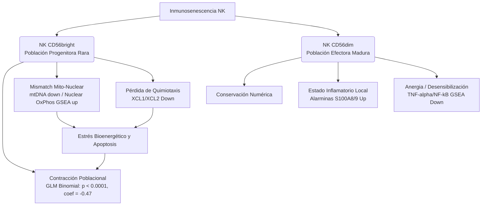

# 🧬 Integración de Subtipos NK y Abundancia Diferencial

Esta nota consolida el mapa conceptual de inmunosenescencia en células NK, sintetizando la dinámica de subpoblaciones (`CD56dim` y `CD56bright`), los resultados de abundancia poblacional y el valor de la estratificación molecular unicelular frente al pooling global.

---

## 🗺️ 1. Mapa Conceptual Consolidado

El envejecimiento de las células NK no es un proceso lineal homogéneo. Consiste en una reestructuración de la composición poblacional y perfiles metabólicos divergentes:

---

## ⚖️ 2. Comparación Metodológica de Abundancia

Para el análisis de la abundancia relativa de `CD56bright` vs `CD56dim` en envejecimiento ($N=187$ donantes), se compararon dos metodologías estadísticas:

### A. Test de Mann-Whitney U
*   **Enfoque:** Comparación directa del ratio individual `CD56bright/CD56dim` por donante.
*   **Resultado:** $p = 0.1674$ (No Significativo).
*   **Falla:** Sensible al *shot noise* técnico en poblaciones celulares minoritarias (donde pocas células introducen variaciones masivas en el ratio). No pondera por el conteo celular total ni corrige por lote.

### B. GLM Binomial
*   **Enfoque:** Modelado probabilístico de recuentos como ensayos binomiales corregido por lote de secuenciación (`assay`).
*   **Resultado:** $p < 0.0001$, Coeficiente de edad = $-0.4702$ (Altamente Significativo).
*   **Fuerza:** Mayor potencia estadística al ponderar la profundidad de lectura por donante y descontar el fuerte sesgo de captura de los assays (v1 coef = -0.96; v2 coef = -2.12). Revela una verdadera contracción de la población Bright.

---

##  paradox 3. La Paradoja de TNF-α/NF-κB y el Efecto Cancelación

### La Paradoja
El análisis funcional de **GSEA** muestra una represión significativa de la vía `TNF-alpha Signaling via NF-kB` en las células **CD56dim** y **Global** durante el envejecimiento. Sin embargo, las células **CD56dim** muestran una inducción extrema de los genes de alarminas `S100A8` y `S100A9` (LFC > 7.0), que son potentes inductores inflamatorios in vivo.

*   **Explicación:** **Enmascaramiento por Inflammaging**. La exposición crónica in vivo a citocinas sistémicas pro-inflamatorias en personas mayores genera una desensibilización del receptor de TNF y un bucle de retroalimentación negativa que bloquea la activación aguda transcripcional (NES negativo), mientras se mantiene una firma de estrés celular localizada (alarminas S100A8/9 up).

### El Efecto Cancelación
En el análisis **Global** (pool completo sin clasificar), la señal de represión de `TNF-alpha/NF-kB` de las CD56dim domina completamente. La firma de **activación** de esta misma vía en las células **CD56bright** senescentes (demostrada por scVI con NES positivo y FDR < 0.05) se **cancela** y oculta debido a que representan solo un 5-10% del total de eventos celulares. Esto demuestra que la transcriptómica global envejece "promediando" y ocultando la dinámica de poblaciones raras.

---

## 🚀 4. Ruta de Validación Bioinformática Futura

Para consolidar las hipótesis causales de esta tesis (apoptosis por mismatch metabólico y transición celular), se proponen tres tuberías analíticas complementarias:

### A. scVelo & CellRank (Inferencia de Destino)
*   **Propósito:** Validar si la pérdida de CD56bright se debe a una diferenciación acelerada o bloqueada.
*   **Método:** RNA Velocity basado en el ratio de intrones (no procesados) y exones (procesados) para modelar vectores de transición y pseudotiempo dinámico entre Bright $\rightarrow$ Dim en jóvenes vs viejos.

### B. Score de Apoptosis (AUCell / UCell)
*   **Propósito:** Confirmar si el mismatch mitocondrial induce apoptosis selectiva en CD56bright viejas.
*   **Método:** Cálculo de firmas génicas individuales a nivel unicelular basadas en la expresión de caspasas y mediadores de muerte celular programada.

### C. scFEA (Flujos Metabólicos)
*   **Propósito:** Reconstruir el balance de flujo metabólico mitocondrial a partir de la expresión coordinada de transportadores y enzimas de la cadena respiratoria.
