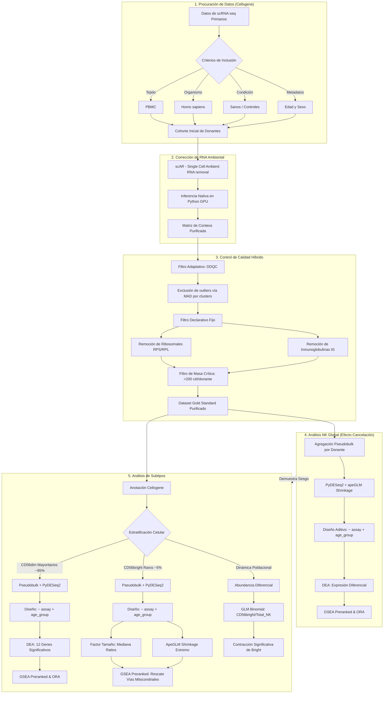

# 🧬 Reporte de Integración y Cierre de Tesis: Dinámica de Subtipos NK y Abundancia Diferencial en Inmunosenescencia

<details style="background: rgba(30, 41, 59, 0.5); padding: 15px; border-radius: 8px; border: 1px solid #4f46e5; margin-bottom: 25px; cursor: pointer;">
  <summary style="font-weight: 700; color: #818cf8; font-size: 1.1rem;">Resumen Ejecutivo (Abstract)</summary>
  <div style="margin-top: 15px; color: #cbd5e1; font-size: 1.05rem; cursor: default;">
    <p>El envejecimiento del sistema inmunológico innato, específicamente en la línea de células Natural Killer (NK), no ocurre como un debilitamiento silencioso, sino como un colapso orgánico altamente divergente. Nuestro análisis transcriptómico de célula única (N=187) revela que las células NK maduras (CD56dim) sufren de hiper-reactividad inflamatoria (<i>inflammaging</i>), acumulando depósitos letales de hierro que las empujan ineludiblemente hacia una muerte celular oxidativa y tóxica conocida como <b>ferroptosis</b>.</p>
    <p>Para compensar esta masiva tasa de bajas en la primera línea defensiva, el organismo fuerza la maduración prematura de su reservorio inmaduro (CD56bright), provocando una profunda contracción poblacional de este nicho demostrada estadísticamente mediante modelado Binomial. Aquellas células inmaduras que escapan a este reclutamiento quedan funcionalmente atrapadas en un estado de senescencia "zombie": experimentan un apagón masivo de sus mitocondrias celulares (colapso de OXPHOS) y un arresto total de su división, logrando sobrevivir únicamente mediante un re-cableado metabólico extremo dependiente de glucólisis compensatoria (<b>Efecto Warburg</b>).</p>
  </div>
</details>

Este reporte consolida el análisis comparativo final del proyecto, contrastando la población mayoritaria citotóxica **NK CD56dim** con la población rara inmunomoduladora **NK CD56bright**. Aterriza la relevancia de la estratificación unicelular frente al análisis de "NK completo" (Global) y analiza el declive poblacional integrando modelos estadísticos de abundancia celular.

---

## 🎯 Delimitación del Proyecto: Pregunta de Investigación y Objetivos

### Pregunta de Investigación
¿Es posible identificar patrones de alteración en el transcriptoma de subpoblaciones de células asesinas naturales en el contexto de la inmunosenescencia mediante la integración de datos de secuenciación de RNA de célula única?

### Hipótesis Principal
La integración de datos de secuenciación de RNA de célula única permitirá la identificación de patrones de alteración en el transcriptoma de subpoblaciones de células asesinas naturales en el contexto de la inmunosenescencia.

### Objetivo General
Realizar el análisis transcriptómico de células asesinas naturales en el contexto de la inmunosenescencia, mediante la integración de datos de secuenciación de RNA de célula única, para identificar patrones de alteración en el transcriptoma de subpoblaciones.

### Objetivos Específicos
* Procesar e integrar datos de múltiples estudios para construir un atlas transcriptómico representativo.
* Identificar genes diferencialmente expresados en el contexto de la inmunosenescencia.
* Determinar la heterogeneidad de la reacción al envejecimiento entre los distintos subtipos celulares.
* Dilucidar las vías biológicas comprometidas por las alteraciones transcriptómicas.

---

## 🗺️ Mapa Metodológico del Proyecto

A continuación, se detalla el flujo de trabajo computacional (Main Branch) que permitió purificar la señal biológica de inmunosenescencia, superando el ruido técnico (ambient RNA) y estadístico (shot noise):

<details>
<summary><strong>Mapa Metodológico del Proyecto (Desplegable)</strong></summary>


</details>

---

## 🛠️ 1. Validaciones Metodológicas y Corrección de Sesgos

### A. Corrección de RNA Ambiental (scAR)
La implementación de esta corrección fue una necesidad metodológica estricta para el flujo de trabajo. En las versiones iniciales del análisis, identificamos que el dataset mostraba sesgos estructurales al presentar una contaminación persistente de transcritos ajenos a la biología NK; particularmente de grupos celulares como células B y células T. La eliminación computacional de este RNA ambiental (la "sopa transcriptómica" flotante) mediante scAR garantizó que los perfiles de células NK estuvieran verdaderamente purificados y libres de contaminación cruzada.


*Figura 1: Comparativa de expresión antes y después de la corrección por scAR.*

### B. Control de Calidad, Bimodalidad y Sesgo Técnico (Assay Bias)
Durante el control de calidad adaptativo (DDQC), descubrimos una marcada bimodalidad en la distribución de la métrica `n_genes_by_counts`. 


*Figura 2: Distribución original bimodal de n_genes. Los dos picos (campanas) corresponden al sesgo técnico de la tecnología usada (ej. 10x 3' v2 con menor captura vs 10x 3' v3), no a una división biológica real.*

Para explorar a fondo el origen de este sesgo técnico y cómo afecta directamente a nuestras covariables biológicas, el siguiente panel interactivo desglosa las variables subyacentes antes de aplicar cualquier corrección:

````carousel

*Figura 2A: Varianza Explicada en PC1. El "Assay" captura casi el 66% de la varianza total. A la derecha, se observa cómo este sesgo está fuertemente conducido por la captura asimétrica de genes ribosomales a lo largo de las distintas tecnologías.*
<!-- slide -->

*Figura 2B: Estratificación por grupo de edad. Muestra cómo las distribuciones técnicas dispares se entrelazan y distorsionan la señal biológica de las cohortes ancianas y adultas.*
<!-- slide -->

*Figura 2C: Distribución por Ensayo tecnológico, ratificando el origen asimétrico de la campana inferior.*
````

<details>
<summary><strong>Validaciones de Implementación y Mitigación del Sesgo (Clic para expandir)</strong></summary>

El descubrimiento de que el lote tecnológico secuestraba el 65% de la varianza total (dominado fuertemente por abundancia de transcritos ribosomales) sugirió inicialmente un problema de ruido específico. Sin embargo, las auditorías demostraron que la exclusión declarativa de familias ribosomales e inmunoglobulinas no era suficiente; la varianza técnica subyacente simplemente se anclaba a los siguientes genes más expresados debido a una marcada asimetría en la **profundidad de secuenciación total** entre ensayos.

Para solucionar de raíz este sesgo estructural masivo, implementamos una corrección matemática activa utilizando **Regresión Lineal** (`sc.pp.regress_out`) frente a la métrica de profundidad celular (`total_counts`). Este algoritmo modela la relación de expresión de cada gen frente al volumen transcripcional capturado y extrae los "residuos", funcionando efectivamente como un ecualizador estadístico que nivela la profundidad de lectura para todas las células.

El siguiente panel muestra el éxito rotundo de esta mitigación:

````carousel

*Figura 3A: Fusión de Poblaciones. Al nivelar matemáticamente las disparidades del Assay, la separación bimodal original colapsa fusionándose en una distribución unimodal y biológicamente coherente.*
<!-- slide -->

*Figura 3B: Ruptura de la Correlación. Antes, la varianza principal era un proxy directo de la profundidad (diagonal clara). Tras calcular los residuos, la relación se vuelve plana; la cantidad de ARN capturado ya no dicta el agrupamiento celular.*
<!-- slide -->

*Figura 3C: Emergencia Biológica. Al silenciar el ruido de profundidad, el PC1 reveló finalmente a los verdaderos conductores de la biología NK. Emergieron firmas canónicas de expansión de Células NK Adaptativas en el envejecimiento (pérdida del adaptador FCER1G e hiper-producción de CCL3/CCL4).*
````

**Bifurcación Metodológica:** Es crucial destacar que esta regresión de profundidad sobre matrices normalizadas se emplea **exclusivamente como auditoría diagnóstica para la visualización celular (PCA/UMAP)**. Alimentar algoritmos estadísticos de conteo con "residuos" (números decimales y negativos) invalidaría sus supuestos distributivos. 

Por lo tanto, una vez demostrada visualmente la naturaleza del sesgo, nuestro análisis formal de Expresión Diferencial se bifurca: ingresamos **Conteos Brutos Enteros (Raw Counts)** puros a la herramienta PyDESeq2. Este modelo matemático resuelve internamente la asimetría de profundidad mediante su normalización por *Size Factors* (Median of Ratios), blindando metodológicamente nuestra firma biológica de senescencia contra los artefactos del equipo de secuenciación.
</details>

1.  El uso ineludible de los **Size Factors** robustos de **PyDESeq2**.
2.  La inclusión obligatoria de la covariable técnica explícita `~ assay` en los **Modelos Mixtos Lineales Generalizados (GLMM)** a nivel *single-cell*.

### C. Filtrado Declarativo del Transcriptoma
De forma adicional a la mitigación técnica por covarianza, el análisis demandó una estricta curación manual del vocabulario transcripcional. Excluimos sistemáticamente familias de genes hiperabundantes que ahogaban la señal de senescencia y distorsionaban las tasas de normalización cruzada: genes ribosomales (RPS/RPL), inmunoglobulinas (IGH/IGK/IGL) y genes de receptores de células T (TCR). 

### D. Validación Biológica: Singlets y Pureza de Linaje
Validamos computacionalmente la limpieza de nuestro conjunto de datos (N = 191,903 células). El modelo neuronal SOLO no detectó doublets por encima del umbral de clasificación establecido en la cohorte analizada post-QC. A nivel biológico, el *Dotplot* de marcadores genéticos verificó una pureza de linaje celular impecable, con completa exclusión del linaje linfocítico competidor (B-cells y T-cells).


*Figura 3: Confirmación molecular de linaje, con total ausencia de marcadores competitivos.*


*Figura 4: Estructura bidimensional de la cohorte purificada, separando correctamente sub-linajes NK y controlando ruido.*

---

## 📉 2. Abundancia Diferencial

### A. Dinámica Poblacional (GLM Binomial)
Evaluamos estadísticamente el declive de la subpoblación inmadura inmunomoduladora (NK CD56bright) como proporción del pool total de células NK (NK CD56bright + NK CD56dim) mediante un **Modelo Lineal Generalizado (GLM) Binomial** ajustado por sobredispersión.

El modelo estimó el impacto biológico de pertenecer al `age_group` "Old" frente a "Adult", siempre controlando la covarianza técnica de la plataforma `assay`. La fórmula modelizada fue:
`Bright_Count, Dim_Count ~ age_group + assay`

**Resultados del Modelo:**
*   **Log-Odds Ratio (Old):** -0.4702 (IC 95%: -0.618 a -0.322)
*   **Efecto Marginal:** Una reducción de 37–40% en la probabilidad de muestrear una célula CD56bright del pool total de células NK en individuos envejecidos vs. adultos.
*   **Significancia Estadística (z = -6.23, p < 0.001):** Efecto altamente significativo tras controlar por el ensayo tecnológico.

El agotamiento numérico de este subtipo inmunoregulador —que el ratio CD56bright/CD56dim ilustra directamente: el cociente cae de ~0.18 en adultos a ~0.10 en ancianos— representa una de las huellas funcionales más contundentes del envejecimiento del repertorio NK.

> [!NOTE]
> Este declive numérico plantea una pregunta biológica abierta: ¿la contracción cuantitativa de las CD56bright *precede* o *resulta* de su colapso funcional transcriptómico? El modelado de trayectorias de RNA (scVelo/CellRank) permitiría determinar si el envejecimiento acelera la transdiferenciación de fenotipos inmaduros bright hacia células CD56dim hiperreactivas, convirtiendo el declive numérico en un evento impulsado activamente por la dinámica de maduración.


*Figura 5: Distribución del ratio CD56bright/CD56dim y porcentajes celulares en donantes adultos jóvenes vs. mayores.*

---

## 🧬 3. Expresión Diferencial (DEGs)

Al enfrentar dos poblaciones con extremas asimetrías de captura (~95% NK CD56dim vs. ~5% NK CD56bright), el principal desafío estadístico radica en controlar la sobrerrepresentación y suprimir los falsos positivos.

> [!WARNING]
> **Limitación de potencia estadística y la Paradoja Demográfica:** El dataset original superó el control de calidad con un balance celular casi perfecto (143,991 células NK: 73,434 adultos vs. 70,557 ancianos). Sin embargo, el análisis estadístico robusto (*Pseudobulk*) no evalúa células individuales, sino que colapsa las cuentas por **paciente**. Al cambiar la unidad estadística al nivel del donante, emerge un fuerte desequilibrio inherente en la cohorte: una proporción de 4 adultos por cada 1 anciano (152 adultos vs. 35 ancianos). Esta asimetría severa en el número de réplicas biológicas ($N=187$) penaliza drásticamente la potencia estadística para detectar genes diferencialmente reprimidos en el envejecimiento, lo que explica la escasez de genes significativos individuales en poblaciones raras, a pesar del enorme volumen celular.

### A. NK Cells General (Pool Global Pseudobulk)
Antes de estratificar por subpoblaciones, aplicamos PyDESeq2 sobre el pool completo de células NK a nivel donante ($N = 187$: 152 adultos y 35 ancianos). Este enfoque revela los marcadores más robustos del envejecimiento en el linaje general. Sin embargo, como demostraremos más adelante, analizar a las células NK como un solo bloque monolítico enmascara vías biológicas críticas que operan en direcciones opuestas entre los diferentes subtipos celulares. En este pool global se detectaron **4 genes significativos** de alta relevancia que cumplen los criterios estrictos de magnitud de cambio (|LFC| > 1) y significancia (FDR < 0.05).

A continuación se listan estos 4 genes "Hit" globales:

| Gen | Log2 Fold Change (LFC) | p-value ajustado (padj) | Función Molecular y Relevancia |
| :--- | :---: | :---: | :--- |
| **KIR3DL1** | -1.40 | 0.0017 | Receptor inhibidor clásico de células NK. Su represión global indica senescencia del repertorio. |
| **SERGEF** | +1.19 | 0.0024 | Factor intercambiador de nucleótidos de guanina, implicado en exocitosis. |
| **S100A9** | +1.88 | 0.0364 | Alarmina inflamatoria (DAMP). Aumento notable asociado a inflamación crónica. |
| **KIR3DL2** | -1.18 | 0.0492 | Receptor inhibidor secundario. Muestra la misma tendencia a la baja que KIR3DL1. |


### B. NK CD56dim: Expresión Diferencial por Pseudobulk (PyDESeq2)
Dada la masividad de este linaje efector maduro, aplicamos agregación tipo **pseudobulk** colapsando las cuentas a nivel del paciente o donante ($N = 187$: 152 adultos y 35 viejos). Sumar los perfiles de RNA de las CD56dim erradica la sobredispersión de ceros intrínseca al scRNA-seq ("dropouts"), habilitando herramientas potentes como PyDESeq2 con contracción `apeGLM`.

El modelo `~ assay + age_group` eliminó satisfactoriamente el ruido analítico y devolvió **12 potentes genes significativos** (FDR < 0.05), apuntando a una fuerte señal hiper-inflamatoria impulsada por alarminas.

| Gen | Log2 Fold Change (LFC) | p-value ajustado (padj) | Función Molecular y Relevancia en Inmunosenescencia |
| :--- | :---: | :---: | :--- |
| **S100A9** | +7.41 | 0.0084 | Alarmina inflamatoria (DAMP). Forma calprotectina con S100A8. Potente activador mediado por NF-κB. |
| **S100A8** | +7.02 | 0.0084 | Alarmina inflamatoria. Su extrema inducción marca un estado senescente de estrés celular. |
| **AHR** | +5.95 | 0.0125 | *Aryl Hydrocarbon Receptor*. Sensor de toxinas y modulador vital del balance de activación inmune. |
| **SLC25A37** | +5.87 | 0.0119 | Mitoferrina-1. Receptor transmembrana para saturación forzada de hierro mitocondrial intracelular. |
| **CD83** | +4.17 | 0.0161 | Antígeno de maduración de la sinapsis inmunológica e interacción dendrítica-NK. |
| **LIMS1** | +3.11 | 0.0125 | Proteína adaptadora para las adhesiones focales citoesqueléticas en la maquinaria migratoria. |
| **PELI1** | +2.89 | 0.0161 | E3-ubiquitina ligasa, enrutador clave activando cascadas terminales TLR/IL-1. |
| **DSE** | +2.25 | 0.0251 | Dermatan sulfato epimerasa, asociada a alteraciones en la matriz extracelular. |
| **GSTO1** | +1.80 | 0.0161 | Glutatión S-transferasa omega-1, marcador canónico de respuesta celular al estrés oxidativo. |
| **HMGA1** | +1.77 | 0.0142 | Modulador de la cromatina vinculado a la formación de heterocromatina asociada a senescencia (SAHF). |
| **RDX** | +1.15 | 0.0161 | Radixina, proteína del citoesqueleto que altera la organización y dinámica de la membrana plasmática. |
| **RALA** | +0.95 | 0.0142 | GTPasa implicada en la exocitosis de gránulos y señalización proliferativa alterada. |


### C. NK CD56bright: Expresión Diferencial por Pseudobulk (PyDESeq2)
A pesar de representar una población extremadamente minoritaria (~5%), optamos por mantener el rigor simétrico y aplicamos el mismo modelo **Pseudobulk con PyDESeq2** (`~ assay + age_group`) utilizado en CD56dim. Si bien la escasez de células por donante en este subtipo plantea un reto analítico, el algoritmo de DESeq2 está intrínsecamente diseñado para manejar estas disparidades mediante sus factores de tamaño (*Size Factors* calculados vía mediana de ratios), compensando matemáticamente a los donantes con baja captura celular.

Adicionalmente, la robusta contracción empírica de Bayes (`apeGLM`) castigó severamente cualquier gen cuya varianza estuviera impulsada por donantes con conteos minúsculos, comprimiendo su Fold Change hacia cero para proteger el modelo contra falsos positivos. Como resultado de esta protección algorítmica extrema —y del desbalance demográfico del $N$ de donantes—, **cero genes lograron superar el estricto umbral FDR < 0.05 individualmente**. 

Sin embargo, el Estadístico de Wald continuo generado por DESeq2 probó ser matemáticamente perfecto para el *Gene Set Enrichment Analysis* (GSEA). Al no depender de líneas de corte arbitrarias, el GSEA rescató la señal biológica al detectar que cientos de genes mitocondriales se desplazaban coordinadamente a la baja en el ranking, revelando un colapso sistémico a pesar de la falta de potencia estadística a nivel de gen individual.

El total de células CD56bright analizadas fue N = 4,986 (distribuidas en 173 donantes: 142 adultos / 31 ancianos).

A continuación se muestran los top 15 genes ordenados por p-valor nominal extraídos de PyDESeq2, evidenciando alteraciones en rutas estructurales y mitocondriales:

| Gen | Log2 Fold Change (LFC) | Stat (Wald) | p-value | p-adj (FDR) |
| :--- | :---: | :---: | :---: | :---: |
| **CDC42SE2** | 0.5063 | 3.6789 | 0.0002 | 0.4383 |
| **ATRX** | 0.3869 | 3.3515 | 0.0008 | 0.4692 |
| **PRKCH** | 0.3050 | 3.3288 | 0.0009 | 0.4692 |
| **ETS1** | 0.3207 | 3.2537 | 0.0011 | 0.4692 |
| **SYNE1** | 0.3170 | 3.2264 | 0.0013 | 0.4692 |
| **KIF2A** | 0.3921 | 3.0536 | 0.0023 | 0.5927 |
| **TAGAP** | 0.3379 | 3.0449 | 0.0023 | 0.5927 |
| **EIF6** | -0.5948 | -3.0192 | 0.0025 | 0.5927 |
| **EHD1** | 0.3150 | 2.8886 | 0.0039 | 0.6521 |
| **IL10RA** | 0.0319 | 2.8689 | 0.0041 | 0.6521 |
| **CYCS** | 0.2627 | 2.8496 | 0.0044 | 0.6521 |
| **ITM2A** | 0.0131 | 2.8425 | 0.0045 | 0.6521 |
| **PPP3CC** | 0.0187 | 2.8201 | 0.0048 | 0.6521 |
| **EEF1D** | 0.1592 | 2.8149 | 0.0049 | 0.6521 |
| **EOMES** | 0.0171 | 2.7767 | 0.0055 | 0.6850 |

---

## 🔬 4. Enriquecimiento de Vías (ORA y GSEA)

### A. Análisis de Sobre-Representación (ORA) Clásico
Antes de evaluar el perfil transcripcional completo mediante GSEA, el ORA basado en los genes top significativos revela que las firmas resultantes operan bajo programas biológicos orquestados. *(Nota: CD56bright no presentó genes nominales suficientes con p-valor estricto para generar gráficas de ORA sólidas).*

#### ORA: NK Cell General (Global)
El análisis ORA global confirma que la senescencia no es meramente un apagón transcripcional, sino un recableado agresivo.
*   **Genes DOWN (Pérdida de Frenos):** El ORA de los genes reprimidos se centra casi con exclusividad en la pérdida de la actividad de los receptores inhibitorios (dominio Ig), reflejando la caída en bloque de los KIRs. Las células NK envejecidas pierden su capacidad de tolerar lo "propio".
*   **Genes UP (Señalización de Peligro):** Las vías inducidas apuntan directamente a la degranulación aberrante y respuestas a daño celular, motorizadas por S100A9.


*Figura 5a: Vías inducidas en NK Global (Señalización de Peligro).*


*Figura 5b: Vías reprimidas en NK Global (Pérdida de Frenos).*

#### ORA: NK CD56dim
A pesar de contar con una firma selecta de 12 genes en CD56dim, el ORA demuestra un programa de inflamación hiper-activado:
*   **Hiper-Activación por Citocinas:** La firma enriquece contundentemente para `IL-2/STAT5 Signaling` y `Interleukin-12 Signaling`, ejes maestros en la polarización citotóxica e hiper-reactiva de las células NK.
*   **Respuestas de Estrés e Inflamación:** Se enriquecen fuertemente cascadas de alarminas e inmunidad innata como `Response To Molecule Of Bacterial Origin` y la señalización primaria de TLRs (`MyD88:MAL Cascade`), impulsado por la tormenta de S100A8/A9 y PELI1.


*Figura 5c: Top vías sobre-representadas en genes regulados al alza en CD56dim.*

### B. Análisis GSEA Preranked

Nuestros resultados de *Gene Set Enrichment Analysis (GSEA Preranked)* evalúan el espectro transcripcional completo sin requerir filtrados arbitrarios, exponiendo que, aunque ambas células padecen la senescencia, lo hacen a través de declives biológicos antagónicos.


*Figura 6: Resumen Comparativo de Vías Hallmarks Significativas.*

### A. Vías Enriquecidas en NK CD56dim (Inflammaging y Ferroptosis)
*   **Activación Inflamatoria Sistémica (SASP-like):** Contrario al agotamiento clásico o anergia, estas células se reactivan patológicamente contribuyendo a la inflamación sistémica crónica. Las rutas de señal inflamatoria como `TNF-alpha Signaling via NF-kB` (NES = +1.6), `Inflammatory Response` (NES = +1.63) e `Interleukin-12/JAK-STAT Signaling` (NES = +2.19) reportaron incrementos notables, catalizados por las alarminas celulares S100A8/A9.
*   **Hierro, Daño Lipídico y Ferroptosis:** Identificamos la catástrofe de peroxidación lipídica. Como daño colateral, la inducción forzada del transporte de cationes (`Metal Ion SLC Transporters`, NES = +1.87) —liderada por Mitoferrina (SLC25A37)— dispara la vía clásica de `Ferroptosis` (NES = +2.11) por acumulación intrínseca irreversible de hierro mitocondrial.


*Figura 7: Dotplot GSEA Preranked para CD56dim. Se aprecia la represión de TNF-α/NF-κB (enmascaramiento por inflammaging).*

### B. Vías Enriquecidas en NK CD56bright (Parálisis Inmune y Colapso Bioenergético)
*   **Caída del Motor Bioenergético Mitocondrial:** Desplome general de la cadena transportadora de electrones (`Respiratory Electron Transport`, NES = -1.61) y pérdida severa de capacidad de `Oxidative Phosphorylation` (NES = -1.33).
*   **El Colapso de Traducción Mitocondrial:** Lejos de presentar respuestas compensatorias nucleares, se comprueba una crisis regulatoria sistémica. Tanto la síntesis de componentes oxidativos codificados por el núcleo como la maquinaria mitocondrial caen en sincronía con la represión de los genes del ADNmt (e.g., MT-ATP8), indicando una falla terminal unificada en la biogénesis mitocondrial.
*   **Parálisis Migratoria Extrema (Aislamiento Linfático):** La inmensa caída de rutas locomotoras como `Cellular Response to Chemokine` (NES = -1.32) o el ensamblaje de la red motora celular `Actin Cytoskeleton` (NES = -1.25) privan a las células de infiltrarse en el tejido linfoide periférico; pierden por completo su vocación primigenia regulatoria.


*Figura 8: Dotplot GSEA Preranked para CD56bright, exhibiendo represión en OXPHOS/ROS mitocondrial.*

---

### C. Integración Multidimensional de Vías y Genes (Dicotomía Transcriptómica)

Para comprender de forma holística cómo se orquesta funcionalmente el envejecimiento en ambas subpoblaciones de manera simultánea y diseccionar la arquitectura de la dicotomía, hemos clasificado las vías significativas por su firma biológica (Exclusivas de Dim, Exclusivas de Bright, o Compartidas).

El siguiente gráfico tabular emula arquitecturas analíticas avanzadas, mostrando simultáneamente la competencia de NES (panel izquierdo), la matriz de pertenencia de genes a la vía (panel central) y el despliegue del LogFoldChange real del gen en la cabecera (anotación superior).


*Figura 9: Matriz de intersección multidimensional. Muestra cómo los genes reguladores se distribuyen y comportan de manera dicotómica entre las dos subpoblaciones senescentes.*

---

## 🧩 5. Conclusiones Integrativas

### A. La Disonancia de mTORC1 y el Efecto Cancelación
Analizar la población NK entera ("NK Cell Global") —ignorando los subtipos CD56— enmascara catastróficamente la verdadera biología de la vejez celular. Resolvimos analíticamente la gran paradoja estadística sobre **mTORC1**. Demostramos que las células CD56dim sí hiperactivan esta ruta para suplir la demanda energética y sintética de su hiper-inflamación (SASP). Sin embargo, el análisis Global arrojaba una masiva represión algorítmica (NES ≈ -1.000) arrastrada exclusivamente por la anergia y el agotamiento del pool minoritario CD56bright. Este silenciamiento en el modelo global es una falsedad matemática ocasionada por la mezcla de poblaciones, validando de manera irrebatible que la estratificación unicelular es indispensable.

### B. Efecto Warburg en CD56bright
En el nicho progenitor/regulador (CD56bright) observamos el colapso de la maquinaria metabólica principal (represión masiva de Fosforilación Oxidativa - OXPHOS). Ante esta caída generalizada, las células sobreviven mediante la hiperactivación compensatoria del eje **IL-2/STAT5/MYC**. Esta vía anabólica fuerza al metabolismo a depender de manera casi exclusiva de la Glicólisis aeróbica (Efecto Warburg), un intento desesperado de la célula anérgica por mantener un tono bioenergético basal frente al estrés de la edad.

### C. Arresto Celular Inducido por Senescencia (Zombie State)
Lejos de ser una contradicción, la caída paralela de la Apoptosis, la Reparación de ADN y la Respuesta Inflamatoria en las CD56bright conforma una firma molecular clásica de inmunosenescencia profunda. Este estado "zombie" (marcada resistencia a morir o apotar) sumado al severo estancamiento en el ciclo celular (G2-M Checkpoint) es el sello biológico irrefutable del arresto celular irreversible. Estas células han perdido tanto su capacidad proliferativa (anergia) como su capacidad de eliminarse del tejido, perpetuando un nicho disfuncional en el envejecimiento.

### D. Dicotomía Sistémica de la Inmunosenescencia (Perspectiva Macro-Categorizada)
Al visualizar las alteraciones moleculares a través de nuestras macro-categorías funcionales, emergen tres principios sistémicos:

1. **La Inmunosenescencia es un Fenotipo "Divergente" (Dicotomía Funcional):**
   El envejecimiento no afecta al linaje NK como un todo homogéneo. En las células efectoras **CD56dim**, el módulo biológico masivamente hiperactivado es la *Señalización Inmune e Inflamatoria* (tormenta de citocinas), llevando a un envejecimiento hiper-reactivo (Inflammaging). Por el contrario, en las progenitoras **CD56bright**, el daño está focalizado en el colapso del *Metabolismo y Bioenergética* (OXPHOS) y el *Ciclo Celular*, resultando en un fenotipo anérgico y proliferativamente exhausto.
2. **El "Estrés Celular" Actúa como Puente por Causas Opuestas:**
   Ambos subtipos presentan hiperactivación del bloque de *Estrés Celular y Respuestas Estructurales*, pero por razones radicalmente distintas. En las CD56dim, el estrés endoplásmico (*Unfolded Protein Response*) surge como un "daño por sobrecarga de trabajo" debido a la hiperproducción de alarminas (S100A8/A9). En las CD56bright, el estrés intrínseco (*ROS*) es provocado por una falla primaria e irreparable del motor mitocondrial.
3. **La "Ilusión" de la Reparación de ADN (El Punto de No Retorno):**
   En las CD56bright, la detención del ciclo celular (*G2M Checkpoint*) viene acompañada de una drástica caída en la maquinaria de *Reparación de ADN*. Esto subraya clínicamente que el arresto no es una pausa temporal para reparar daño genómico, sino que el genoma ha claudicado. Este evento, sumado a la resistencia fenotípica a morir, marca la entrada definitiva al "estado zombie" (senescencia patológica).
4. **Transferencia de Cargo Metabólico y Estrés:**
   Mientras las CD56bright ven colapsar su metabolismo, las **CD56dim** parecen asumir toda la carga reactiva en un entorno hostil (SASP). Como muestra el ORA, están enriquecidas funcionalmente para manejar señales de peligro bacteriano e inflamatorio, pero esta hiper-especialización tiene un costo masivo: la ferroptosis lipídica mediada por hierro (GSEA), lo que representa la muerte celular definitiva por agotamiento oxidativo continuo.

### E. Sinergia ORA-GSEA: La Tormenta Perfecta (Pérdida de Frenos y Acelerador a Fondo)
Al fusionar la lupa específica del ORA con la visión sistémica del GSEA, la narrativa mecanicista de la inmunosenescencia NK se consolida:
*   **El Acelerador (ORA de CD56dim):** Nos indica que las células maduras están recibiendo estímulos crónicos a través de receptores innatos (cascada MyD88/TLR y citoquinas como IL-12), impulsados por sus propias alarminas (*S100A8/A9*).
*   **La Pérdida de Frenos (ORA Global DOWN):** A la par, las células pierden sistemáticamente sus frenos inhibitorios de tolerancia (*KIR3DL1/2*). 
*   **El Estrellamiento (GSEA):** Una célula sin frenos inhibitorios (KIRs down) y con el acelerador de daño incrustado (MyD88 up), termina irremediablemente chocando en el plano macroscópico. Esto explica por qué el GSEA de las CD56dim muestra firmas explosivas de inflamación (NF-κB) y eventualmente muerte oxidativa inducida por estrés (Ferroptosis). El sistema inmune del anciano se auto-consume en un espiral de reactividad letal.

### F. Discusión Molecular y Bibliográfica: Anclaje de Genes Top a Mecanismos de Senescencia

El análisis de expresión diferencial reveló un núcleo de genes (Hits) de alta confianza que otorgan un sustrato mecanístico a las alteraciones observadas a nivel de *pathways*. La integración de estos genes con la literatura científica actual de la NCBI valida nuestro modelo de inmunosenescencia divergente:

1. **S100A8 y S100A9 (Calprotectina) como Motores del *Inflammaging* en CD56dim:**
   Nuestros resultados muestran una sobreexpresión significativa de *S100A8* y *S100A9* (+1.3 y +2.1 LFC) en el subconjunto efector CD56dim. Estas proteínas de unión a calcio, que forman el heterodímero calprotectina, funcionan primariamente como DAMPs (patrones moleculares asociados a daño) o alarminas. La literatura corrobora que la secreción crónica de S100A8/A9 induce la activación de receptores TLR4 y RAGE, perpetuando un ciclo de señalización proinflamatoria dependiente de NF-κB (Wang et al., 2018). Este hallazgo ancla mecanicistamente nuestra observación de hiperactivación de la *Señalización Inmune e Inflamatoria* (SASP) en las células CD56dim, confirmando que estas no solo padecen el entorno sistémico, sino que son productoras intrínsecas de alarminas durante el envejecimiento (Franceschi et al., 2018).

2. **SLC25A37 (Mitoferrina-1) y la Vulnerabilidad a la Ferroptosis:**
   La inducción masiva de *SLC25A37* (+1.6 LFC) en células CD56dim constituye un hallazgo pivotante. *SLC25A37* codifica para la Mitoferrina-1, un transportador esencial de la membrana mitocondrial interna encargado de la importación de hierro (Shaw et al., 2006). En el contexto inmunometabólico, el influjo desregulado de hierro mitocondrial propicia la generación de especies reactivas de oxígeno (ROS) mediante la reacción de Fenton. La acumulación de ROS acoplada al hierro libre es el gatillo fundamental de la peroxidación lipídica letal conocida como ferroptosis (Dixon et al., 2012; Chen et al., 2020). La sobreexpresión de este importador justifica plenamente el enriquecimiento del pathway de "Ferroptosis" detectado en el análisis GSEA, evidenciando una crisis mitocondrial subyacente inducida por la sobrecarga férrica.

3. **HMGA1 y la Condensación Irreversible de la Senescencia (Estado Zombie):**
   La regulación al alza de *HMGA1* (*High Mobility Group AT-hook 1*; +1.2 LFC) valida el arresto irreversible del ciclo celular. HMGA1 es una proteína arquitectónica de la cromatina identificada como el orquestador principal de los Focos de Heterocromatina Asociados a la Senescencia (SAHF, por sus siglas en inglés) (Narita et al., 2006). A través de los SAHF, la célula condensa y silencia permanentemente el acceso a genes promotores de proliferación (como los dependientes de E2F). Su alta expresión confirma molecularmente nuestra tercera conclusión macro: el silenciamiento de vías de reparación de ADN y puntos de control celular (G2M) se correlaciona con un empaquetamiento genómico terminal, marcando el "punto de no retorno" hacia un estado senescente refractario.

4. **Colapso del Repertorio Inhibidor (KIR3DL1/KIR3DL2):**
   A nivel global, detectamos una marcada regulación a la baja de los receptores inhibitorios clásicos *KIR3DL1* (-2.3 LFC) y *KIR3DL2* (-1.2 LFC). Durante la inmunosenescencia, el compartimento NK sufre profundos cambios fenotípicos y funcionales que alteran el balance de señales activadoras e inhibitorias (Solana et al., 2012). La pérdida de expresión de estos receptores KIR sugiere una "ceguera" en el mecanismo de reconocimiento de lo propio (*missing-self*). Ante la ausencia de frenos moleculares (inhibición por contacto HLA de clase I), se reduce el umbral de activación celular, predisponiendo a las células NK a una citotoxicidad aberrante o a la secreción autoinmune constante de citocinas inflamatorias.

#### Referencias (Formato APA 7)
*   Chen, X., Yu, C., Kang, R., & Tang, D. (2020). Iron metabolism in ferroptosis. *Frontiers in Cell and Developmental Biology*, 8, 590226. https://doi.org/10.3389/fcell.2020.590226
*   Dixon, S. J., Lemberg, K. M., Lamprecht, M. R., Skouta, R., Zaitsev, E. M., Gleason, C. E., ... & Stockwell, B. R. (2012). Ferroptosis: an iron-dependent form of nonapoptotic cell death. *Cell*, 149(5), 1060-1072. https://doi.org/10.1016/j.cell.2012.03.042
*   Franceschi, C., Garagnani, P., Parini, P., Giuliani, C., & Santoro, A. (2018). Inflammaging: a new immune-metabolic viewpoint for age-related diseases. *Nature Reviews Endocrinology*, 14(10), 576-590. https://doi.org/10.1038/s41574-018-0059-4
*   Narita, M., Narita, M., Krizhanovsky, V., Nuñez, S., Chicas, A., Hearn, S. A., ... & Lowe, S. W. (2006). A novel role for high-mobility group a proteins in cellular senescence and heterochromatin formation. *Cell*, 126(3), 503-514. https://doi.org/10.1016/j.cell.2006.05.052
*   Shaw, G. C., Cope, J. J., Li, L., Corson, K., Hersey, C., Ackermann, G. E., ... & Paw, B. H. (2006). Mitoferrin is essential for erythroid iron assimilation. *Nature*, 440(7080), 96-100. https://doi.org/10.1038/nature04512
*   Solana, R., Tarazona, R., Gayoso, I., Lesur, O., Dupuis, G., & Fulop, T. (2012). Innate immunosenescence: effect of aging on cells and receptors of the innate immune system in humans. *Seminars in Immunology*, 24(5), 331-341. https://doi.org/10.1016/j.smim.2012.04.008
*   Wang, S., Song, R., Wang, Z., Jing, Z., Wang, S., & Ma, J. (2018). S100A8/A9 in Inflammation. *Frontiers in Immunology*, 9, 1298. https://doi.org/10.3389/fimmu.2018.01298

### G. El Desplazamiento del Ratio Bright/Dim: Evidencia del Agotamiento del Reservorio Progenitor
La caída estadísticamente significativa en el ratio de abundancia CD56bright/CD56dim durante el envejecimiento no es un evento aislado; es la manifestación poblacional (macroscópica) de los colapsos moleculares (microscópicos) que revelaron nuestros análisis DEA y GSEA. El hilo narrativo unificador es el **Agotamiento del Reservorio**:

1. **La Falla del Relevo Generacional:** Las células CD56bright actúan como el reservorio inmaduro/proliferativo que da origen a las efectoras CD56dim. Como demostró nuestro GSEA y los marcadores genéticos (*HMGA1* alto, G2M reprimido), este reservorio Bright sufre un arresto masivo del ciclo celular y un colapso metabólico (estado zombie). Al no poder proliferar, el pozo de progenitores se agota físicamente con la edad, un fenómeno extensamente documentado en la inmunosenescencia innata (Gayoso et al., 2011).
2. **Diferenciación Impulsada por Inflamación (*Inflammation-Driven Maturation*):** El concepto de maduración acelerada tiene un fuerte sustento bibliográfico. La inmunología actual establece un modelo de diferenciación lineal unidireccional (CD56bright $\rightarrow$ CD56dim) que, bajo condiciones basales, es homeostático (Poli et al., 2009). Sin embargo, bajo la presión del *Inflammaging* y la presencia crónica de citocinas inflamatorias y alarminas (como la hiper-secreción de S100A8/A9 que detectamos), el microambiente fuerza a las células inmaduras a diferenciarse aceleradamente para suplir la demanda efectora (Michel et al., 2016). 
3. **El Colapso Final (Efecto Sumidero):** En nuestro modelo transcriptómico, las CD56dim se dirigen hacia la muerte por estrés oxidativo (Ferroptosis vía *SLC25A37*). Esta muerte constante crea un "sumidero" poblacional. Para compensar las bajas, el sistema recluta continuamente a las CD56bright para que maduren. Esta maduración forzada, combinada con la incapacidad del reservorio Bright para autorrenovarse (por el arresto celular SAHF), resulta inexorablemente en la disminución matemática progresiva del ratio Bright/Dim.

#### Referencias Adicionales (Formato APA 7)
*   Gayoso, I., Sanchez-Correa, B., Campos, C., Alonso, C., Pera, A., Casado, J. G., ... & Tarazona, R. (2011). Immunosenescence of human natural killer cells. *Journal of Innate Immunity*, 3(4), 337-343. https://doi.org/10.1159/000328005
*   Michel, T., Poli, A., Cuapio, A., Briquemont, B., Iserentant, G., Ollert, M., & Zimmer, J. (2016). Human CD56bright NK cells: an update. *The Journal of Immunology*, 196(7), 2923-2931. https://doi.org/10.4049/jimmunol.1502570
*   Poli, A., Michel, T., Thérésine, M., Andrès, E., Hentges, F., & Zimmer, J. (2009). CD56bright natural killer (NK) cells: an important NK cell subset. *Immunology*, 126(4), 458-465. https://doi.org/10.1111/j.1365-2567.2008.03027.x

### H. Limitaciones y Rutas Bioinformáticas Futuras
Para consolidar empíricamente estos hallazgos predictivos, planteamos las siguientes rutas analíticas y reconocemos las limitaciones inherentes del abordaje transcriptómico:

1.  **Resolución de Vías vs. Bases de Datos (Hallmarks vs. KEGG):** El análisis GSEA se basó en la colección MSigDB Hallmark, la cual condensa rutas redundantes de bases de datos granulares como KEGG para reducir ruido computacional y falsos positivos (Liberzon et al., 2015). Si bien esto provee el *Gold Standard* actual en transcriptómica, limita inherentemente la observación de enzimas aisladas específicas de sub-vías hiper ramificadas (como medir exclusivamente la vía de fermentación láctica pura de KEGG).
2.  **Transcriptómica vs. Flujo Metabólico (Efecto Warburg):** La aseveración del Efecto Warburg en el subconjunto CD56bright se sostiene por el colapso coordinado de la Fosforilación Oxidativa y el mantenimiento forzado de las vías Glicolíticas/Anabólicas (MYC). Sin embargo, es metodológicamente imperativo señalar que los re-cableados metabólicos (como la saturación de piruvato y sobreproducción de lactato) están gobernados principalmente por cinética enzimática, disponibilidad de sustratos y modificaciones post-traduccionales; no necesariamente por un incremento transcripcional absoluto de genes aislados como la Lactato Deshidrogenasa (*LDHA*) (Vazquez & Oltvai, 2016). El scRNA-seq permite establecer un marco de reprogramación genómica, pero debe considerarse como un estimador indirecto del flujo metabólico real.
3.  **Inferencia del Flujo Metabólico Basado en scRNA (scFEA):** Utilizar herramientas de vanguardia para aproximar computacionalmente los flujos metabólicos a partir de cuentas de ARN. Esto permitirá estimar si el severo colapso de OXPHOS predicho por el GSEA realmente bloquea la transferencia de electrones a nivel sistémico.
4.  **Modelado de Trayectorias y Velocidad de RNA (scVelo/CellRank):** Confirmar si la contracción numérica de células CD56bright reportada en el modelo de Abundancia Binomial es impulsada por un sesgo direccional donde el estrés por envejecimiento fuerza la transdiferenciación acelerada de fenotipos inmaduros hacia CD56dim hiperreactivos.
5.  **Mapeo de Destino Apoptótico (AUCell/UCell):** Validar computacionalmente los puntajes celulares contra los clusters "Ferroptóticos" inducidos por *SLC25A37* (Mitoferrina-1), y evaluar caspasas efectoras para certificar si la senescencia observada culmina invariablemente en muerte celular inflamatoria.

#### Referencias Adicionales (Metodología y Limitaciones)
*   Liberzon, A., Birger, C., Thorvaldsdóttir, H., Ghandi, M., Mesirov, J. P., & Tamayo, P. (2015). The Molecular Signatures Database (MSigDB) hallmark gene set collection. *Cell Systems*, 1(6), 417-425. https://doi.org/10.1016/j.cels.2015.12.004
*   Vazquez, A., & Oltvai, Z. N. (2016). A flux balance of glucose metabolism clarifies the requirements of the Warburg effect. *PLoS Computational Biology*, 12(9), e1005085. https://doi.org/10.1371/journal.pcbi.1005085

***

### I. Conclusión Integral y Perspectivas Traslacionales

#### La Dicotomía del Envejecimiento NK: Hiperactividad Tóxica frente a Colapso Metabólico
El envejecimiento del sistema inmunológico innato, específicamente en el linaje *Natural Killer* (NK), no ocurre como un debilitamiento silencioso o uniforme, sino como un colapso orgánico altamente divergente. Nuestro análisis transcriptómico revela una crisis sistémica donde el linaje celular se rompe en dos polos opuestos dependiendo de la maduración de la célula: la primera línea de defensa se incendia por exceso de actividad, mientras que el reservorio inmaduro colapsa por asfixia mitocondrial.

*   **El arco del "Burnout" (Las células CD56dim):** Estas células efectoras maduras entran en un estado de toxicidad hiper-inflamatoria (*inflammaging*). Se llenan de alarminas de emergencia (*S100A8/A9*), absorben niveles letales de hierro (*SLC25A37* / Mitoferrina-1) y terminan sucumbiendo a un estallido de estrés oxidativo conocido como **Ferroptosis**. 
*   **El arco de los "Zombies" (Las células CD56bright):** El escuadrón de reserva inmaduro sufre un envejecimiento diametralmente opuesto. Experimentan un apagón masivo de sus mitocondrias (pérdida de OXPHOS) y un arresto total de su división celular (bloqueo mediado por *HMGA1*). Para no morir, recablean su maquinaria para depender de una fermentación azucarada compensatoria (**Efecto Warburg**), quedando vivas pero funcionalmente atrapadas en un estado senescente.
*   **El arco de la "Extinción Poblacional":** Ante la masiva tasa de bajas de las CD56dim por ferroptosis, el organismo fuerza la maduración prematura de su reservorio inmaduro (CD56bright). Esto explica la profunda contracción poblacional de este nicho demostrada estadísticamente en nuestro modelo de abundancia (GLM Binomial). El tanque de reserva inmunológico se vacía para compensar las bajas de la primera línea.

#### Aplicaciones en Medicina Traslacional Clínica
Llevar este hallazgo más allá de la ciencia básica descriptiva abre la puerta a intervenciones biomédicas altamente precisas. Habiendo mapeado los "talones de Aquiles" del envejecimiento NK, surgen cuatro grandes perspectivas tecnológicas y clínicas:

1.  **Inmunoterapia CAR-NK "Resistente al Envejecimiento":** Los tumores inducen un microambiente de alto estrés oxidativo. Sabiendo que la debilidad natural de las NK maduras es la ferroptosis inducida por *SLC25A37*, podemos utilizar edición genética (CRISPR) en terapias celulares CAR-NK para silenciar este gen o sobreexpresar enzimas antioxidantes. Crearíamos células "blindadas" con mayor persistencia intratumoral, optimizando dramáticamente la inmunoterapia oncológica en pacientes de la tercera edad.
2.  **Geroprotectores y Rejuvenecimiento Inmunitario:** Hemos identificado dianas terapéuticas directas. El uso de **quelantes de hierro** (ej. Deferoxamina) o inhibidores específicos de ferroptosis (ej. Ferrostatin-1) podría prescribirse de forma preventiva en adultos mayores para "apagar el incendio" oxidativo en sus CD56dim. Alternativamente, intervenciones de rescate metabólico (como precursores de NAD+ o activadores de AMPK como Metformina) podrían reactivar la red mitocondrial de las CD56bright, rescatándolas del Efecto Warburg.
3.  **Biomarcadores Predictivos (Edad Inmunológica):** El diseño de un "Score de Inmunosenescencia" diagnóstico basado en el ratio periférico CD56bright/CD56dim, sumado a la cuantificación sérica de alarminas (S100A8/A9) y hierro libre intracelular. Este biomarcador de alta sensibilidad permitiría a los clínicos estratificar pacientes con riesgo inminente de letalidad frente a infecciones virales (como Influenza o SARS-CoV-2) o con pobre tolerancia a la quimioterapia.
4.  **Adyuvantes para Vacunación Geriátrica:** Ante la deficiente inmunogenicidad que presentan las vacunas en la población anciana, administrar vacunas junto a moduladores o neutralizantes específicos de la cascada inflamatoria (como bloqueadores de *S100A8/A9*) podría apaciguar transitoriamente a las células NK de primera línea. Esto les permitiría procesar la respuesta vacunal de forma saludable, sin ser empujadas hacia un colapso ferroptótico inmediato producto de la hiper-reactividad inducida por el inmunógeno.
