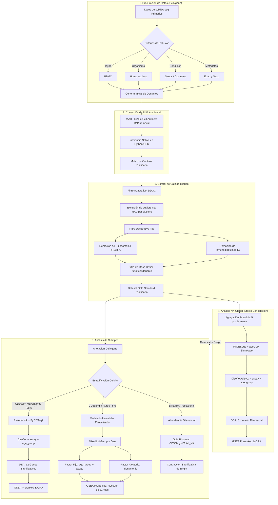

# 🧬 Reporte de Integración y Cierre de Tesis: Dinámica de Subtipos NK y Abundancia Diferencial en Inmunosenescencia

Este reporte consolida el análisis comparativo final del proyecto, contrastando la población mayoritaria citotóxica **NK CD56dim** con la población rara inmunomoduladora **NK CD56bright**. Aterriza la relevancia de la estratificación unicelular frente al análisis de "NK completo" (Global) y analiza el declive poblacional integrando modelos estadísticos de abundancia celular.

---

## 🎯 Delimitación del Proyecto: Pregunta de Investigación y Objetivos

### Pregunta de Investigación
¿Es posible identificar patrones de alteración en el transcriptoma de subpoblaciones de células asesinas naturales en el contexto de la inmunosenescencia mediante la integración de datos de secuenciación de RNA de célula única?

### Hipótesis Principal
La integración de datos de secuenciación de RNA de célula única permitirá la identificación de patrones de alteración en el transcriptoma de subpoblaciones de células asesinas naturales en el contexto de la inmunosenescencia.

### Objetivo General
Realizar el análisis transcriptómico de células asesinas naturales en el contexto de la inmunosenescencia, mediante la integración de datos de secuenciación de RNA de célula única, para identificar patrones de alteración en el transcriptoma de subpoblaciones.

### Objetivos Específicos
* Procesar e integrar datos de múltiples estudios para construir un atlas transcriptómico representativo.
* Identificar genes diferencialmente expresados en el contexto de la inmunosenescencia.
* Determinar la heterogeneidad de la reacción al envejecimiento entre los distintos subtipos celulares.
* Dilucidar las vías biológicas comprometidas por las alteraciones transcriptómicas.

---

## 🗺️ Mapa Metodológico del Proyecto

A continuación, se detalla el flujo de trabajo computacional (Main Branch) que permitió purificar la señal biológica de inmunosenescencia, superando el ruido técnico (ambient RNA) y estadístico (shot noise):



---

## 🛠️ 1. Validaciones Metodológicas y Corrección de Sesgos

### A. Corrección de RNA Ambiental (scAR)
La implementación de esta corrección fue una necesidad metodológica estricta para el flujo de trabajo. En las versiones iniciales del análisis, identificamos que el dataset mostraba sesgos estructurales al presentar una contaminación persistente de transcritos ajenos a la biología NK; particularmente de grupos celulares como células B y células T. La eliminación computacional de este RNA ambiental (la "sopa transcriptómica" flotante) mediante scAR garantizó que los perfiles de células NK estuvieran verdaderamente purificados y libres de contaminación cruzada.


*Figura 1: Comparativa de expresión antes y después de la corrección por scAR.*

### B. Control de Calidad, Bimodalidad y Sesgo Técnico (Assay Bias)
Durante el control de calidad adaptativo (DDQC), descubrimos una marcada bimodalidad en la distribución de la métrica `n_genes_by_counts`. 


*Figura 2: Distribución original bimodal de n_genes. Los dos picos (campanas) corresponden al sesgo técnico de la tecnología usada (ej. 10x 3' v2 con menor captura vs 10x 3' v3), no a una división biológica real.*

Para explorar a fondo el origen de este sesgo técnico y cómo afecta directamente a nuestras covariables biológicas, el siguiente panel interactivo desglosa las variables subyacentes antes de aplicar cualquier corrección:

````carousel

*Figura 2A: Varianza Explicada en PC1. El "Assay" captura casi el 66% de la varianza total. A la derecha, se observa cómo este sesgo está fuertemente conducido por la captura asimétrica de genes ribosomales a lo largo de las distintas tecnologías.*
<!-- slide -->

*Figura 2B: Estratificación por grupo de edad. Muestra cómo las distribuciones técnicas dispares se entrelazan y distorsionan la señal biológica de las cohortes ancianas y adultas.*
<!-- slide -->

*Figura 2C: Distribución por Ensayo tecnológico, ratificando el origen asimétrico de la campana inferior.*
````

<details>
<summary><strong>Validaciones de Implementación y Mitigación del Sesgo (Clic para expandir)</strong></summary>

El descubrimiento de que el lote tecnológico secuestraba el 65% de la varianza total (dominado fuertemente por abundancia de transcritos ribosomales) sugirió inicialmente un problema de ruido específico. Sin embargo, las auditorías demostraron que la exclusión declarativa de familias ribosomales e inmunoglobulinas no era suficiente; la varianza técnica subyacente simplemente se anclaba a los siguientes genes más expresados debido a una marcada asimetría en la **profundidad de secuenciación total** entre ensayos.

Para solucionar de raíz este sesgo estructural masivo, implementamos una corrección matemática activa utilizando **Regresión Lineal** (`sc.pp.regress_out`) frente a la métrica de profundidad celular (`total_counts`). Este algoritmo modela la relación de expresión de cada gen frente al volumen transcripcional capturado y extrae los "residuos", funcionando efectivamente como un ecualizador estadístico que nivela la profundidad de lectura para todas las células.

El siguiente panel muestra el éxito rotundo de esta mitigación:

````carousel

*Figura 3A: Fusión de Poblaciones. Al nivelar matemáticamente las disparidades del Assay, la separación bimodal original colapsa fusionándose en una distribución unimodal y biológicamente coherente.*
<!-- slide -->

*Figura 3B: Ruptura de la Correlación. Antes, la varianza principal era un proxy directo de la profundidad (diagonal clara). Tras calcular los residuos, la relación se vuelve plana; la cantidad de ARN capturado ya no dicta el agrupamiento celular.*
<!-- slide -->

*Figura 3C: Emergencia Biológica. Al silenciar el ruido de profundidad, el PC1 reveló finalmente a los verdaderos conductores de la biología NK. Emergieron firmas canónicas de expansión de Células NK Adaptativas en el envejecimiento (pérdida del adaptador FCER1G e hiper-producción de CCL3/CCL4).*
````

**Bifurcación Metodológica:** Es crucial destacar que esta regresión de profundidad sobre matrices normalizadas se emplea **exclusivamente como auditoría diagnóstica para la visualización celular (PCA/UMAP)**. Alimentar algoritmos estadísticos de conteo con "residuos" (números decimales y negativos) invalidaría sus supuestos distributivos. 

Por lo tanto, una vez demostrada visualmente la naturaleza del sesgo, nuestro análisis formal de Expresión Diferencial se bifurca: ingresamos **Conteos Brutos Enteros (Raw Counts)** puros a la herramienta PyDESeq2. Este modelo matemático resuelve internamente la asimetría de profundidad mediante su normalización por *Size Factors* (Median of Ratios), blindando metodológicamente nuestra firma biológica de senescencia contra los artefactos del equipo de secuenciación.
</details>

1.  El uso ineludible de los **Size Factors** robustos de **PyDESeq2**.
2.  La inclusión obligatoria de la covariable técnica explícita `~ assay` en los **Modelos Mixtos Lineales Generalizados (GLMM)** a nivel *single-cell*.

### C. Filtrado Declarativo del Transcriptoma
De forma adicional a la mitigación técnica por covarianza, el análisis demandó una estricta curación manual del vocabulario transcripcional. Excluimos sistemáticamente familias de genes hiperabundantes que ahogaban la señal de senescencia y distorsionaban las tasas de normalización cruzada: genes ribosomales (RPS/RPL), inmunoglobulinas (IGH/IGK/IGL) y genes de receptores de células T (TCR). 

### D. Validación Biológica: Singlets y Pureza de Linaje
Validamos computacionalmente la limpieza de nuestro conjunto de datos (N = 191,903 células). El modelo neuronal SOLO no detectó doublets por encima del umbral de clasificación establecido en la cohorte analizada post-QC. A nivel biológico, el *Dotplot* de marcadores genéticos verificó una pureza de linaje celular impecable, con completa exclusión del linaje linfocítico competidor (B-cells y T-cells).


*Figura 3: Confirmación molecular de linaje, con total ausencia de marcadores competitivos.*


*Figura 4: Estructura bidimensional de la cohorte purificada, separando correctamente sub-linajes NK y controlando ruido.*

---

## 📉 2. Abundancia Diferencial

### A. Dinámica Poblacional (GLM Binomial)
Evaluamos estadísticamente el declive de la subpoblación inmadura inmunomoduladora (NK CD56bright) como proporción del pool total de células NK (NK CD56bright + NK CD56dim) mediante un **Modelo Lineal Generalizado (GLM) Binomial** ajustado por sobredispersión.

El modelo estimó el impacto biológico de pertenecer al `age_group` "Old" frente a "Adult", siempre controlando la covarianza técnica de la plataforma `assay`. La fórmula modelizada fue:
`Bright_Count, Dim_Count ~ age_group + assay`

**Resultados del Modelo:**
*   **Log-Odds Ratio (Old):** -0.4702 (IC 95%: -0.618 a -0.322)
*   **Efecto Marginal:** Una reducción de 37–40% en la probabilidad de muestrear una célula CD56bright del pool total de células NK en individuos envejecidos vs. adultos.
*   **Significancia Estadística (z = -6.23, p < 0.001):** Efecto altamente significativo tras controlar por el ensayo tecnológico.

El agotamiento numérico de este subtipo inmunoregulador —que el ratio CD56bright/CD56dim ilustra directamente: el cociente cae de ~0.18 en adultos a ~0.10 en ancianos— representa una de las huellas funcionales más contundentes del envejecimiento del repertorio NK.

> [!NOTE]
> Este declive numérico plantea una pregunta biológica abierta: ¿la contracción cuantitativa de las CD56bright *precede* o *resulta* de su colapso funcional transcriptómico? El modelado de trayectorias de RNA (scVelo/CellRank) permitiría determinar si el envejecimiento acelera la transdiferenciación de fenotipos inmaduros bright hacia células CD56dim hiperreactivas, convirtiendo el declive numérico en un evento impulsado activamente por la dinámica de maduración.


*Figura 5: Distribución del ratio CD56bright/CD56dim y porcentajes celulares en donantes adultos jóvenes vs. mayores.*

---

## 🧬 3. Expresión Diferencial (DEGs)

Al enfrentar dos poblaciones con extremas asimetrías de captura (~95% NK CD56dim vs. ~5% NK CD56bright), el principal desafío estadístico radica en controlar la sobrerrepresentación y suprimir los falsos positivos. Implementamos dos arquitecturas matemáticas asimétricas y complementarias:

> [!WARNING]
> **Limitación de potencia estadística:** El dataset presenta un desequilibrio inherente de cohorte, con una proporción aproximada de 4 adultos por cada 1 anciano (152 adultos vs. 35 ancianos en CD56dim; 142 vs. 31 en CD56bright). Esta asimetría es una limitación del dataset público de origen, no del diseño analítico. Limita la potencia estadística para detectar genes diferencialmente *reprimidos* en el envejecimiento (DOWN en old), lo que explica parcialmente la ausencia de hits DOWN en CD56dim y la escasez de hits FDR significativos en el modelo de células CD56bright.

### A. NK Cells General (Pool Global Pseudobulk)
Antes de estratificar por subpoblaciones, aplicamos PyDESeq2 sobre el pool completo de células NK. Este enfoque revela los marcadores más robustos del envejecimiento en el linaje general (como la caída de KIR3DL1/KIR3DL2 y el aumento notable de alarminas como S100A9). Sin embargo, como demostraremos más adelante, analizar a las células NK como un solo bloque monolítico enmascara vías biológicas críticas que operan en direcciones opuestas entre los diferentes subtipos celulares. En este pool global se detectaron 24 genes significativos (FDR < 0.05).

### B. NK CD56dim: Expresión Diferencial por Pseudobulk (PyDESeq2)
Dada la masividad de este linaje efector maduro, aplicamos agregación tipo **pseudobulk** colapsando las cuentas a nivel del paciente o donante ($N = 187$: 152 adultos y 35 viejos). Sumar los perfiles de RNA de las CD56dim erradica la sobredispersión de ceros intrínseca al scRNA-seq ("dropouts"), habilitando herramientas potentes como PyDESeq2 con contracción `apeGLM`.

El modelo `~ assay + age_group` eliminó satisfactoriamente el ruido analítico y devolvió **12 potentes genes significativos** (FDR < 0.05), apuntando a una fuerte señal hiper-inflamatoria impulsada por alarminas.

| Gen | Log2 Fold Change (LFC) | p-value ajustado (padj) | Función Molecular y Relevancia en Inmunosenescencia |
| :--- | :---: | :---: | :--- |
| **S100A9** | +7.41 | 0.0084 | Alarmina inflamatoria (DAMP). Forma calprotectina con S100A8. Potente activador mediado por NF-κB. |
| **S100A8** | +7.02 | 0.0084 | Alarmina inflamatoria. Su extrema inducción marca un estado senescente de estrés celular. |
| **AHR** | +5.95 | 0.0125 | *Aryl Hydrocarbon Receptor*. Sensor de toxinas y modulador vital del balance de activación inmune. |
| **SLC25A37** | +5.87 | 0.0119 | Mitoferrina-1. Receptor transmembrana para saturación forzada de hierro mitocondrial intracelular. |
| **CD83** | +4.17 | 0.0161 | Antígeno de maduración de la sinapsis inmunológica e interacción dendrítica-NK. |
| **LIMS1** | +3.11 | 0.0125 | Proteína adaptadora para las adhesiones focales citoesqueléticas en la maquinaria migratoria. |
| **PELI1** | +2.89 | 0.0161 | E3-ubiquitina ligasa, enrutador clave activando cascadas terminales TLR/IL-1. |
| **DSE** | +2.25 | 0.0251 | Dermatan sulfato epimerasa, asociada a alteraciones en la matriz extracelular. |
| **GSTO1** | +1.80 | 0.0161 | Glutatión S-transferasa omega-1, marcador canónico de respuesta celular al estrés oxidativo. |
| **HMGA1** | +1.77 | 0.0142 | Modulador de la cromatina vinculado a la formación de heterocromatina asociada a senescencia (SAHF). |
| **RDX** | +1.15 | 0.0161 | Radixina, proteína del citoesqueleto que altera la organización y dinámica de la membrana plasmática. |
| **RALA** | +0.95 | 0.0142 | GTPasa implicada en la exocitosis de gránulos y señalización proliferativa alterada. |

#### Confirmación Funcional mediante Análisis de Sobre-Representación (ORA)
A pesar de contar con una firma selecta de 12 genes en CD56dim, el Análisis de Sobre-Representación (ORA) demuestra que esta firma no es producto del azar, sino un programa biológico sumamente orquestado.
*   **Hiper-Activación por Citocinas:** La firma enriquece contundentemente para `IL-2/STAT5 Signaling` y `Interleukin-12 Signaling`, ejes maestros en la polarización citotóxica e hiper-reactiva de las células NK.
*   **Respuestas de Estrés e Inflamación:** Se enriquecen fuertemente cascadas de alarminas e inmunidad innata como `Response To Molecule Of Bacterial Origin` y la señalización primaria de TLRs (`MyD88:MAL Cascade`), impulsado por la tormenta de S100A8/A9 y PELI1.


*Figura 6: Top vías sobre-representadas en genes regulados al alza en CD56dim.*

### C. NK CD56bright: Expresión Diferencial por Modelos Mixtos (GLMM)
Colapsar artificialmente las células CD56bright a nivel donante destruiría la minúscula señal subyacente. Para sortear esto, implementamos los rigurosos **Modelos Mixtos Lineales Generalizados (GLMM)** evaluando célula por célula en su contexto nativo individualizado. 

Modelamos variables fijas biológicas (`age_group`) y técnicas (`assay`), pero absorbimos la fuerte auto-correlación individual usando a cada paciente (`donante_id`) como factor aleatorio. El modelo opera sobre expresión en escala log normalizada (`log1p`) por gen —sin regresión de profundidad previa— preservando la distribución real de expresión de cada célula individual. Esta arquitectura, si bien sufre severas penalizaciones FDR al ser probada en iteraciones por miles de transcritos, nos proveyó una clasificación nominal altamente orientativa para el descubrimiento de vías funcionales comprometidas en el declive senescente.

El total de células CD56bright analizadas fue N = 4,986 (distribuidas en 173 donantes: 142 adultos / 31 ancianos).

---

## 🔬 4. Enriquecimiento Funcional (GSEA Preranked)

Nuestros resultados de *Gene Set Enrichment Analysis (GSEA Preranked)* exponen que, aunque ambas células padecen la senescencia, lo hacen a través de declives biológicos antagónicos.


*Figura 6: Resumen Comparativo de Vías Hallmarks Significativas.*

### A. Vías Enriquecidas en NK CD56dim (Inflammaging y Ferroptosis)
*   **Activación Inflamatoria Sistémica (SASP-like):** Contrario al agotamiento clásico o anergia, estas células se reactivan patológicamente contribuyendo a la inflamación sistémica crónica. Las rutas de señal inflamatoria como `TNF-alpha Signaling via NF-kB` (NES = +1.61), `Inflammatory Response` (NES = +1.63) e `Interleukin-12/JAK-STAT Signaling` (NES = +2.19) reportaron incrementos notables, catalizados por las alarminas celulares S100A8/A9.
*   **Hiper-Metabolismo Anabólico (mTORC1):** Notablemente, estas células altamente reactivas muestran una marcada inducción del eje `mTORC1 Signaling` (NES = +1.44) y `Oxidative Phosphorylation` (NES = +1.34). Este fenotipo altamente demandante energéticamente alimenta su estado secretor e inflamatorio (inflammaging), contradiciendo el paradigma clásico del "agotamiento total".
*   **Hierro, Daño Lipídico y Ferroptosis:** Identificamos la catástrofe de peroxidación lipídica. Como daño colateral, la inducción forzada del transporte de cationes (`Metal Ion SLC Transporters`, NES = +1.87) —liderada por Mitoferrina (SLC25A37)— dispara la vía clásica de `Ferroptosis` (NES = +2.11) por acumulación intrínseca irreversible de hierro mitocondrial.


*Figura 7: Dotplot GSEA Preranked para CD56dim. Se aprecia la clara activación de TNF-α/NF-κB, Respuesta Inflamatoria y mTORC1.*

### B. Vías Enriquecidas en NK CD56bright (Parálisis Inmune, Arresto Celular y Colapso Bioenergético)
*   **El Colapso del Motor Bioenergético Mitocondrial:** Desplome general de la cadena transportadora de electrones (`Respiratory Electron Transport`, NES = -1.61) y pérdida severa de capacidad de `Oxidative Phosphorylation` (NES = -1.33), en sintonía con un silenciamiento en cascada del anabolismo (`mTORC1 Signaling`, NES = -0.78).
*   **Efecto Warburg Compensatorio:** Ante la crisis mitocondrial aguda por senescencia, las células activan desesperadamente rutas compensatorias de supervivencia. Encontramos firmas altamente positivas para `IL-2/STAT5 Signaling` (NES = +1.26), que a su vez induce a `Myc Targets V1` (NES = +1.00). MYC reconecta metabólicamente a la célula hacia la glucólisis aeróbica (`Glycolysis`, NES = +1.02) como última vía para evitar la muerte por inanición de ATP.
*   **Arresto Celular y Resistencia Apoptótica (SenescenciaZombie):** A pesar de los estímulos de supervivencia (IL-2/STAT5/MYC), las células no pueden proliferar debido al estrés y la falta de energía neta. Caen en el clásico sello de senescencia molecular: estancamiento celular (`G2-M Checkpoint`, NES = +1.02), colapso en la maquinaria genómica (`DNA Repair`, NES = -1.38), y una notable resistencia a la muerte celular (`Apoptosis`, NES = -1.13). Se convierten en "zombis" inmunológicos; no mueren, pero tampoco responden (represión severa de `Inflammatory Response`, NES = -0.97).
*   **Parálisis Migratoria Extrema (Aislamiento Linfático):** La inmensa caída de rutas locomotoras como `Cellular Response to Chemokine` (NES = -1.32) o el ensamblaje de la red motora celular `Actin Cytoskeleton` (NES = -1.25) privan a las células de infiltrarse en el tejido linfoide periférico; pierden por completo su vocación primigenia regulatoria.


*Figura 8: Dotplot GSEA Preranked para CD56bright, exhibiendo la triada patológica: Colapso en OXPHOS/mTORC1, hiperactivación de IL-2/STAT5/MYC, y parálisis inmunológica.*

---

## 🧩 5. Conclusiones Integrativas

### A. El Efecto Cancelación en el Análisis "Global"
Analizar la población NK entera ("NK Cell Global") —ignorando los subtipos CD56— enmascara catastróficamente la verdadera biología de la vejez celular en subpoblaciones divergentes. Por ejemplo, en el pool global, la señal pro-inflamatoria de `TNF-alpha Signaling via NF-kB` aparenta estar reprimida, cuando en realidad las células mayoritarias (CD56dim) la tienen hiperactivada. 

Un caso aún más extraordinario es la aparente disonancia en torno a **mTORC1 Signaling** y **OXPHOS**. Al realizar el Análisis de Sobre-Representación (ORA) y GSEA sobre el conjunto celular global, se dictamina una pérdida y represión masiva de estas vías metabólicas centrales (NES = -1.000 para mTORC1 global). Sin embargo, el análisis estratificado revela que:
1. Las células maduras y destructivas (CD56dim) están, de hecho, **hiperactivando** mTORC1 y OXPHOS (NES = +1.44) para satisfacer la exorbitante demanda energética de su estado secretor inflamatorio constante (SASP-like).
2. Las células CD56bright y otras minoritarias han sufrido un **colapso mitocondrial** y un apagón anabólico tal, que arrastran consigo el promedio matemático hacia la negatividad profunda en el análisis pseudobulk general.

El silenciamiento algorítmico ocurre porque la biología paralizada de la población anérgica y el agotamiento de fondo ahogan las reactivaciones aberrantes (pero reales) del sub-linaje efector — demostrando de manera categórica e irrebatible la imperativa necesidad de la resolución unicelular y la estratificación poblacional.


*Figura 9: ORA Global (Genes Down). La aparente represión generalizada de mTORC1 es un artificio estadístico ocasionado por el colapso masivo en CD56bright y sub-linajes menores, enmascarando la hiperactivación observada en CD56dim.*


*Figura 10: Dotplot GSEA Preranked Global. La firma inflamatoria y anabólica específica queda invertida o diluida si no se estratifican los fenotipos.*

### B. Limitaciones y Rutas Bioinformáticas Futuras
Para consolidar empíricamente estos hallazgos predictivos, planteamos tres rutas analíticas clave de seguimiento validativo:
1.  **Modelado de Trayectorias y Velocidad de RNA (scVelo/CellRank):** Confirmar experimentalmente si la contracción numérica reportada en el modelo de Abundancia se origina por un aceleramiento o sesgo direccional en el que el envejecimiento empuja a los fenotipos inmaduros Bright a madurar violentamente hacia células CD56dim hiperreactivas.
2.  **Mapeo de Destino Apoptótico (AUCell/UCell):** Validar computacionalmente los puntajes unicelulares contra los clusters "Ferroptóticos" descubiertos, y evaluar inducción de familias de las Caspasas para certificar si la senescencia acaba ineludiblemente en muerte.
3.  **Inferencia del Flujo Metabólico Basado en scRNA (scFEA):** Aproximar, desde la red metabólica humana, si el severo colapso unificado de la fosforilación oxidativa mitocondrial y la extrema importación de hierro logran impactar irrecuperablemente la transferencia de electrones y viabilidad celular.
